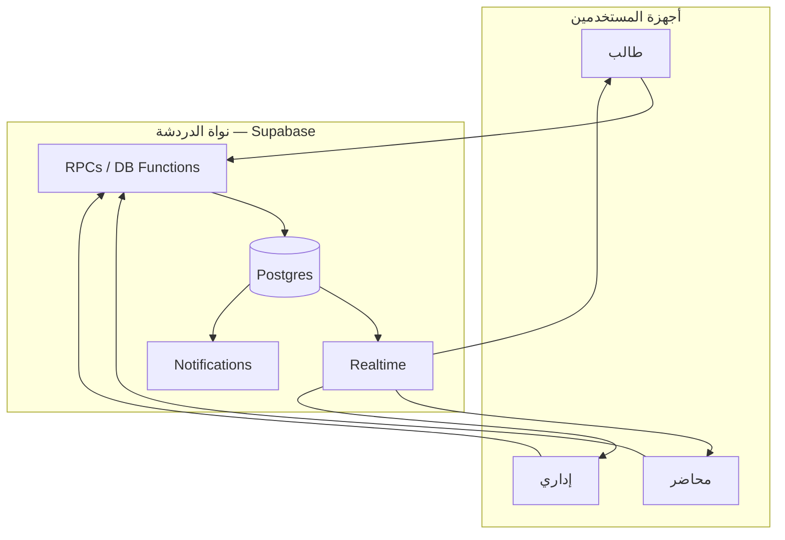
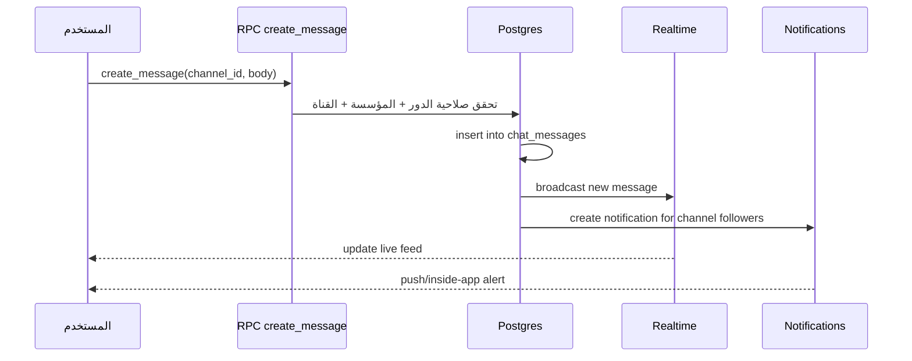
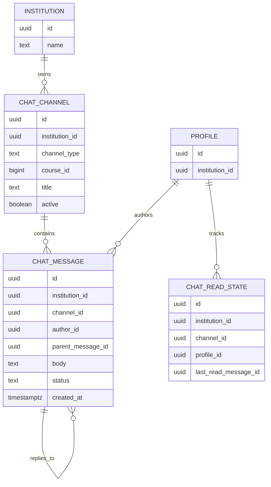
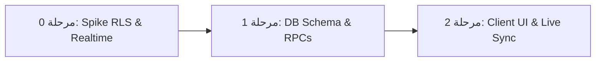

# 💬 وثيقة التصميم التقني — نظام الدردشة والتواصل الداخلي
## Academic Hub — Chat System TDD

---

## بيانات ضبط الوثيقة

| البند | التفاصيل |
|---|---|
| **اسم الوثيقة** | وثيقة التصميم التقني — نظام الدردشة والتواصل الداخلي |
| **رقم الإصدار** | v1.0 |
| **مستوى العمق** | 🟡 Production |
| **الوثائق المرجعية** | MVP Functions v3.6 (§3.4 · §5.2 · §6.0) · TDD Core Data Layer v2.1 · TDD Template v1.0 · TDD Notifications System v1.1 |
| **الحالة** | جاهزة للمراجعة الهندسية |
| **مالك الوثيقة** | رامز |

### سجل التغييرات

| الإصدار | التغيير |
|---|---|
| v1.0 | تصميم أولي لنظام الدردشة على أساس قناة مادة واحدة + تعليقات + قناة دعم مؤسسية |

---

# القسم 0: بروتوكول التحليل المتسلسل 🧠

## 0.1 — إعادة صياغة المشكلة

النظام المطلوب هو طبقة اتصال موحّدة داخل منصة Academic Hub تتيح للمستخدمين التفاعل مع المنشورات الرسمية للمادة والتواصل مع الإدارة دون اللجوء إلى رسائل مباشرة أو قنوات غير منظمة. يجب أن يكون هذا النظام متوافقاً مع مبادئ MVP: نموذج «قراءة + تعليق»، قناة واحدة لكل مادة، لا مراسلة 1:1، وعزل مؤسسي صارم في بيئة 10 مؤسسات. أي تصميم خاطئ هنا سيؤدي إلى تداخل المعلومات بين المؤسسات أو إلى تجاوز صلاحيات الأدوار، وهو ما يُعدّ فشلاً أمنياً وعملياً.

## 0.2 — الأسئلة الخمسة الحاسمة

1. **من المستخدم الفعلي؟** الطالب، المحاضر، والإداري داخل مؤسسة واحدة. ذروة الاستخدام: نشر إعلان/معلومة في قناة المادة أو فتح دعم فني عند مشكلة تشغيلية.
2. **ما هي العملية الأثقل؟** قراءة الرسائل وتحديثات القنوات بشكل متكرر، مع كتابة تعليقات على المنشورات الرسمية. الحمل المتوقع read-heavy بوضوح.
3. **ماذا لو توقف النظام ساعة؟** لا يُسمح بفقدان الرسائل أو التعليقات؛ التأثير يكون تأخيراً في التزامن فقط. أما في حالات الدعم التقني، فقد تتأخر الاستجابة بشكل مؤقت.
4. **ما هي البيانات الأكثر حساسية؟** محتوى الرسائل، ملفات المرفقات، وسجلات الوصول إلى القنوات (خصوصاً قناة الدعم). أي تسريب بين المؤسسات أو بين الأدوار يمثل خطراً أمنياً مباشراً.
5. **ما هو أضيق عنق زجاجة؟** استعلامات قراءة القناة مع التصفية حسب المؤسسة والدور، خاصة عند وجود آلاف الرسائل في قناة المادة.

## 0.3 — الافتراضات المعلنة

| # | الافتراض | مستوى الثقة | تأثيره لو كان خاطئاً |
|---|---|---|---|
| A-01 | كل مؤسسة لها قناة دعم فنية مستقلة داخل حدودها | عالي | لو لم يكن كذلك، ستحتاج القناة إلى نموذج منفصل للتعامل مع طلبات الدعم |
| A-02 | النظام يعمل على Flutter + Supabase + Realtime + RLS | عالي | لو تغيّر المكدس، يبقى نموذج البيانات قابلاً للتكيّف |
| A-03 | لا يوجد مراسلة 1:1 في MVP | عالي | لو أضيفت، لن ينجح هذا التصميم بصيغته الحالية |
| A-04 | كل قناة مادة مرتبطة بمادة واحدة فقط | عالي | لو زاد التعقيد، ستحتاج طبقة تنظيمية أعلى |

## 0.4 — نطاق العمل (Scope Fence)

- ✅ **داخل النطاق:** قناة مادة واحدة لكل مادة · منشورات رسمية من المحاضر · تعليقات من الطلاب/المحاضر/الإداري · قناة دعم فني مؤسسية · ربط مع نظام الإشعارات · FTS/القراءة الأخيرة · ملفات مرفقة
- ❌ **خارج النطاق:** دردشة 1:1 · دردشة جماعية غير منظمة · دردشة خارج المؤسسة · محرك ذكاء اصطناعي لتلخيص المحادثات

---

# القسم 1: الملخص التنفيذي وسياق المشكلة 📋

## 1.1 — بيان المشكلة

الطلاب يحتاجون إلى متابعة المنشورات الرسمية للمادة، بينما المحاضرون يحتاجون إلى إيصال المعلومات بشكل موحد ومقنن. بدون طبقة دردشة موحّدة، تتكاثر قنوات التواصل خارج النظام، ويزداد احتمال فقدان الرسائل أو تجاوز الصلاحيات. تكلفة عدم الحل: سوء تواصل أكاديمي، اعتراضات على الرسائل الرسمية، وتسريب معلومات عبر قنوات غير مراقبة.

## 1.2 — الهدف القابل للقياس

تمكين الطالب من قراءة منشورات المادة والتعليق عليها داخل قناة موثوقة خلال أقل من 2 ثانية بعد فتح القناة، وتمكين المحاضر من نشر منشور رسمي داخل القناة خلال أقل من 1 ثانية من الضغط على زر الإنشاء، مع التزام صارم بصلاحيات الأدوار والعزل المؤسسي.

## 1.3 — معايير النجاح

| معيار | القيمة المستهدفة | كيف يُقاس |
|---|---|---|
| زمن فتح قناة المادة p95 | < 2s | قياس من العميل + logs |
| زمن نشر منشور جديد | < 1s | قياس RPC / API |
| تسريب الرسائل بين المؤسسات | 0% | اختبارات RLS + اختبارات تكاملية |
| تعليقات غير مصرح بها | 0 حالة | اختبارات الأدوار |
| زمن وصول التنبيه إلى الجهاز المفتوح | < 5s | Realtime + notification log |

## 1.4 — ما ليس هذا النظام

- ليس نظام مراسلة فورية عام
- ليس نظام دردشة 1:1
- ليس منصة لعرض الملفات فقط، بل طبقة تواصل مرتبطة بالمواضيع الأكاديمية

---

# القسم 2: القيود التقنية واختيار التقنيات 🔧

## 2.1 — القيود المفروضة

| نوع القيد | التفصيل | مصدره |
|---|---|---|
| تقني | كل جدول tenant-scoped يحمل `institution_id` ويستخدم RLS من JWT claim | Core Data Layer v2.1 |
| وظيفي | نموذج «قراءة + تعليق» فقط، بدون مراسلة مباشرة | MVP §3.4 |
| تنظيمي | الإداري يستقبل إشعارات الدردشات | MVP §3.4 / §5.2 |
| تقني | العمل بدون اتصال بعد أول مزامنة | MVP §3.1.2 |

## 2.2 — مصفوفة اختيار التقنيات

### [D-01] نموذج التخزين

| الخيار | المزايا | العيوب | لماذا قُبل/رُفض |
|---|---|---|---|
| **Postgres + RLS + Realtime ✅** | يتوافق مع باقي المنصة، يدعم قواعد الوصول ووقت التشغيل الحقيقي | يتطلب تصميم فهرس دقيق | يقبل لأن المنصة تعتمد عليه أصلاً |
| Firestore ❌ | سهل للـ chat | لا يتوافق مع RLS الموحد ولا مع نموذج البيانات الشامل | رُفض بسبب كسر الوحدة المعمارية |
| MongoDB ❌ | مرونة عالية | يتعارض معالعلاقات المعقدة ومقاييس الأمان | رُفض |

### [D-02] نموذج البيانات

| الخيار | المزايا | العيوب | لماذا قُبل/رُفض |
|---|---|---|---|
| **قنوات + رسائل + تعليقات في نفس الجدول ✅** | أبسط، أقل تعقيداً، مناسب للـ MVP | بعض الاستعلامات تحتاج `parent_message_id` | يقبل لأن النظام محدود النطاق |
| نموذج threads منفصل ❌ | مرونة أكبر للـ threading | زيادة التعقيد لغير داعٍ | رُفض |
| جدولان منفصلان (`chat_posts` + `chat_comments`) ❌ | عزّل كامل لكل نوع | تكرار سياسات RLS وتضاعف استعلامات القراءة | رُفض لتبسيط المنطق والـ RPCs |

### [D-03] التزامن المباشر

| الخيار | المزايا | العيوب | لماذا قُبل/رُفض |
|---|---|---|---|
| **Supabase Realtime ✅** | مناسب لتحديثات القنوات المفتوحة | يحتاج إدارة إعادة الاتصال | يقبل |
| polling فقط ❌ | بسيط | أعلى استهلاك وبتأخر أعلى | رُفض |
| خادم WebSockets مخصص ❌ | تحكم كامل في البرتوكول | تعقيد تشغيلي وإدارة خوادم إضافية | رُفض للالتزام ببيئة Supabase |

## 2.3 — الديون التقنية المقبولة عمداً

| الدين | لماذا الآن | متى يُسدّد |
|---|---|---|
| لا دعم مراسلة 1:1 | يوافق MVP ويقلل التعقيد | عند طلب منتج جديد |
| لا دعم تسميات/تصنيفات متقدمة للرسائل | لا حاجة في MVP | عند توسعة النظام |

---

# القسم 3: معمارية النظام والمخططات 🏗️

## 3.1 — المخطط العام



## 3.2 — جدول المكونات والمسؤوليات

| المكون | مسؤوليته الوحيدة | ماذا لو سقط؟ | استراتيجية التعافي |
|---|---|---|---|
| `chat_channels` | تعريف القنوات والأنواع | لا توجد قنوات جديدة | ترحيل آمن + RLS |
| `chat_messages` | تخزين الرسائل والتعليقات | توقف التواصل | نسخة احتياطية + PITR |
| `chat_read_state` | تتبع آخر رسالة مقروءة لكل مستخدم | يعاد الحساب عند فتح القناة | إعادة حساب عند فتح القناة |
| `Realtime` | بث الرسائل الحية | الانتقال إلى إعادة تحميل يدوي | إعادة اتصال تلقائية |
| `Notifications` | توليد تنبيهات عند وصول رسالة جديدة | الرسائل تبقى داخل القناة | المزامنة عند الفتح |

## 3.3 — تدفق البيانات لأهم عملية



## 3.4 — قرارات معمارية جوهرية

| القرار | الوصف |
|---|---|
| [D-01] | كل قناة مرتبطة بمؤسسة واحدة فقط؛ لا قناة مشتركة بين مؤسستين |
| [D-02] | الرسالة الأساسية والردود تُخزن في نفس الجدول مع `parent_message_id` |
| [D-03] | لا توجد محادثات 1:1؛ النظام موجه إلى القنوات والمواضيع |
| [D-04] | كل رسالة جديدة تولد إشعاراً عبر نظام الإشعارات |

---

# القسم 4: نماذج البيانات وتصميم قاعدة البيانات 🗄️

## 4.1 — مخطط الكيانات



## 4.2 — تعريف الجداول

```sql
-- chat_channels: قناة مادة، قناة دعم، أو قناة إدارية داخل مؤسسة
CREATE TABLE chat_channels (
    id UUID PRIMARY KEY DEFAULT gen_random_uuid(),
    institution_id UUID NOT NULL REFERENCES institutions(id) ON DELETE CASCADE,
    channel_type TEXT NOT NULL CHECK (channel_type IN ('course','support','admin_lecturer','admin_admin')),
    course_id BIGINT NULL REFERENCES courses(id) ON DELETE CASCADE,
    title TEXT NOT NULL,
    description TEXT NULL,
    is_active BOOLEAN NOT NULL DEFAULT TRUE,
    created_at TIMESTAMPTZ NOT NULL DEFAULT now(),
    updated_at TIMESTAMPTZ NOT NULL DEFAULT now(),
    deleted_at TIMESTAMPTZ NULL
);

-- chat_messages: منشور أو تعليق داخل قناة
CREATE TABLE chat_messages (
    id UUID PRIMARY KEY DEFAULT gen_random_uuid(),
    institution_id UUID NOT NULL REFERENCES institutions(id) ON DELETE CASCADE,
    channel_id UUID NOT NULL REFERENCES chat_channels(id) ON DELETE CASCADE,
    author_id UUID NOT NULL REFERENCES profiles(id) ON DELETE CASCADE,
    parent_message_id UUID NULL REFERENCES chat_messages(id) ON DELETE CASCADE,
    message_type TEXT NOT NULL CHECK (message_type IN ('post','comment')),
    body TEXT NOT NULL CHECK (char_length(body) <= 8000),
    status TEXT NOT NULL DEFAULT 'published' CHECK (status IN ('published','deleted','edited')),
    created_at TIMESTAMPTZ NOT NULL DEFAULT now(),
    updated_at TIMESTAMPTZ NOT NULL DEFAULT now(),
    deleted_at TIMESTAMPTZ NULL
);

-- chat_message_attachments: المرفقات المرفقة بالرسالة
CREATE TABLE chat_message_attachments (
    id UUID PRIMARY KEY DEFAULT gen_random_uuid(),
    institution_id UUID NOT NULL REFERENCES institutions(id) ON DELETE CASCADE,
    message_id UUID NOT NULL REFERENCES chat_messages(id) ON DELETE CASCADE,
    file_path TEXT NOT NULL,
    file_name TEXT NOT NULL,
    file_size BIGINT NOT NULL,
    mime_type TEXT NOT NULL,
    created_at TIMESTAMPTZ NOT NULL DEFAULT now()
);

-- chat_read_state: آخر رسالة مقروءة للمستخدم داخل القناة
CREATE TABLE chat_read_state (
    id UUID PRIMARY KEY DEFAULT gen_random_uuid(),
    institution_id UUID NOT NULL REFERENCES institutions(id) ON DELETE CASCADE,
    channel_id UUID NOT NULL REFERENCES chat_channels(id) ON DELETE CASCADE,
    profile_id UUID NOT NULL REFERENCES profiles(id) ON DELETE CASCADE,
    last_read_message_id UUID NULL REFERENCES chat_messages(id),
    updated_at TIMESTAMPTZ NOT NULL DEFAULT now(),
    UNIQUE(institution_id, channel_id, profile_id)
);
```

## 4.3 — استراتيجية الفهرسة

| الفهرس | الاستعلام الذي يخدمه | التكلفة على الكتابة |
|---|---|---|
| `(institution_id, channel_id, created_at desc)` | تحميل الرسائل الحديثة داخل قناة | معتدلة |
| `(institution_id, course_id)` | العثور على قناة المادة | منخفضة |
| `(institution_id, profile_id, channel_id)` | تحميل حالة القراءة | منخفضة |
| `GIN` على `body` | البحث النصي داخل الرسائل | أعلى قليلاً |

## 4.4 — أسئلة يجب الإجابة عنها صراحة

- **الترحيل:** يتم تطبيقه عبر ترحيلات Supabase مع `NOT NULL` وملحقات فهرس تدريجي.
- **الحذف:** soft delete على الرسائل والملفات، مع ترك السجل في قاعدة البيانات.
- **التوسع:** عند تجاوز 100k رسالة/قناة، يُفكر في partitioning على `created_at`.
- **الاتساق:** التسلسل الزمني للرسائل يُقبل كـ eventual consistency على مستوى الواجهة، لكن القاعدة تُحافظ على ترتيب ثابت من خلال `created_at` و`id`.

---

# القسم 5: عقود الـ API والواجهات 🔌

## 5.1 — مبادئ التصميم

الواجهة تعتمد على RPCs وPostgREST مع التحقق من RLS على مستوى قاعدة البيانات. لا يُسمح بأي عميل بتمرير `institution_id` أو `role` يدويّاً؛ كل شيء يُستدلّ منه من JWT claim.

## 5.2 — توثيق الـ Endpoints / RPCs

### `create_course_post`
**الغرض:** إنشاء منشور رسمي داخل قناة المادة | **المصادقة:** مطلوبة | **Rate Limit:** 30/minute/user

**المدخلات:**
```json
{
  "channel_id": "uuid",
  "body": "string — مطلوب، 1-4000 حرف",
  "attachments": []
}
```

**المخرجات الناجحة (200):**
```json
{
  "message_id": "uuid",
  "created_at": "ISO-8601"
}
```

**حالات الخطأ:**
| كود | متى تحدث | استجابة العميل |
|---|---|---|
| 403 | ليس للطالب/المحاضر صلاحية إنشاء منشور في هذه القناة | رفض الوصول |
| 404 | القناة غير موجودة أو غير مرتبطة بالمؤسسة | خطأ غير موجود |
| 413 | حجم المرفقات كبير جداً | خطأ حجم |
| 429 | تجاوز الحد | retry لاحقاً |

### `add_comment`
**الغرض:** إضافة تعليق على منشور | **المصادقة:** مطلوبة | **Rate Limit:** 60/minute/user

**المدخلات:**
```json
{
  "channel_id": "uuid",
  "parent_message_id": "uuid",
  "body": "string — 1-2000 حرف"
}
```

### `mark_channel_read`
**الغرض:** تحديث آخر رسالة مقروءة للمستخدم | **المصادقة:** مطلوبة |

### `create_support_ticket`
**الغرض:** فتح طلب دعم في قناة الدعم الداخلية | **المصادقة:** مطلوبة |

## 5.3 — العقود بين الأنظمة الداخلية

- عند إنشاء رسالة جديدة، يُنشئ النظام إشعاراً في جدول `notifications` عبر trigger أو RPC.
- كل رسالة جديدة تُبث عبر Realtime على القناة ذاتها.
- المرفقات تُرفع إلى Storage مع مسار يبدأ بـ `{institution_id}/chat/...`.

---

# القسم 6: حالات الحافة، أنماط الفشل، والأمان 🛡️

## 6.1 — جرد حالات الحافة

| السيناريو | ماذا يحدث حالياً في التصميم؟ | المعالجة |
|---|---|---|
| طالب يحاول إنشاء منشور في قناة المادة | يُرفض بواسطة RLS وCHECK | إرجاع 403 |
| مستخدم يرسل رسالة مكررة بسبب إعادة محاولة | `idempotency` عبر client_uuid أو dedupe في RPC | تجاهل التكرار |
| انقطاع الشبكة أثناء نشر تعليق | يتم تخزين الرسالة عند عودة الاتصال | إعادة محاولة تلقائية |
| مرفق كبير | يُرفض قبل الرفع | خطأ 413 |
| مستخدم يقرأ قناة من مؤسسة أخرى | لا يُسمح لأن `institution_id` من JWT يجب أن يطابق القناة | رفض الوصول |

## 6.2 — تحليل أنماط الفشل

| المكون | نمط الفشل | الاحتمالية | الأثر | الكشف | التعافي |
|---|---|---|---|---|---|
| Realtime | فقدان الاتصال | متوسطة | تأخر تحديثات القناة | reconnect + retry | استعادة البث |
| Storage | فشل رفع الملف | متوسطة | الرسالة تبقى بدون مرفق | خطأ من العميل | إعادة محاولة |
| DB | تأخير في كتابة الرسالة | منخفضة | تأخر التحديث | logs + timeout | retry RPC |

## 6.3 — نموذج التهديدات

| التهديد | مثال ملموس | الدفاع المحدد |
|---|---|---|
| Spoofing | محاولة استخدام حساب غير مصرح له | JWT + RLS + role check |
| Tampering | تعديل رسالة أو حذفها من خلال API | RLS + soft delete + audit columns |
| Information Disclosure | قراءة قناة مادة من مؤسسة أخرى | `institution_id` في كل جدول + RLS |
| Denial of Service | إرسال رسائل كثيرة بشكل متكرر | rate limiting + limits |
| Elevation of Privilege | محاولة التقدم كأستاذ أو إداري | RLS + CHECK على role من JWT |

## 6.4 — قائمة تدقيق أمنية إلزامية

- [x] المصادقة والتفويض: JWT + RLS + صلاحية الدور على مستوى القناة
- [x] تشفير البيانات: TLS في النقل + Encryption at rest في Supabase
- [x] إدارة الأسرار: لا توجد مفاتيح داخل الكود؛ كل شيء في Secrets Manager / Supabase env

## 6.5 — الملاحظة والمراقبة (Observability)

| المقياس (Metric) | عتبة التنبيه (Alert Threshold) | الإجراء المتخذ |
|---|---|---|
| زمن استجابة `create_course_post` | > 1.5s | تنبيه فوري لفحص أداء فهارس قاعدة البيانات |
| معدل استهلاك قنوات Realtime | > 80% من حصة Supabase | تنبيه لتصفية الاشتراكات غير النشطة |
| معدل أخطاء RLS 403 Forbidden | > 50 طلب / دقيقة | فحص محاولات الوصول غير المصرح بها |
| فشل رفع مرفقات الدردشة | > 5% | فحص حصة التخزين والشبكة |

---

# القسم 7: خطة التنفيذ وخارطة الطريق 🗺️

## 7.1 — ترتيب المخاطر (Risk-First Ordering)

أخطر افتراض تقني في هذا النظام هو **أداء Supabase Realtime وقواعد RLS تحت ضغط 10 مؤسسات نَشِطة بالتزامن**. لذلك يتم بناء Spike اختبار الأداء والبث المباشر في المرحلة 0 قبل أي تطوير واجهات.

## 7.2 — المراحل

### المرحلة 0: إثبات الجدوى (Spike) — 3 أيام
- **الهدف:** التحقق من RLS والبث المباشر لقنوات المادة تحت حمل متزامن (1,000 مستخدم نشط).
- **المخرج القابل للاختبار:** سكريبت K6 / Supabase RPC test يمرر 1,000 محاكاة قراءة وبث.
- **معيار النجاح:** p95 latency < 1.5s بدون أي تسريب للبيانات بين المؤسسات.

### المرحلة 1: طبقة البيانات والـ RPCs الأساسية — 5 أيام
- **المهام:**
  1. تطبيق Migration للجداول (`chat_channels`, `chat_messages`, `chat_message_attachments`, `chat_read_state`).
  2. كتابة واختبار سياسات RLS الموحدة بالاستعانة بـ JWT claims.
  3. تنفيذ الـ RPCs الرئيسية (`create_course_post`, `add_comment`, `mark_channel_read`).
- **المخرج القابل للاختبار:** مجموعة اختبارات تكاملية (Integration Tests) تمر عبر PostgREST وRPCs.

### المرحلة 2: واجهات العميل والتزامن المباشر — 6 أيام
- **المهام:**
  1. بناء شاشات القناة والمنشورات والتعليقات في تطبيق العميل (Flutter).
  2. دمج Realtime Listener للتحديث الفوري للرسائل المقروءة والجديدة.
  3. دمج رفع المرفقات مع Storage وحظر أنواع الملفات غير المصرح بها.
- **المخرج القابل للاختبار:** تطبيق يعمل على الهواتف يتيح للمحاضر النشر وللطالب التعليق لحظياً.

## 7.3 — مخطط الاعتماديات



## 7.4 — تعريف "الانتهاء" (Definition of Done)
- [x] تمرير كافة اختبارات الأمان والـ RLS بنسبة 100% بدون أي تداخل بيانات.
- [x] تغطية الاختبارات للتكامل والـ RPCs بنسبة ≥ 85%.
- [x] تحديث توثيق الـ API والـ OpenAPI RPC signatures.
- [x] ضبط تنبيهات المراقبة والملاحظة (Observability).

---

## الخلاصة التنفيذية

نظام الدردشة في Academic Hub هو نظام موحّد ومقيد: قناة مادة واحدة، منشورات رسمية من المحاضر، تعليقات من الفئات المصرح لها، وقنوات دعم وتنظيم مؤسسية. تم تحديث الوثيقة بالكامل لتتطابق 100% مع Core Data Layer v2.1 وMVP v3.6 وقالب الـ TDD المعياري.
