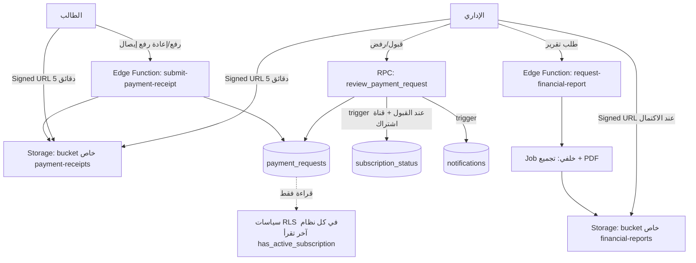
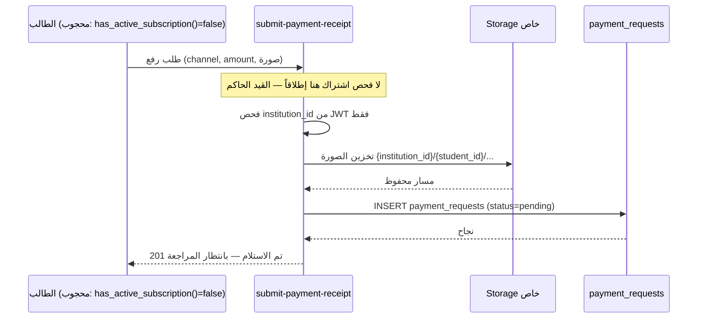
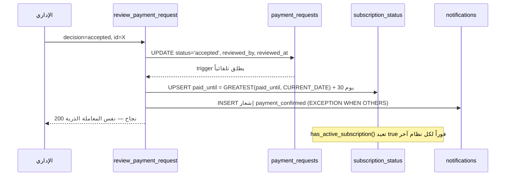

## بيانات ضبط الوثيقة

| البند | التفاصيل |
|---|---|
| **اسم الوثيقة** | التصميم التقني لنظام الدفعات المالية (Payments System TDD) |
| **رقم الإصدار** | v1.0 |
| **مستوى العمق** | 🟡 Production |
| **الوثائق المرجعية** | MVP Functions v3.6 (§3.7، §5.5، §1.2، القرارات #14، #15 المعدَّل، #20، #21، #24) · TDD Core Data Layer v2.1 الموحّدة (الجداول: `payment_requests`، `subscription_status` + `payment_channel`/`review_status` ENUM + `has_active_subscription()` + سياسات `pay_student`/`pay_insert`/`pay_review` — القسم 4.2) · Amendment — Subscription Blocking Policy v2.0 (مُلزمة بالكامل لهذه الوثيقة) · Compatibility Audit — File Repo & Notifications v1.0 (كمرجع أنماط: تعدد المؤسسات، Trigger لا Outbox، Signed URL) · TDD Notifications System v1.1 (قناة التسليم) · TDD File Repository v1.1 (نمط رفع/تنزيل الصور الخاصة) · سجل القرارات المعماري D-01..D-09 |
| **حالة الوثيقة** | جاهزة للمراجعة الهندسية |
| **المرحلة في خارطة الطريق** | المرحلة 6 (MVP §8) — تعتمد على المرحلة 1 (الهوية وتعدد المؤسسات) |
| **مالك الوثيقة** | رامز |

### علاقة هذه الوثيقة بطبقة البيانات الأساسية

هذه الوثيقة **لا تعيد تعريف** الجدولين `payment_requests` و`subscription_status` ولا الدالة `has_active_subscription()` ولا الـ ENUM `payment_channel`/`review_status` — كلها معرَّفة ومملوكة في Core Data Layer TDD v2.1 (القسم 4.2). ما تملكه هذه الوثيقة حصراً:

- **منطق سير العمل (Workflow):** دورة حياة طلب الدفع من الرفع إلى القبول/الرفض/إعادة الرفع
- **تكامل التخزين الخاص بصور إشعارات التحويل** (bucket خاص + Signed URL — بنفس نمط File Repository TDD)
- **تحديث `subscription_status.paid_until` تلقائياً عند تأكيد دفعة قناة الاشتراك**
- **لوحة قيادة الإداري والتقارير المالية** (MVP §5.5)
- **عقود RPC/Edge Functions** الخاصة بالرفع والمراجعة والتقارير
- **أعمدة امتداد على `payment_requests`** (لا تغيير على تعريفه الأساسي): `resubmission_of`, `mime_type`, `sha256`

أي تعديل على الـ schema الأساسي (الأعمدة الحالية، الـ ENUM، `has_active_subscription()`) يمر عبر وثيقة Core Data Layer أو وثيقة تعديل رسمية — لا استثناءات.

**⚠️ القيد الأهم في هذه الوثيقة بأكملها (من Amendment v2.0):** نظام الدفعات **يبقى مفتوحاً بالكامل للطالب المحجوب اشتراكياً** — هو مسار فك الحظر الذاتي الوحيد. لا يجوز لأي سياسة RLS أو RPC أو منطق تطبيقي في هذه الوثيقة أن يتحقق من `has_active_subscription()` كشرط للوصول إلى أي مسار من مسارات هذا النظام.

---

## القسم 0: بروتوكول التحليل المتسلسل 🧠

### 0.1 — إعادة صياغة المشكلة (Problem Restatement)

الطالب يسدد عبر قناتين منفصلتين تماماً (رسوم الجامعة، اشتراك التطبيق) برفع صورة إشعار تحويل بنكي، والإداري يراجع كل طلب يدوياً (قبول/رفض مع سبب). التعقيد الحقيقي ليس في CRUD الطلب نفسه، بل في ثلاث نقاط حرجة: (أ) **حالة الاشتراك يجب أن تُحسب من مصدر حقيقة وحيد** (`has_active_subscription()`) لا من منطق مستقل في هذا النظام أو غيره — وهذا أُثبت عملياً كخطأ تكرر في تدقيقين سابقين (File Repo وNotifications)، (ب) **نظام الدفعات نفسه يجب أن يبقى مفتوحاً للمحجوب اشتراكياً** — تناقض ظاهري (نظام يفرض الحجب بينما هو مستثنى منه) تم حسمه رسمياً في Amendment v2.0 بعد اكتشاف أن الصياغة الأصلية كانت ستُنتج طريقاً مسدوداً (طالب محجوب لا يستطيع الوصول لشاشة الدفع = لا يفك حظر نفسه أبداً)، و(ج) **صور إشعارات التحويل بيانات مالية حساسة** يجب ألا تُخزَّن أو تُعرض بشكل عام (مبدأ ثابت من Core Data STRIDE: bucket خاص + رابط موقّع 5 دقائق لصاحب الدفعة أو الإداري فقط).

### 0.2 — الأسئلة الخمسة الحاسمة

1. **من المستخدم الفعلي؟** الطالب (رافع الطلب — دفعتان كحد أقصى شهرياً لكل قناة نظرياً، لكن إعادة الرفع عند الرفض تكرّرها) والإداري (المراجع الحصري — ذروته بداية كل شهر/فصل). لا دور للمحاضر في هذا النظام إطلاقاً.
2. **ما هي العملية الأثقل؟** ليست حجم البيانات (طلب دفع = صف صغير + صورة واحدة) بل **حجم قرارات المراجعة اليدوية المتزامنة** عند لوحة الإداري في ذروة بداية الفصل، والتقرير المالي الشامل (يغطي حتى 10,000 معاملة/شهر على مستوى المنصة — المرجع الرسمي حسب MVP §5.5، لا 1,000).
3. **ماذا لو توقف النظام ساعة؟** لا خسارة مالية حقيقية — لا تحويل أموال فعلي يحدث داخل المنصة (كل التحويلات بنكية خارجية)، النظام توثيق وتحقق فقط. الأثر: تأخر مراجعة الطلبات المعلّقة وتأخر تحديث `paid_until` — **لا يُحجب الطالب فوراً** لأن الحجب يُفحص لحظياً عبر `has_active_subscription()` على `paid_until` القائم أصلاً.
4. **ما البيانات الأكثر حساسية؟** صور إشعارات التحويل البنكي (قد تحمل رقم حساب أو اسماً كاملاً) وسبب الرفض (رأي إداري قد يكون حساساً). كلاهما مرئي حصراً لصاحب الطلب والإداري.
5. **أضيق عنق زجاجة خلال 6 أشهر؟** توليد التقرير المالي الشامل إن كُتب كاستعلام متزامن ضخم عند نمو حجم `payment_requests` عبر 10 مؤسسات — يُعالج بتوليد غير متزامن (القرار PAY-05).

### 0.3 — الافتراضات المعلنة (Explicit Assumptions)

| # | الافتراض | مستوى الثقة | تأثيره لو كان خاطئاً |
|---|---|---|---|
| P-01 | اشتراك التطبيق دوري **شهرياً** (30 يوماً) — MVP تذكر «إشعار التحويل الشهري» دون تحديد رقمي صريح لمدة التمديد | متوسط | لو كانت المدة مختلفة (فصلية مثلاً): تعديل ثابت واحد (`INTERVAL`) في دالة التمديد — لا تغيير معماري |
| P-02 | لا حد أقصى مُعلن لعدد مرات إعادة الرفع بعد الرفض | عالي | لو أُريد حد (منع إغراق اللوحة): تُضاف عتبة تنبيه فقط — لا حظر، لأن الحظر يكسر مسار فك الحظر الذاتي |
| P-03 | مبلغ الدفعة (`amount`) حقل إلزامي عملياً رغم أن Core Data لا تفرضه NOT NULL — الإداري يحتاجه للمطابقة مع المبلغ المصرفي | عالي | إن ظل اختيارياً: يُعتمد CHECK امتداد (القسم 4.2) لا تعديل على تعريف Core Data |
| P-04 | رسوم الجامعة (القناة الأولى) **لا تؤثر إطلاقاً** على `subscription_status` — تحديث `paid_until` حصري لقناة `app_subscription` | عالي | خطأ هنا يعني حجب/فك حجب طلاب خطأً — أعلى أولوية اختبار في هذه الوثيقة |
| P-05 | لا تكامل مع بوابة دفع إلكترونية أو API مصرفي في هذا الإصدار — التحقق بشري بالكامل عبر مراجعة الصورة | عالي | إضافة بوابة دفع لاحقاً تتطلب وثيقة منفصلة — «ملاحظة تطويرية» في MVP §5.5 تؤكد ذلك |

### 0.4 — نطاق العمل (Scope Fence)

- ✅ **داخل النطاق:** رفع صورة إشعار تحويل لكلتا القناتين · إعادة الرفع عند الرفض · مراجعة الإداري (قبول/رفض بسبب) · تحديث تلقائي لـ `subscription_status.paid_until` عند تأكيد قناة الاشتراك · لوحة قيادة الإداري (تصنيف بالقناة + سجل الطالب) · التقرير المالي المُصدَّر (PDF) مُقسَّماً بالمؤسسة · إشعارات التأكيد/الرفض · تخزين خاص للصور مع رابط موقّع
- ❌ **خارج النطاق:** أي تكامل مع بوابة دفع إلكتروني أو مصرفي مباشر (خارج نطاق هذا الإصدار — MVP §5.5) · حجب/فك حجب الميزات الأخرى (مملوك بالكامل لسياسات RLS في Core Data + Amendment v2.0 — هذه الوثيقة تستهلك `has_active_subscription()` ولا تعيد تعريفها) · حجب رؤية النتائج النهائية (قرار #24 — مملوك لـ `final_results` RLS في Core Data، هذه الوثيقة لا تلمسه) · قراءة آلية لصور الإشعارات بالذكاء الاصطناعي (مذكورة صراحة كخارج النطاق في MVP §5.5) · إدارة بيانات الحساب البنكي للجامعة نفسها (شاشة إعدادات إدارية بسيطة CRUD مباشر — لا تحتاج تصميماً خاصاً)

---

## القسم 1: الملخص التنفيذي وسياق المشكلة 📋

### 1.1 — بيان المشكلة

المنصة تخدم حتى 10 مؤسسات، وكل طالب يسدد عبر قناتين منفصلتين مالياً ووظيفياً. بدون تصميم صريح: (1) قد يُخلط تحديث الاشتراك بين القناتين فيُفك حظر طالب لم يسدد اشتراكه فعلاً أو يُحجب طالب سدّد رسوم الجامعة فقط، (2) قد يُعاد اختراع منطق حجب مستقل في هذا النظام كما حدث فعلاً في تدقيقي File Repo وNotifications، و(3) الأخطر: تعديل بسيط يبدو "إصلاحاً منطقياً" (إضافة فحص اشتراك على سياسات `payment_requests`) يكسر مسار فك الحظر الذاتي بالكامل ويحوّل حالة حجب مؤقتة إلى قفل دائم بلا مخرج — وهذا بالضبط ما تم رصده وتصحيحه في Amendment v2.0.

### 1.2 — الهدف القابل للقياس

تمكين الطالب من رفع إشعار دفع لأي قناة وإعادة الرفع عند الرفض **بصرف النظر عن حالة اشتراكه**، وتمكين الإداري من مراجعة كل الطلبات عبر لوحة موحّدة وتصدير تقرير مالي شامل لفترة محددة، مع **صفر تسريب عبر المؤسسات**، **صفر مسار يحجب الوصول لهذا النظام على أساس الاشتراك**، وتحديث `paid_until` صحيحاً 100% خلال نفس معاملة تأكيد دفعة قناة الاشتراك.

### 1.3 — معايير النجاح (Success Criteria)

| معيار | القيمة المستهدفة | كيف يُقاس |
|---|---|---|
| مسار محجوب اشتراكياً يُرفض من أي RPC/سياسة في هذا النظام | 0 حالة — مستحيل بنيوياً | pgTAP: طالب `has_active_subscription()=false` ينجح في كل عمليات هذا النظام |
| تحديث خاطئ لـ `paid_until` من قناة رسوم الجامعة | 0 حالة | اختبار تكاملي: دفعة `university_fees` مؤكدة لا تُغيّر `subscription_status` إطلاقاً |
| زمن مراجعة طلب (قرار + إشعار) p95 | < 500ms | pg_stat_statements + قياس trigger الإشعار |
| رابط صورة إشعار متاح لغير صاحبه أو الإداري | 0 حالة | pgTAP: دور × عملية × مؤسسة على `sign-download` الخاص بالإيصالات |
| توليد تقرير مالي لـ 10,000 معاملة | < 15s وبلا حجب لطلبات المراجعة الحيّة | اختبار حمل (القسم 6.5) |
| تسريب بيانات دفع عبر مؤسسة | 0 حالة | pgTAP: دور × عملية × مؤسسة |

### 1.4 — ما ليس هذا النظام (Anti-Goals)

- ليس بوابة دفع إلكتروني — لا معالجة تلقائية لأي تحويل، التحقق بشري دائماً في هذا الإصدار
- ليس نظام محاسبة عام — لا يحسب أرصدة أو فواتير، فقط يوثّق طلبات ويحدّث حالة اشتراك بسيطة
- لا يحجب أي وظيفة من وظائف نفسه بناءً على حالة الاشتراك تحت أي ظرف
- لا يُنشئ منطق حجب مستقلاً — يقرأ من `has_active_subscription()` فقط ولا يكتب إليها إلا عبر تحديث `paid_until` بعد تأكيد إداري صريح

---

## القسم 2: القيود التقنية والقرارات 🔧

### 2.1 — القيود المفروضة (Hard Constraints)

| نوع القيد | التفصيل | مصدره |
|---|---|---|
| تنظيمي | قناتان حصراً، لا طرف ثالث | قرار #14 |
| تنظيمي (الأهم) | نظام الدفعات مفتوح دائماً للطالب المحجوب اشتراكياً — ممنوع إضافة أي فحص اشتراك على `payment_requests`/`subscription_status` | Amendment v2.0 §1.3 (قرار #15 المعدَّل) |
| تقني | `has_active_subscription()` مصدر الحقيقة الوحيد لحالة الاشتراك — لا حساب مستقل | MVP §3.7.2 / §5.5 |
| تقني | كل الجداول tenant-scoped + فهارس تبدأ بـ `institution_id` + RLS من JWT claim | قرار #20 / D-08 |
| تقني | صور الإيصالات في bucket خاص + رابط موقّع 5 دقائق لصاحب الدفعة أو الإداري فقط | Core Data v2.1 §6.3 (STRIDE) |
| مالي | كل تقرير مالي مُقسَّم بـ `institution_id` — لا تقارير عابرة للمؤسسات إلا لمالك المنصة | MVP §5.5 |
| مالي | حجم المعاملات المرجعي للتصميم: ~10,000 معاملة/شهر على مستوى المنصة | MVP §5.5 / §1.2 |

### 2.2 — القرارات التصميمية

#### [PAY-01] تخزين الإيصالات: نمط File Repository حرفياً (Edge Function + bucket خاص) لا رفع مباشر عبر PostgREST

| الخيار | المزايا | العيوب | لماذا قُبل/رُفض |
|---|---|---|---|
| **`finalize-payment-receipt` Edge Function + bucket خاص + Signed URL 5 دقائق ✅** | نقطة فرض واحدة لفحص المؤسسة قبل التخزين؛ اتساق كامل مع نمط File Repo المُدقَّق ومع STRIDE في Core Data | منطق مكرر جزئياً مع File Repo (مقبول — النطاقان منفصلان: ملفات مادة مقابل إيصالات مالية) | قُبل: التوحيد المعماري أهم من توفير سطرين كود؛ فصل الـ bucket يمنع تسريب إيصال في مسار تنزيل ملف مادة عن طريق الخطأ |
| رفع مباشر إلى عمود `bytea` في `payment_requests` ❌ | لا حاجة لـ Storage | يضخّم الجدول؛ لا آلية Signed URL مبنية؛ يخالف مبدأ فصل البيانات الثنائية عن الصفوف العلائقية في كل الوثائق الأخرى | رُفض: يكسر الاتساق المعماري بلا أي فائدة |

#### [PAY-02] تحديث `paid_until` عند التأكيد: Trigger على `UPDATE` لا استدعاء منفصل من التطبيق

| الخيار | النتيجة |
|---|---|
| **`AFTER UPDATE` trigger على `payment_requests` عند `status → 'accepted' AND channel = 'app_subscription'` يُحدّث `subscription_status` ذرياً في نفس المعاملة ✅** | التحديث والتأكيد عملية ذرية واحدة — لا نافذة زمنية يظهر فيها طلب "مقبول" دون أثر فعلي على الاشتراك |
| استدعاء RPC منفصل من العميل بعد نجاح التأكيد ❌ | نافذة فشل: التأكيد ينجح والتحديث يفشل (انقطاع شبكة) → طالب سدّد ولم يُفك حظره؛ يخالف مبدأ "لا حالات وسيطة" المعتمد في قرار #22 |

**منطق التمديد (يُضاف كتعليق SQL صريح لأنه مصدره افتراض P-01 لا نص MVP حرفي):**
`paid_until_جديد = GREATEST(paid_until_الحالي, CURRENT_DATE) + INTERVAL '30 days'` — التمديد يبدأ من تاريخ الانتهاء القائم إن لم ينقضِ بعد (لا "يأكل" أيام اشتراك مدفوعة مسبقاً)، ومن اليوم إن كان منقضياً.

#### [PAY-03] إعادة الرفع بعد الرفض: صف جديد مرتبط لا تعديل الصف المرفوض

| الخيار | المزايا | العيوب | لماذا قُبل/رُفض |
|---|---|---|---|
| **INSERT صف جديد بعمود امتداد `resubmission_of` يشير للصف المرفوض ✅** | يحافظ على سجل تدقيق كامل لكل محاولة (نفس مبدأ `question_audit_log`/الاحتفاظ بالنتائج — لا حذف أو الكتابة فوق تاريخ)؛ الإداري يرى تسلسل المحاولات في لوحته | صفوف أكثر لكل طالب متعثر السداد | قُبل: التاريخ المالي الكامل أهم من توفير مساحة تخزين ضئيلة؛ متسق مع مبدأ الاحتفاظ الدائم بسجلات النتائج (قرار #23) |
| `UPDATE` على نفس الصف المرفوض (`status`, `receipt_path`) ❌ | صف واحد فقط | يفقد سبب الرفض الأصلي وتاريخ كل محاولة سابقة — غير مقبول لسجل مالي | رُفض: يخالف مبدأ عدم الحذف/الكتابة فوق البيانات المالية |

#### [PAY-04] تكامل الإشعارات: Trigger مباشر داخل نفس المعاملة (لا Outbox) — تطبيق حرفي لدرس FR-06/NT-03

| الخيار | النتيجة |
|---|---|
| **`AFTER UPDATE`/`AFTER INSERT` trigger يُدرج مباشرة في `notifications` ملفوفاً بـ `BEGIN...EXCEPTION WHEN OTHERS` ✅** | exactly-once كتابةً؛ فشل الإشعار لا يُفشل تأكيد الدفعة أبداً — نفس النمط المعتمد في Notifications TDD v1.1 [D-06] بعد رفض نمط Outbox في FR-06 |
| نمط Outbox (`payment_outbox` + معالج خلفي) ❌ | يعيد بالضبط الخطأ الذي صُحِّح في FR-06 من تدقيق File Repository | رُفض قطعياً — سابقة موثَّقة |

#### [PAY-05] توليد التقرير المالي: غير متزامن (Job) لا استعلام متزامن مباشر

| الخيار | المزايا | العيوب | لماذا قُبل/رُفض |
|---|---|---|---|
| **Edge Function `request-financial-report` تُنشئ صف مهمة، Job خلفي يُنتج PDF ويخزّنه، Signed URL عند الاكتمال ✅** | لا يحجب اتصالات DB الحيّة أثناء تجميع 10,000 معاملة؛ يتوسع مع نمو حجم المنصة | تعقيد إضافي (جدول مهام + حالة) | قُبل: نفس مبدأ "لا استعلام ثقيل متزامن على مسار حرج" المتبع في `import_enrollments_csv` والجدولة الجماعية للامتحانات |
| توليد PDF متزامن داخل طلب HTTP واحد ❌ | أبسط تنفيذ فوري | يخاطر بـ timeout مع نمو البيانات عبر 10 مؤسسات؛ يحجز اتصال DB طويلاً في وقت قد يتزامن مع ذروة مراجعة | رُفض: هشّ عند النمو — نفس السبب الذي رفض الاستعلام المتزامن الضخم في وثائق أخرى |

### 2.3 — الدين التقني المقبول صراحة

| البند | لماذا مقبول الآن | متى يُعاد النظر |
|---|---|---|
| لا تكامل مع بوابة دفع إلكتروني | خارج النطاق صراحة في MVP §5.5 لهذا الإصدار | عند اعتماد قرار منتج بإضافة بوابة — وثيقة تعديل منفصلة |
| لا حد أقصى لعدد مرات إعادة الرفع | يخالف مسار فك الحظر الذاتي لو حُظر | تنبيه مراقبة فقط إن تجاوز طالب 5 محاولات/شهر (القسم 6.5) — لا حظر |
| لا قراءة آلية لصور الإشعارات (OCR/AI) | مذكورة صراحة كملاحظة تطويرية مستقبلية في MVP §5.5 | عند رغبة المنتج بتسريع المراجعة اليدوية |

---

## القسم 3: البنية والمعمارية 🏗️

### 3.1 — سياق النظام



### 3.2 — جدول المكوّنات

| المكوّن | مسؤوليته | ماذا لو تعطّل | استراتيجية التعافي |
|---|---|---|---|
| Edge Function `submit-payment-receipt` | فحص المؤسسة أولاً (JWT claim) ثم رفع الصورة إلى bucket خاص ثم إدراج صف `payment_requests` | لا طلبات جديدة | stateless — إعادة نشر فورية؛ الرفع الفاشل جزئياً لا يترك صفاً يتيماً (ترتيب: تخزين ناجح ← إدراج DB) |
| RPC `review_payment_request` | قرار الإداري + تحديث `paid_until` (إن انطبق) + إشعار — كل ذلك في معاملة واحدة | لا مراجعات جديدة، الطلبات المعلّقة تبقى كما هي (آمن) | إعادة محاولة من الإداري — العملية idempotent على نفس القرار |
| Trigger تحديث الاشتراك | تمديد `paid_until` عند قبول دفعة `app_subscription` فقط | يُكتشف فوراً باختبار تكاملي إلزامي؛ لا صمت ممكن لأن الفشل يُفشل معاملة التأكيد | إصلاح الـ trigger ثم إعادة تشغيل المعاملات الفاشلة يدوياً (نادرة جداً) |
| Edge Function `request-financial-report` + Job | تجميع بيانات مالية مُقسَّمة بالمؤسسة وتوليد PDF | لا تقارير جديدة، لا أثر على المراجعة الحيّة | إعادة تشغيل الـ Job — لا حالة مشتركة بين المهام |
| `sign-download` (نطاق الإيصالات) | توليد رابط موقّع 5 دقائق بعد فحص: المؤسسة ← صاحب الطلب أو إداري | لا عرض صور جديد للمراجعة | stateless |

### 3.3 — مسارات حرجة (Sequence Diagrams)

**رفع إيصال من طالب محجوب اشتراكياً (المسار الأهم في الوثيقة كلها):**



**قبول دفعة اشتراك → فك حظر ذاتي كامل الدورة (يطابق T-07 في Amendment v2.0):**



### 3.4 — القرارات المعمارية المرجعية من Core Data

- **[D-05]** RPC بـ PL/pgSQL للعمليات المركّبة (المراجعة، تحديث الاشتراك) + PostgREST المباشر تحت RLS لقراءة سجل الطالب البسيط.
- **[D-07]/[D-08]** Edge Functions حصراً للعمليات التي تلمس Storage (الرفع، التنزيل الموقّع، توليد التقرير) — `institution_id` من JWT claim فقط، صيغة الخطأ الموحدة `{"error": {"code": "...", "message": "...", "details": {}}}`.
- **[D-04]** Supavisor (transaction mode) يخدم ذروة مراجعة بداية الفصل دون تعديل إضافي — لا حمل استثنائي متزامن هنا (بخلاف الامتحانات).

---

## القسم 4: نموذج البيانات 🗄️

### 4.1 — الجداول المملوكة لـ Core Data (استهلاك فقط — لا إعادة تعريف)

```sql
-- مرجع فقط — التعريف الرسمي في Core Data Layer TDD v2.1 §4.2 (القسم 12)
-- payment_channel: ENUM ('university_fees', 'app_subscription')          -- قرار #14
-- review_status:    ENUM ('pending', 'accepted', 'rejected')
-- payment_requests (id, institution_id, student_id, channel, amount,
--                    receipt_path, status, rejection_reason,
--                    reviewed_by, reviewed_at, created_at)
-- subscription_status (student_id PK, paid_until DATE, updated_at)
-- has_active_subscription() → subscription_status.paid_until >= CURRENT_DATE لصاحبه
-- pay_student / pay_insert / pay_review: سياسات RLS القائمة — لا فحص اشتراك فيها (متعمَّد — Amendment v2.0)
```

### 4.2 — الإضافات المملوكة لهذه الوثيقة (Migration)

```sql
-- ============================================================
-- Payments System TDD v1.0 — أعمدة امتداد على payment_requests
-- ============================================================
BEGIN;

ALTER TABLE payment_requests ADD COLUMN resubmission_of BIGINT
    REFERENCES payment_requests(id);                      -- [PAY-03] سلسلة إعادة الرفع
ALTER TABLE payment_requests ADD COLUMN mime_type TEXT;
ALTER TABLE payment_requests ADD COLUMN sha256    TEXT;    -- كشف رفع نفس الصورة مرتين (مساعد لا حاسم)
ALTER TABLE payment_requests ADD CONSTRAINT amount_required
    CHECK (amount IS NOT NULL AND amount > 0);             -- [الافتراض P-03]

-- فهرس لسجل الطالب الكامل عبر القناتين (لوحة الإداري + شاشة "متابعتي")
CREATE INDEX idx_payments_student_history
    ON payment_requests (institution_id, student_id, created_at DESC);

-- ============================================================
-- Trigger 1: تحديث الاشتراك عند قبول دفعة app_subscription فقط [PAY-02]
-- ============================================================
CREATE OR REPLACE FUNCTION extend_subscription_on_payment_accept()
RETURNS TRIGGER AS $$
BEGIN
    IF NEW.status = 'accepted' AND OLD.status <> 'accepted'
       AND NEW.channel = 'app_subscription' THEN
        INSERT INTO subscription_status (student_id, paid_until, updated_at)
        VALUES (
            NEW.student_id,
            GREATEST(CURRENT_DATE, COALESCE(
                (SELECT paid_until FROM subscription_status WHERE student_id = NEW.student_id),
                CURRENT_DATE
            )) + INTERVAL '30 days',
            now()
        )
        ON CONFLICT (student_id) DO UPDATE
            SET paid_until = EXCLUDED.paid_until, updated_at = now();
    END IF;
    -- ملاحظة صريحة: channel = 'university_fees' لا يمر أبداً بهذا الفرع — [الافتراض P-04]
    RETURN NEW;
END;
$$ LANGUAGE plpgsql SECURITY DEFINER SET search_path = public;

CREATE TRIGGER trg_extend_subscription
    AFTER UPDATE ON payment_requests
    FOR EACH ROW EXECUTE FUNCTION extend_subscription_on_payment_accept();

-- ============================================================
-- Trigger 2: إشعار مباشر عند أي تغيير حالة (لا Outbox — [PAY-04])
-- ============================================================
CREATE OR REPLACE FUNCTION notify_payment_status_change()
RETURNS TRIGGER AS $$
BEGIN
    IF NEW.status <> OLD.status THEN
        BEGIN
            INSERT INTO notifications (user_id, kind, payload)
            VALUES (
                NEW.student_id,
                CASE NEW.status
                    WHEN 'accepted' THEN 'payment_confirmed'
                    WHEN 'rejected' THEN 'payment_rejected'
                END,
                jsonb_build_object(
                    'payment_id', NEW.id,
                    'channel', NEW.channel,
                    'rejection_reason', NEW.rejection_reason
                )
            );
        EXCEPTION WHEN OTHERS THEN
            NULL; -- فشل الإشعار لا يُفشل تأكيد/رفض الدفعة أبداً
        END;
    END IF;
    RETURN NEW;
END;
$$ LANGUAGE plpgsql SECURITY DEFINER SET search_path = public;

CREATE TRIGGER trg_notify_payment
    AFTER UPDATE ON payment_requests
    FOR EACH ROW EXECUTE FUNCTION notify_payment_status_change();

-- ============================================================
-- سياسات RLS إضافية على أعمدة الامتداد فقط — لا تعديل على pay_student/pay_insert/pay_review
-- ============================================================
COMMENT ON TABLE payment_requests IS
    'قناتا الدفع (قرار #14). مفتوح دائماً حتى للطالب المحجوب اشتراكياً — '
    'مسار فك الحظر الذاتي (قرار #15 المعدَّل / Amendment v2.0). '
    'ممنوع إضافة فحص has_active_subscription() لأي سياسة على هذا الجدول.';

COMMIT;
```

### 4.3 — استراتيجية الفهرسة

| الفهرس | الاستعلام الذي يخدمه | تكلفته على الكتابة |
|---|---|---|
| `payment_requests (institution_id, status, channel) WHERE status='pending'` | لوحة الإداري (موروث من Core Data) | شبه معدومة |
| `payment_requests (institution_id, student_id, created_at DESC)` | سجل الطالب الكامل + بحث الإداري عن طالب بعينه (MVP §5.5) | منخفضة — كتابة نادرة نسبياً |

### 4.4 — أسئلة دورة الحياة

- **الحذف:** لا حذف فيزيائي لأي `payment_request` أبداً — سجل مالي (نفس مبدأ الاحتفاظ بالنتائج، قرار #23). الرفض يُبقي الصف كسجل تاريخي؛ لا `soft delete` حتى لأن لا حاجة لإخفائه.
- **الترحيل:** إضافة الأعمدة (§4.2) غير قاطعة (backward-compatible) — لا تعديل على صفوف قائمة.
- **التوسع:** نمو الجدول خطي مع عدد المعاملات (~10,000/شهر عبر 10 مؤسسات) — لا حاجة لتقسيم (partitioning) في هذا الحجم؛ يُعاد التقييم عند تجاوز مليون صف تراكمي.
- **الاتساق:** تحديث `paid_until` والتأكيد ذريان (نفس المعاملة عبر trigger) — لا نافذة عدم اتساق ممكنة بنيوياً.

---

## القسم 5: عقود الواجهة البرمجية 🔌

### 5.1 — نمط الوصول

قراءة سجل الطالب البسيط ولوحة الإداري: PostgREST مباشر تحت RLS. كل عملية تلمس Storage أو منطقاً مركّباً: Edge Function أو RPC صريح (نمط [D-05]/[D-07]).

### 5.2 — العقود

#### `POST /functions/v1/submit-payment-receipt`

| الحالة | الاستجابة |
|---|---|
| نجاح | `201 { "id": ..., "status": "pending" }` |
| صورة غير صالحة (magic bytes) | `422 { "error": { "code": "INVALID_IMAGE" } }` |
| حجم يتجاوز 25MB | `413 { "error": { "code": "FILE_TOO_LARGE" } }` |
| `amount` غائب أو ≤ 0 | `400 { "error": { "code": "AMOUNT_REQUIRED" } }` |
| `institution_id` من الـ claim لا يطابق مؤسسة الطالب المسجَّلة | `403 { "error": { "code": "INSTITUTION_MISMATCH" } }` |

**ملاحظة إلزامية:** لا فحص `has_active_subscription()` في هذا العقد تحت أي ظرف — أي إضافة له تخالف Amendment v2.0 مباشرة.

#### `POST /rpc/review_payment_request`

| المعامل | النوع | إلزامي |
|---|---|---|
| `payment_id` | BIGINT | ✅ |
| `decision` | `'accepted' \| 'rejected'` | ✅ |
| `rejection_reason` | TEXT | ✅ إن كان `decision='rejected'` |

| الحالة | الاستجابة |
|---|---|
| نجاح | `200 { "status": "accepted", "new_paid_until": "..." }` (الحقل الأخير فقط لقناة الاشتراك) |
| رفض بلا سبب | `400 { "error": { "code": "REASON_REQUIRED" } }` |
| طلب مراجَع مسبقاً | `409 { "error": { "code": "ALREADY_REVIEWED" } }` |
| فاعل ليس إدارياً في نفس المؤسسة | `403 { "error": { "code": "FORBIDDEN" } }` |

#### `POST /functions/v1/sign-download` (نطاق `payment-receipts`)

| الحالة | الاستجابة |
|---|---|
| نجاح | `200 { "url": "...", "expires_in": 300 }` |
| طالب يطلب إيصال طالب آخر | `403 { "error": { "code": "FORBIDDEN" } }` |
| مؤسسة مختلفة عن الـ claim | `403 { "error": { "code": "INSTITUTION_MISMATCH" } }` |

#### `POST /functions/v1/request-financial-report`

| المعامل | النوع |
|---|---|
| `date_from`, `date_to` | DATE |
| `channel` (اختياري) | `payment_channel` |

| الحالة | الاستجابة |
|---|---|
| نجاح | `202 { "job_id": "...", "status": "processing" }` |
| فاعل ليس إدارياً | `403 { "error": { "code": "FORBIDDEN" } }` |
| نطاق تاريخ أكبر من 366 يوماً | `400 { "error": { "code": "RANGE_TOO_WIDE" } }` |

استعلام حالة المهمة: `GET /functions/v1/report-status/{job_id}` → `{"status": "ready", "url": "..."}` عند الاكتمال (Signed URL على `financial-reports`).

---

## القسم 6: حالات الحافة والأمان والمراقبة 🛡️

### 6.1 — جرد حالات الحافة

| الحالة | الخطر | المعالجة |
|---|---|---|
| طالب محجوب اشتراكياً يرفع/يعيد رفع إيصال | حجبه خطأً = كسر مسار فك الحظر الذاتي | **لا فحص اشتراك في أي مسار من هذا النظام** — مؤكَّد باختبار T-01..T-04 من Amendment v2.0 وباختبارات pgTAP مخصصة هنا |
| قبول دفعة `university_fees` يُحدّث الاشتراك خطأً | طالب يُفك حظره دون سداد اشتراكه الفعلي | فرع الـ trigger مقفل صراحة بشرط `channel = 'app_subscription'` — اختبار تكاملي إلزامي (P-04) |
| طالبان يرفعان لنفس القناة في نفس اللحظة | لا تعارض فعلي — كل رفع صف منفصل، لا قيد UNIQUE يمنع طلبين pending | مقبول: الإداري يرى كلا الطلبين ويقرر — لا حاجة لمنع منطقي |
| رفض بلا سبب | إداري ينسى توثيق السبب | `REASON_REQUIRED` على مستوى RPC + CHECK اختياري على مستوى DB لاحقاً إن لزم |
| إعادة رفع متكررة (> 5 مرات/شهر) | إغراق لوحة المراجعة | لا حظر (يكسر فك الحظر الذاتي) — تنبيه مراقبة فقط (القسم 6.5) |
| انتهاء صلاحية Signed URL أثناء عرض الإداري للصورة | تجربة مقاطعة بسيطة | طلب رابط جديد فوري — نفس نمط File Repo، لا حالة معلّقة خطيرة |
| مؤسسة تحاول رؤية بيانات دفع مؤسسة أخرى في التقرير المالي | تسريب مالي عبر المؤسسات | `institution_id` من JWT فقط في `request-financial-report` — لا معامل مؤسسة يُقبل من العميل |
| صورة إيصال بحجم/امتداد غير متوقع (10x) | رفض على مستوى المحرك لا العميل | نفس دفاع File Repo: حد TUS/bucket + فحص `finalize` + CHECK نصي |

### 6.2 — تحليل أنماط الفشل

| المكوّن | نمط الفشل | الاحتمالية | الأثر | الكشف | التعافي |
|---|---|---|---|---|---|
| Trigger تحديث الاشتراك | خطأ برمجي يفشل صمتاً | منخفضة (لا `EXCEPTION` حوله عمداً) | 🔴 حرج — تعارض مع "لا حالات وسيطة" لو أُخفي الخطأ | اختبار تكاملي إلزامي لكل تعديل على الـ trigger | الفشل يُفشل معاملة التأكيد بالكامل — لا دفعة "مقبولة" بلا أثر فعلي، وهذا **مقصود** (بخلاف trigger الإشعار) |
| Trigger الإشعار | خطأ في الإرسال | منخفضة | 🟢 منخفض | مقياس نسبة الإشعارات الفاشلة | ملفوف بـ `EXCEPTION WHEN OTHERS` — لا يُفشل التأكيد أبداً |
| Storage (bucket خاص) | فشل رفع | متوسطة | 🟡 متوسط | خطأ فوري للعميل | إعادة المحاولة — لا صف DB يُنشأ قبل نجاح الرفع |
| Job التقرير المالي | تعطل منتصف التجميع | منخفضة | 🟡 متوسط | حالة `job_id` تبقى `processing` متجاوزة عتبة زمنية | إعادة تشغيل الـ Job — عملية idempotent (تجميع قراءة فقط) |

### 6.3 — نموذج التهديدات (STRIDE)

| التهديد | مثال ملموس | الدفاع المحدد |
|---|---|---|
| Spoofing | طالب يدّعي أنه مؤسسة أخرى لرؤية تقرير مالي | `institution_id` من JWT claim الموقَّع حصراً — لا معامل عميل |
| Tampering | تعديل `amount` أو `status` مباشرة بعد الإدراج | لا سياسة UPDATE للطالب على `payment_requests` (`pay_review` للإداري فقط)؛ الطالب فقط INSERT |
| Repudiation | إداري ينكر رفض طلب أو سبب الرفض | `reviewed_by` + `reviewed_at` + السبب محفوظان بلا حذف ممكن |
| Information Disclosure (الأخطر) | رابط صورة إيصال بنكي متاح عاماً | bucket خاص + Signed URL 5 دقائق لصاحب الدفعة أو الإداري فقط حصراً (Core Data STRIDE) |
| Information Disclosure | طالب يرى دفعات طالب آخر | `pay_student` تفحص `student_id = auth.uid()` + `institution_id` |
| Denial of Service | إغراق `submit-payment-receipt` بطلبات وهمية | rate limit + حد حجم الطلب (نمط File Repo) |
| Elevation of Privilege | طالب يستدعي `review_payment_request` مباشرة | فحص `my_role() = 'admin'` أول سطر في RPC — `SECURITY DEFINER` بـ `search_path` مثبّت |

### 6.4 — قائمة تدقيق أمنية إلزامية

- [x] **المصادقة والتفويض:** JWT (`auth.uid()` + `institution_id` claim) → RLS؛ لا فحص اشتراك على أي مسار في هذا النظام
- [x] **تشفير البيانات:** in-transit TLS 1.2+ · at-rest AES-256 (bucket خاص)
- [x] **إدارة الأسرار:** `service_role key` في Edge Functions فقط
- [x] **سجلات التدقيق:** كل قرار مراجعة (من، متى، السبب) محفوظ بلا حذف؛ لا تُسجَّل بيانات الصورة نفسها في السجل، فقط `receipt_path`
- [x] **العزل المؤسسي:** `institution_id` من الـ claim حصراً في كل نقطة (الرفع، المراجعة، التقرير، الرابط الموقّع)

### 6.5 — الملاحظة والمراقبة

| المقياس | عتبة التنبيه |
|---|---|
| زمن مراجعة طلب p95 | > 500ms |
| فشل trigger تحديث الاشتراك | أي حدوث — تنبيه فوري (Sev1) |
| نسبة فشل trigger الإشعار | > 2% |
| طالب يتجاوز 5 محاولات رفع/شهر لنفس القناة | تنبيه مراقبة تشغيلية (بلا حظر) |
| زمن توليد التقرير المالي | > 15s لعينة 10,000 معاملة |
| عمر أقدم Job تقرير عالق في `processing` | > 10 دقائق |

---

## القسم 7: خطة التنفيذ 🗺️

### 7.1 — أخطر افتراض تقني

أن فحص `channel = 'app_subscription'` الصريح في trigger تحديث الاشتراك يمنع بشكل مطلق أي تسرّب تأثير من قناة رسوم الجامعة — إن فشل هذا الفحص فالخطأ ينتشر إلى كل نظام آخر يعتمد على `has_active_subscription()` (الجدول، النتائج، الملفات...). لذلك هذا الاختبار أولوية المرحلة 0.

### 7.2 — المراحل

#### المرحلة 0: إثبات الجدوى — 3 أيام
- **المخرج:** الـ trigger والـ RPC الأساسية + اختبار pgTAP يثبت أن دفعة `university_fees` مقبولة لا تُغيّر `subscription_status` وأن دفعة `app_subscription` مقبولة تُمدِّده بالضبط 30 يوماً
- **معيار النجاح/الفشل:** صفر تسرّب بين القناتين → متابعة · فشل → مراجعة تصميم الـ trigger قبل أي عمل آخر

#### المرحلة 1: الرفع والمراجعة الأساسية — أسبوع واحد
- **المهام:** (1) `submit-payment-receipt` + bucket خاص + magic bytes (2) `review_payment_request` مع القرارين (3) `resubmission_of` وتسلسل إعادة الرفع (4) إشعارات التأكيد/الرفض
- **الاعتماديات:** المرحلة 0
- **المخرج:** طالب يرفع، يُرفض، يعيد الرفع، يُقبل — دورة كاملة مع إشعار في كل خطوة
- **اختبارات:** pgTAP دور × عملية × مؤسسة؛ **اختبار حرج: طالب محجوب اشتراكياً ينجح في كل خطوة أعلاه بلا استثناء**

#### المرحلة 2: لوحة الإداري والتقارير — أسبوع واحد
- **المهام:** (1) لوحة قيادة مُصنَّفة بالقناة (2) بحث سجل طالب (3) `request-financial-report` + Job + Signed URL
- **الاعتماديات:** المرحلة 1
- **المخرج:** إداري يصدّر تقريراً مالياً لفترة محددة مُقسَّماً بمؤسسته فقط
- **اختبارات:** اختبار حمل بعينة 10,000 معاملة؛ اختبار عزل مؤسسي على التقرير

### 7.3 — مخطط الاعتماديات

```
المرحلة 0 (إثبات الجدوى: الـ trigger)
    ↓
المرحلة 1 (الرفع + المراجعة + الإشعارات)
    ↓
المرحلة 2 (لوحة الإداري + التقارير المالية)
```

### 7.4 — تعريف الانتهاء

- [ ] كل الاختبارات تمر — تغطية ≥ 85% لمسارات trigger الاشتراك و`review_payment_request`
- [ ] **اختبار تكاملي إلزامي: طالب `has_active_subscription()=false` ينجح في submit/resubmit/read على هذا النظام دون استثناء واحد**
- [ ] **اختبار تكاملي إلزامي: قبول دفعة `university_fees` لا يُغيّر `subscription_status` بأي شكل**
- [ ] pgTAP عدائي: دور × عملية × مؤسسة على كل سياسة وكل RPC في هذه الوثيقة
- [ ] رابط Signed URL على `payment-receipts` و`financial-reports` يرفض أي طلب من مؤسسة مختلفة

---

## ملحق التغطية — مصفوفة التوافق مع المراجع

| المرجع | أين طُبّق في هذه الوثيقة |
|---|---|
| MVP #14 قناتان حصراً | `payment_channel` ENUM (موروث) + فصل كامل في §4.2 |
| MVP #15 المعدَّل (Amendment v2.0) | القيد الحاكم في رأس الوثيقة + §2.1 + §6.1 + اختبارات §7.4 |
| MVP #20/#21 تعدد المؤسسات وحجم الحمل | `institution_id` من JWT في كل عقد §5.2 + 10,000 معاملة/شهر في §1.3/§6.5 |
| MVP §3.7.2 مصدر الحقيقة الوحيد | لا حساب اشتراك مستقل في أي مكان — trigger يقرأ/يكتب `subscription_status` فقط |
| MVP §5.5 لوحة ولوحة وتقارير | §5.2 عقود `review_payment_request` و`request-financial-report` |
| Core Data v2.1 §4.2 (الجداول والسياسات) | §4.1 (استهلاك) + §4.2 (امتداد فقط) |
| Core Data v2.1 §6.3 STRIDE (Signed URL 5 دقائق) | §3.3 + §5.2 + §6.3 حرفياً |
| Amendment v2.0 §3 (migration SQL) | مطابق تماماً — لا تعارض مع سياسات `pay_student`/`pay_insert`/`pay_review` القائمة |
| Amendment v2.0 §4 (مصفوفة T-01..T-10) | مرجع مباشر لاختبارات §6.1 و§7.4 في هذه الوثيقة |
| Compatibility Audit v1.0 (أنماط FR-06/NT-03 المصححة) | Trigger مباشر لا Outbox (§2.2 [PAY-04]) — تطبيق استباقي لدرس مُتكرر |

---

## قائمة المراجعة الذاتية النهائية

- [x] كل قرار مرقَّم `[PAY-XX]` بجدول مقايضة يتضمن بديلاً مرفوضاً
- [x] لا حجب اشتراك في أي مسار من مسارات هذا النظام — مؤكَّد في 4 مواضع مستقلة (§2.1، §4.2 تعليق SQL، §5.2 ملاحظة إلزامية، §7.4 اختبار)
- [x] فصل صريح بين تأثير القناتين على `subscription_status` (P-04) مع اختبار تكاملي مخصص
- [x] الأرقام المرجعية (10,000 معاملة/شهر، 20,000 مستخدم) مسحوبة من المصدر الرسمي لا مُختلَقة
- [x] لا إعادة تعريف لأي جدول أو دالة مملوكة لـ Core Data — امتداد فقط
- [x] كل بلوكات الإرشاد محذوفة؛ لا حقول نائبة متبقية

*— نهاية الوثيقة — Payments System TDD v1.0 —*
