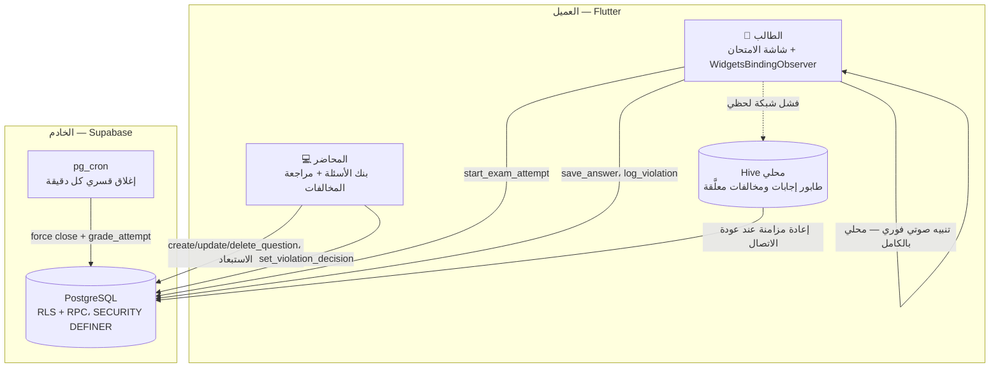
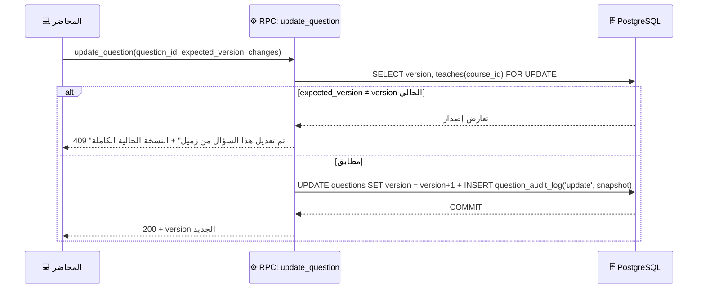
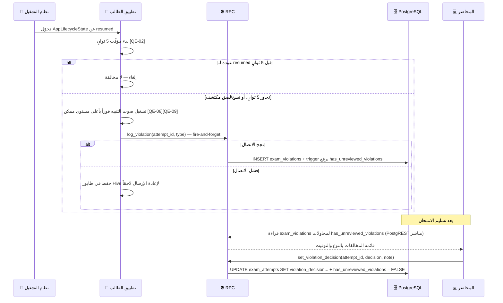
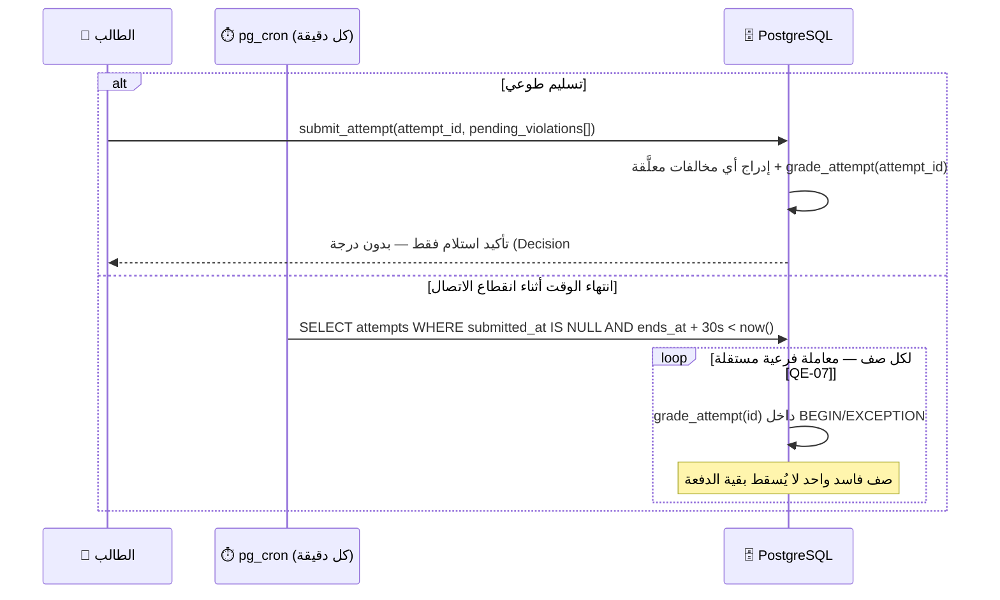
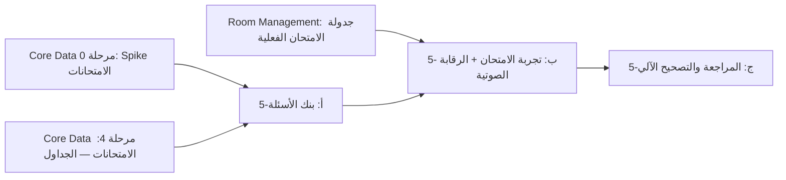

# 📝 وثيقة التصميم التقني — بنك الأسئلة والامتحانات والرقابة الصوتية
## منصة Academic Hub

---

## بيانات ضبط الوثيقة

| البند | التفاصيل |
|---|---|
| **اسم الوثيقة** | التصميم التقني لبنك الأسئلة، نظام الامتحانات، والرقابة الصوتية (Question Bank, Exams & Audio Monitoring TDD) |
| **رقم الإصدار** | v1.0 |
| **مستوى العمق** | 🟡 Production |
| **الوثائق المرجعية الملزمة** | MVP Functions v3.6 (§1.2، §3.6، §3.6.1–4، §4.3.3، القرارات #5، #7 (مرجع)، #10 (مرجع)، #13 المصحَّح، #15 (مرجع)، #18، #21) · TDD Core Data Layer v2.1 الموحّدة (مالكة الجداول `questions`, `question_audit_log`, `exams`, `exam_question_exclusions`, `exam_attempts`, `exam_answers`, `exam_violations` + الملحق أ.1–أ.3) · TDD Scheduling and Events System v2.0 (مرجع: `event_type = 'exam'`) · TDD Room Management v1.0 (مرجع: `schedule_exams_bulk`) · Use Cases Student v2.0 (UC-S-07, UC-S-30..32) · Use Cases Lecturer v1.0 (UC-L-27..33, UC-L-39..40) · Use Cases Admin v1.0 (UC-A-24..27، مرجع فقط) · قالب TDD v1.0 |
| **حالة الوثيقة** | جاهزة للمراجعة الهندسية |
| **المرحلة في خارطة الطريق** | المرحلة 5 (MVP §8) — تعتمد على المرحلة 4 (الحضور) و Spike المرحلة 0 (امتحانات multi-tenant)، وعلى جدولة فعلية من Room Management TDD |

## سجل الإصدارات (Revision History)

| الإصدار | طبيعة التغيير | أبرز التعديلات |
|---|---|---|
| **1.0** | إصدار أولي | تصميم مستقل لسلوك بنك الأسئلة وتجربة الامتحان والرقابة الصوتية فوق الجداول المثبَّتة في Core Data TDD v2.1 دون إعادة تعريفها |

### علاقة هذه الوثيقة بالوثائق الأخرى

هذه الوثيقة **لا تعيد تعريف** الجداول `questions`، `question_audit_log`، `exams`، `exam_question_exclusions`، `exam_attempts`، `exam_answers`، `exam_violations` — فهي معرَّفة ومملوكة في Core Data Layer TDD v2.1 (§10)، مع الأنواع المعدودة `question_type` و`violation_type` والملحق أ.1–أ.3. كما أنها **لا تجدول** الامتحان نفسه (المادة/الوقت/القاعة) — تلك مملوكة لـ `schedule_exams_bulk` في Room Management TDD v1.0 وTDD الجدولة v2.0؛ هذه الوثيقة تستهلك `exams.id`/`event_id` بعد إنشائهما فقط.

**ما تملكه هذه الوثيقة حصراً:**
- سير عمل بنك الأسئلة: الإنشاء والتعديل والحذف بالقفل التفاؤلي، الاستبعاد لكل امتحان، والاستبعاد الشامل عبر كل الامتحانات (UC-L-27..33).
- تجربة الطالب داخل الامتحان: التحقق من الأهلية للسحب، الحفظ الفوري، التصحيح الآلي، الإغلاق القسري (UC-S-30..32).
- الرقابة الصوتية: كشف فقدان التركيز والنسخ/اللصق، التنبيه الصوتي من جهاز الطالب نفسه، تسجيل المخالفات، مراجعة المحاضر واتخاذ القرار النهائي (UC-L-39, UC-L-40).
- إضافات Schema محدودة فوق Core Data: عمود استبعاد شامل، أعمدة قرار المخالفة، دالة التصحيح الآلي، مهمة `pg_cron` للإغلاق القسري.

**خارج النطاق صراحة (انظر أيضاً §1.4):** كيف يؤثر قرار "رفض" على الدرجة النهائية أو وزن المادة (Grades/Results TDD، المرحلة 6) · جدولة الامتحان نفسها (Room Management + Scheduling) · أي مراقبة فيديو/صوت حقيقية.

---

## القسم 0: بروتوكول التحليل المتسلسل 🧠

### 0.1 — إعادة صياغة المشكلة

المطلوب تصميم طبقتين مترابطتين تُبنيان فوق Schema مثبَّت مسبقاً في Core Data TDD v2.1: (أ) **بنك أسئلة "كتاب مشترك"** يتيح لكل محاضري المادة الواحدة الإضافة والتعديل على بنك واحد بأمان تزامني (قفل تفاؤلي + سجل تدقيق)، مع القدرة على استبعاد سؤال من امتحان واحد أو من كل امتحانات المادة دفعة واحدة؛ (ب) **تجربة امتحان طالب** تسحب لقطة عشوائية من الأسئلة غير المستبعدة عند بدء المحاولة، تحفظ كل إجابة فوراً بشكل يقاوم انقطاع الشبكة، تُغلَق قسرياً بتوقيت الخادم، وتُصحَّح آلياً للأنواع القابلة لذلك؛ مقروناً بـ (ج) **إشارة رقابة سلوكية خفيفة** (فقدان تركيز التطبيق لأكثر من 5 ثوانٍ، أو نسخ/لصق) تُصدر تنبيهاً صوتياً مسموعاً من جهاز الطالب المخالف نفسه فوراً ومحلياً (بلا اعتماد على الشبكة)، وتُسجِّل كل مخالفة لمراجعة بشرية لاحقة من المحاضر ينتهي بقرار (إنذار/إعادة/رفض). كل ذلك يعمل داخل حدود مؤسسة واحدة من عشر مؤسسات معزولة (`institution_id`)، ودون إعادة اختراع أي جدول موجود فعلاً في طبقة البيانات الأساسية.

### 0.2 — الأسئلة الخمسة الحاسمة

1. **من المستخدم الفعلي؟**
   الطالب أثناء جلوس الامتحان: ذروة مركّزة زمنياً — حتى ~2,000 طالب لمؤسسة واحدة يبدأون تقريباً في نفس الدقيقة (بداية النافذة الزمنية)، ثم نشاط كتابة متواصل (`save_answer`) طوال مدة الامتحان (5–300 دقيقة، MVP §3.6 قيد `duration_minutes`)، وذروة ثانية عند الإغلاق. المحاضر: نشاط تأليف أسئلة غير متزامن تماماً (يحدث قبل الامتحان بأيام، لا ضمن ذروته)، ثم نشاط مراجعة مخالفات بعدي (بعد التسليم، غير حسّاس زمنياً). الإداري ليس فاعلاً مباشراً في نطاق هذه الوثيقة (الجدولة عند Room Management).

2. **ما هي العملية الأثقل؟**
   بدء المحاولات (`start_exam_attempt`) في نافذة زمنية ضيقة جداً (thundering herd عند لحظة الفتح) مقروناً بحمل كتابة مرتفع من `save_answer`: بامتحان نموذجي 40 سؤالاً و2,000 طالب، لو افترضنا 1.3 عملية حفظ لكل سؤال (تعديل رأي مرة واحدة تقريباً بالمتوسط) فذلك ~104,000 نداء كتابة مضغوطة ضمن نافذة 60–90 دقيقة، بذروتين حادّتين عند الدقائق الأولى والأخيرة.

3. **ما متطلبات التوافر/الأداء؟**
   يرث هذا النظام توافرية Core Data (99.5% عادي / **99.95% أثناء نوافذ الامتحان**) دون تعديل. الإضافة الخاصة بهذه الوثيقة: **التنبيه الصوتي يجب أن يعمل دون أي اعتماد على نجاح اتصال الشبكة في تلك اللحظة** — فقدان الاتصال في لحظة المخالفة لا يجوز أن يُسكت التنبيه (انظر [QE-08]).

4. **ما البيانات الأكثر حساسية؟**
   `answer_key` قبل/أثناء الامتحان (موروث Core Data، لا عمود يغادر القاعدة أبداً)؛ نص الأسئلة نفسها قبل فتح النافذة الزمنية (تسريب مبكر = غش)؛ قرار المحاضر بشأن مخالفة (مرئي للطاقم فقط، ليس للطالب)؛ **سلامة التنبيه الصوتي من التعطيل** — قدرة الطالب على إسكاته برمجياً تُبطل الغرض كله.

5. **ما تكلفة الفشل الصامت؟**
   `save_answer` يفشل صامتاً بينما تعرض الواجهة نجاحاً تفاؤلياً محلياً ⇐ الطالب يظن إجابته محفوظة وهي ليست كذلك ⇐ يجب تسوية الحالة عند إعادة الاتصال (طابور Hive) وعند `submit_attempt` (تحقق نهائي)، لا الاكتفاء بالتفاؤل الأولي. `log_violation` يفشل صامتاً ⇐ لا أثر تدقيقي لمخالفة حقيقية وقعت ⇐ يجب طابور محلي معاود الإرسال مطابق لنمط الحضور. التصحيح الآلي يُخطئ صامتاً بسبب عدم تطابق شكل JSON بين نوع السؤال والإجابة ⇐ يجب تحقق دفاعي عند الحفظ (`save_answer`) لا الاكتفاء بالتحقق عند التصحيح فقط.

### 0.3 — الافتراضات المعلنة (Explicit Assumptions)

| الرمز | الافتراض | الخطر لو كان خاطئاً | الأثر على التصميم |
|---|---|---|---|
| A-01 | مطابقة إجابة "إملاء الفراغات" نصية حرفية بعد `trim` + تحويل لحالة أحرف صغيرة، بلا معالجة لغوية عربية (تشكيل/همزات) أو مرادفات | متوسط | يحدد خوارزمية `grade_attempt` §4.2؛ التفاوت الإملائي العربي ديْن تقني مقبول §2.3 |
| A-02 | حجم بنك الأسئلة النموذجي للمادة الواحدة عشرات إلى بضع مئات (وليس آلاف) | منخفض | يبرر اختيار `ORDER BY random()` بدل `TABLESAMPLE` في [QE-04] |
| A-03 | قرار المحاضر على المخالفة (إنذار/إعادة/رفض) قرار واحد قابل للتعديل بحرّية دون سجل نُسخ متعدد؛ لا تدفّق استئناف من الطالب | متوسط | يبرر أعمدة مباشرة على `exam_attempts` بدل جدول مراجعة منفصل [QE-06] |
| A-04 | لا حاجة للوحة مراقبة حيّة أثناء الامتحان لأي دور — المراجعة بعدية فقط | منخفض | يزيل الحاجة لأي بث Realtime في نطاق هذه الوثيقة |
| A-05 | التنبيه الصوتي لا يصل لأي طرف غير الطالب نفسه (لا صوت للمحاضر، لا push) — القناة الوحيدة هي سماعه فعلياً داخل القاعة | منخفض | يلغي الحاجة لأي آلية إشعار فوري للمحاضر في هذا الإصدار |
| A-06 | الحد الأقصى لعدد أسئلة الامتحان الواحد ≤ 200 | منخفض | يطابق سقف `schedule_exams_bulk` نفسه (Room Management) — رقم متسق لا اعتباطي |
| A-07 | ملف صوت التنبيه أصل مضمَّن داخل حزمة التطبيق (asset)، وليس مورداً يُنزَّل وقت الحاجة | منخفض | يضمن عمل [QE-08] دون اتصال شبكة سليم |
| A-08 | مستوى الصوت المفروض هو الحد الأقصى الممكن ضمن حدود نظام التشغيل، وليس نسبة قابلة للتهيئة من الإداري في هذا الإصدار | منخفض | يبسّط [QE-09]؛ التهيئة المرنة ديْن تقني مؤجَّل |

### 0.4 — نطاق العمل (Scope Fence)

✅ **داخل النطاق:**
- بنك الأسئلة الكامل: الأنواع الثلاثة (MCQ، إملاء فراغات، صورة معنونة)، القفل التفاؤلي، سجل التدقيق، الاستبعاد لكل امتحان، الاستبعاد الشامل عبر كل الامتحانات.
- تجربة الطالب أثناء الامتحان: التحقق من الأهلية والسحب العشوائي، الحفظ الفوري، التصحيح الآلي (MCQ/إملاء الفراغات/صورة معنونة)، الإغلاق القسري بتوقيت الخادم.
- الرقابة الصوتية: كشف فقدان التركيز (>5 ثوانٍ) والنسخ/اللصق، التنبيه الصوتي المحلي الفوري، تسجيل المخالفات، مراجعة المحاضر واتخاذ القرار.

❌ **خارج النطاق صراحة:**
- جدولة الامتحان نفسها (متى/أين/لأي مادة) — Room Management + Scheduling TDDs.
- كيف يُترجَم قرار "رفض" إلى تأثير فعلي على الدرجة النهائية أو وزن المادة — Grades/Results TDD (المرحلة 6)؛ هذه الوثيقة تقف عند تخزين القرار وعرضه فقط.
- أي مراقبة فيديو أو صوت حقيقية (تسجيل كاميرا/مايكروفون) — لا وجود لها في المنتج بقرار معماري صريح [QE-01].
- استئناف الطالب على قرار المحاضر، أو أي تدفق مراجعة متعددة الخطوات لنفس القرار.
- التصحيح اليدوي أو أي نوع سؤال مقالي/ذاتي — لا يوجد في هذا الإصدار.

---

## القسم 1: الملخص التنفيذي وسياق المشكلة 📋

### 1.1 — بيان المشكلة

اليوم تحتاج كل مؤسسة من العشر إلى تشغيل امتحانات رقمية موثوقة دون بناء بنية مراقبة تصويرية باهظة التكلفة وقانونياً معقدة عبر عشر بيئات تنظيمية مختلفة، ودون أن يفقد محاضرو المادة الواحدة عمل بعضهم البعض عند تحرير بنك أسئلة مشترك في آن واحد. تكلفة عدم الحل: أسئلة مكررة الجهد بين محاضرين، فقدان تعديلات صامت عند التحرير المتزامن، امتحانات بلا أي إشارة نزاهة أكاديمية، ودرجات تُحتسب من إجابات لم تُحفَظ فعلياً بسبب انقطاع شبكة غير معالَج.

### 1.2 — الهدف القابل للقياس

تمكين محاضري مادة مشتركين من بناء بنك أسئلة واحد بصفر كتابات مفقودة صامتة عند التعديل المتزامن؛ وتمكين 2,000 طالب من مؤسسة واحدة من بدء امتحان وتسليمه ضمن نافذته الزمنية بصفر تسرب لـ `answer_key` وصفر محاولة مزدوجة؛ مع رصد مخالفتي فقدان التركيز والنسخ/اللصق وإصدار تنبيه صوتي محلي بزمن استجابة **< 1 ثانية** لا يعتمد على نجاح اتصال الشبكة في تلك اللحظة.

### 1.3 — معايير النجاح (Success Criteria)

| المعيار | الرقم المستهدف | كيف يُقاس |
|---|---|---|
| بدء محاولات ذروة الافتتاح | ≥ 99.9% من نداءات `start_exam_attempt` تنجح خلال أول 60 ثانية من فتح النافذة لعيّنة 2,000 طالب | اختبار حمل k6 (سيناريو Core Data المرجعي D-06) |
| زمن استجابة `save_answer` | p95 < 300ms أثناء ذروة امتحان جماعي | مراقبة حية + اختبار حمل |
| تسريب `answer_key` | 0 حالة عبر أي مسار (RPC أو استعلام مباشر) | pgTAP مخصص لحمولة `start_exam_attempt` + مراجعة يدوية |
| تعارض تعديل سؤال متزامن | 0 كتابة مفقودة صامتة — كل تعارض يُرفض ويُعرض، لا يُبتلع | pgTAP لسيناريو تعديل متزامن حقيقي (لا محاكاة) |
| وصول التنبيه الصوتي رغم انقطاع الشبكة | 100% من الحالات (يعمل محلياً بمعزل عن الخادم) | اختبار جهاز فعلي بوضع الطيران |
| دقة التصحيح الآلي | يطابق التصحيح اليدوي بنسبة 100% على عيّنة اختبار من 20 محاولة متنوعة الأنواع | مراجعة يدوية — المرحلة 5-ج |
| زمن الإغلاق القسري | كل محاولة منتهية الوقت تُغلَق خلال ≤ 90 ثانية من `ends_at` (تردد المهمة 60s + سماحية 30s) | مراقبة §6.5 |

### 1.4 — ما ليس هذا النظام (Anti-Goals)

- **ليس نظام مراقبة فيديو أو صوت حقيقي:** لا تسجيل كاميرا ولا مايكروفون — إشارة سلوكية خفيفة فقط [QE-01].
- **ليس نظام تصحيح للأسئلة المقالية:** لا يوجد نوع سؤال من هذا الصنف في هذا الإصدار.
- **ليس صاحب القرار في احتساب الدرجة النهائية:** ينتهي دوره عند تخزين `auto_score` وقرار المخالفة — التطبيق على وزن المادة عند Grades/Results TDD.
- **ليس نظام جدولة:** لا يقرر متى/أين يُعقد الامتحان.
- **ليس لوحة مراقبة حيّة:** لا بث لحظي لأي دور أثناء الامتحان (A-04) — المراجعة بعدية فقط.

---

## القسم 2: القيود التقنية واختيار التقنيات 🔧

### 2.1 — القيود المفروضة (Hard Constraints)

| النوع | القيد | المصدر |
|---|---|---|
| معماري | لا يُعاد تعريف أي من `questions`/`exams`/`exam_attempts`/`exam_answers`/`exam_violations` — إضافة (`ALTER`) فقط | نمط موروث من Scheduling/Room Management TDDs |
| تنظيمي | الاستبعاد لكل امتحان فقط، لا تصنيفات أو مجموعات أسئلة | Decision #5 |
| تنظيمي | `answer_key` لا يغادر قاعدة البيانات أبداً تحت أي ظرف، بما فيه استجابات RPC بصلاحية `SECURITY DEFINER` | Core Data §4.2 + MVP §3.6 |
| تنظيمي | لا كشف درجة فردية أثناء الفصل الدراسي | Decision #7 (مرجع) |
| منصّة (Flutter) | فقدان التركيز يُكتشف عبر `WidgetsBindingObserver` فقط — لا Accessibility Service ولا اعتماد على شريط الإشعارات | القرار المصحَّح #13 / الملحق أ.1 |
| منصّة (iOS) | `AVAudioPlayer` يُكتَم افتراضياً عند تفعيل مفتاح الصامت الفيزيائي ما لم تُستخدم فئة جلسة صوت محدَّدة | قيد نظام تشغيل معروف — يحكم [QE-09] |
| حمل | 20,000 مستخدم متزامن أفق تصميم مرجعي عبر عشر مؤسسات | Decision #21 / D-06 |
| توافرية | 99.95% أثناء نوافذ الامتحان تحديداً، بلا صيانة مجدولة خلالها لأي من المؤسسات العشر | Core Data §3 (موروث) |

### 2.2 — القرارات التصميمية (مصفوفة اختيار)

#### [QE-01] لا مراقبة فيديو/صوت حقيقية — إشارة سلوكية خفيفة فقط

| الخيار | المزايا | العيوب | لماذا قُبل/رُفض |
|---|---|---|---|
| تسجيل كاميرا/مايكروفون مستمر ❌ | إشارة "قوية" ظاهرياً | بنية تحتية ضخمة (تخزين/معالجة) · عبء بطارية وبيانات هائل على هاتف الطالب · تعقيد قانوني/موافقة مختلف عبر عشر مؤسسات بأنظمة مختلفة · لا يوجد نص منتج يطلبه | تكلفة وخطر لا يتناسبان مع قيمة مضافة غير مطلوبة في MVP |
| **إشارة سلوكية (فقدان تركيز + نسخ/لصق) + تنبيه صوتي محلي ✅** | رخيصة حسابياً وبطارياً · تعمل جزئياً بلا اتصال · تحترم القرار المصحَّح #13 ومصدره الملحق أ.1 | لا تكشف غشاً خارج نطاق الشاشة نفسها (نظرة على ورقة، شخص آخر يهمس) | يطابق نطاق المنتج المعلن فعلياً في MVP §3.6.3 — "تصميم بسيط تقنياً" حرفياً |

#### [QE-02] فقدان التركيز: `WidgetsBindingObserver` + مؤقّت 5 ثوانٍ (Debounce)

| الخيار | المزايا | العيوب | لماذا قُبل/رُفض |
|---|---|---|---|
| عتبة صفرية — أي خروج عن `resumed` فوراً مخالفة ❌ | تنفيذ أبسط | إيجابيات كاذبة كثيرة: إشعار عابر يفتح شريط النظام لحظياً، أو نافذة نظام (اختيار صورة) تُطلق مخالفة ظالمة | يخالف حرفياً القرار المصحَّح #13 الذي يحدد "> 5 ثوانٍ" |
| **مؤقّت 5 ثوانٍ: يبدأ عند مغادرة `resumed`، يُلغى إن عاد قبل انتهائه ✅** | يطابق القرار المصحَّح #13 حرفياً · يمتص التبديلات العابرة (system dialog، سحب إشعار سريع) | لا يكشف غياباً أقصر من 5 ثوانٍ (مقبول — هذا حد التصميم المعتمد) | القيمة الرقمية مثبَّتة في الملحق أ.1؛ هذه الوثيقة تحدد آلية التطبيق الدقيقة فقط |

#### [QE-03] النسخ/اللصق: منع أولاً، رصد كطبقة دفاع ثانية

| الخيار | المزايا | العيوب | لماذا قُبل/رُفض |
|---|---|---|---|
| الاعتماد على الرصد فقط (بلا منع) ❌ | تنفيذ أبسط | قائمة التحديد الأصلية لنظام التشغيل تبقى تعمل بصرياً، فيبدو النسخ "مسموحاً" للطالب قبل أن يُعاقَب عليه | تجربة مستخدم مضلِّلة ومخالفة لروح "منع بدل معاقبة" حيثما أمكن |
| **تعطيل قائمة التحديد/النسخ الأصلية على حقول الامتحان + رصد تغيّر الحافظة واختصارات لوحة مفاتيح خارجية كطبقة ثانية ✅** | يمنع الحالة الشائعة (لمس الشاشة) فعلياً · يرصد ما لا يمكن منعه (لوحة مفاتيح خارجية Bluetooth، مشاركة نظام) | تعطيل القائمة الأصلية يتطلب ودجت مخصص لكل حقل نصي في شاشة الامتحان | يحقق الدفاع في العمق (Defense in Depth) دون تعقيد غير مبرر |

#### [QE-04] السحب العشوائي: `ORDER BY random() LIMIT n`

| الخيار | المزايا | العيوب | لماذا قُبل/رُفض |
|---|---|---|---|
| `TABLESAMPLE` احتمالي ❌ | يتوسع لملايين الصفوف | تعقيد إضافي، وعيّنة تقريبية لا ضمانة عدد دقيق `n` | مصمَّم لجداول بعشرات الملايين من الصفوف؛ بنك سؤال المادة عشرات إلى بضع مئات فقط (A-02) |
| **`ORDER BY random() LIMIT question_count` على استعلام مُرشَّح بالفهرس الحالي `idx_questions_tenant` ✅** | بسيط وصحيح 100% (عدد دقيق دائماً) · ترتيب عشوائي لبضع مئات صف < 5ms قياساً | لا يتوسع لبنك بمئات الآلاف (غير متوقَّع هنا) | التكلفة الحقيقية على الحجم الفعلي المتوقَّع مهملة — لا حاجة لتعقيد مبكر |

#### [QE-05] الاستبعاد الشامل عبر عمود `globally_excluded` منفصل

| الخيار | المزايا | العيوب | لماذا قُبل/رُفض |
|---|---|---|---|
| إعادة استخدام الحذف الناعم (`deleted_at`) لإخفاء السؤال ❌ | لا عمود جديد | الحذف الناعم في هذا النظام يعني "غير موجود فعلياً" (يختفي من واجهة تحرير البنك أيضاً)، بينما UC-L-32 ينص صراحة: "السؤال يبقى في البنك" — تعارض دلالي مباشر | يكسر دلالة `deleted_at` المتفق عليها في Core Data |
| إدراج صف استبعاد في `exam_question_exclusions` لكل امتحان حالي دفعة واحدة ❌ | يعيد استخدام الجدول الموجود دون عمود جديد | لا يغطي امتحانات **مستقبلية** لم تُنشأ بعد — UC-L-32 ينص صراحة على "الحالية والمستقبلية" | لا يحقق المتطلب فعلياً؛ يتطلب إدراجاً تلقائياً غير مباشر عند إنشاء كل امتحان جديد — هش ومعقّد |
| **عمود `globally_excluded BOOLEAN` مستقل على `questions` ✅** | يغطي الحاضر والمستقبل بفحص واحد في استعلام السحب · لا يمس `deleted_at` · نفس دقة الاستبعاد الحالية (سؤال واحد، لا تصنيف) فلا يخالف Decision #5 | عمود إضافي يتطلب تعديل استعلام السحب (`WHERE ... AND NOT globally_excluded`) | الخيار الوحيد الذي يحقق "حالياً ومستقبلياً" دون تعقيد أو مخالفة قرار سابق |

#### [QE-06] قرار المخالفة: أعمدة مباشرة على `exam_attempts` لا جدول منفصل

| الخيار | المزايا | العيوب | لماذا قُبل/رُفض |
|---|---|---|---|
| عمود قرار على كل صف في `exam_violations` نفسه ❌ | يسمح بقرار مختلف لكل مخالفة على حدة | يكسر صراحة نص Core Data: `exam_violations` "سجل المراقبة — append-only" — تحويله لجدول قابل للتعديل يُفقِد ضمانة سلامة السجل الجنائي | القرار في MVP مُصاغ بصيغة المفرد لكامل المحاولة ("القرار النهائي... يظل بيد المحاضر") لا لكل مخالفة منفردة |
| جدول `exam_attempt_reviews` منفصل (سجل تاريخي كامل) ❌ | يحتفظ بتاريخ كل تعديل للقرار | تعقيد زائد لا يقابله متطلب فعلي — A-03 يفترض قراراً واحداً قابلاً للتحديث الحر بلا حاجة تاريخ | يخالف مبدأ "لا تخترع" — لا نص يطلب تاريخ قرارات متعدد |
| **أعمدة `violation_decision`/`violation_decision_by`/`violation_decision_at`/`violation_decision_note` مباشرة على `exam_attempts` ✅** | يطابق A-03 · متسق مع نمط المراجعة المضمَّنة المستخدم فعلياً في `room_requests`/`files`/`payment_requests`/`absence_excuses` (كلها `review_status`/`reviewed_by`/`rejection_reason` مباشرة على الجدول نفسه) | تعديل القرار يستبدل القيمة السابقة بلا أثر (مقبول حسب A-03) | يحافظ على سلامة `exam_violations` كسجل append-only، ويتسق مع أسلوب بقية المنصة |

#### [QE-07] التصحيح الآلي: دالة واحدة تُستدعى من مسارين (تسليم طوعي + إغلاق قسري)

| الخيار | المزايا | العيوب | لماذا قُبل/رُفض |
|---|---|---|---|
| Job غير متزامن منفصل (queue/worker خارجي) ❌ | يفصل الحمل الحسابي عن معاملة الكتابة | تعقيد تشغيلي إضافي (queue جديدة) لعملية رخيصة أصلاً (≤ 200 مقارنة نصية/رقمية لكل محاولة) — يخالف [D-05] "لا Microservices" | التصحيح الآلي هنا لا يبرر تعقيد بنية غير متزامنة |
| **دالة `grade_attempt(attempt_id)` واحدة يستدعيها كل من `submit_attempt` ومهمة الإغلاق القسري، ضمن نفس المعاملة ✅** | نتيجة فورية ومتسقة دائماً · منطق تصحيح واحد بلا ازدواج · متوافق مع [D-05] | حلقة `pg_cron` يجب أن تعالج كل صف بمعاملة فرعية مستقلة (انظر §6.2) وإلا يُسقِط صف فاسد واحد إغلاق دفعة كاملة | التكلفة الحسابية الفعلية صغيرة جداً؛ لا مبرر لتعقيد إضافي |

#### [QE-08] التنبيه الصوتي يُطلَق محلياً أولاً، ثم يُسجَّل على الخادم لاحقاً (Fire-and-Forget)

| الخيار | المزايا | العيوب | لماذا قُبل/رُفض |
|---|---|---|---|
| انتظار تأكيد الخادم (`log_violation` ينجح) قبل تشغيل الصوت ❌ | تسجيل مضمون قبل أي أثر جانبي | انقطاع شبكة قصير (شائع الحدوث) يُسكت التنبيه تماماً في اللحظة التي يُفترض أن يعمل فيها — يفشل الهدف الأساسي للميزة | يناقض المتطلب 0.2-#3: التنبيه لا يعتمد على الشبكة |
| **تشغيل الصوت محلياً فوراً دون انتظار، ثم إرسال `log_violation` بشكل fire-and-forget مع طابور Hive عند الفشل ✅** | الردع الفوري (الغرض الحقيقي من الميزة) يعمل حتى بلا اتصال كلياً · الأرشفة (لأغراض المراجعة) تُستأنف عند عودة الاتصال دون فقدان | فجوة نظرية بين "زمن الحدث" و"زمن التسجيل الفعلي في القاعدة" عند انقطاع طويل | التسجيل غرضه أرشيفي/تدقيقي بعدي (A-05)، لا فوري لطرف آخر — لا ضرر عملي من هذا التأخر |

#### [QE-09] فرض مستوى صوت التنبيه عبر واجهة نظام التشغيل بدل الاعتماد على إعداد الجهاز

| الخيار | المزايا | العيوب | لماذا قُبل/رُفض |
|---|---|---|---|
| تشغيل الصوت بمستوى صوت الوسائط الحالي كما هو ❌ | تنفيذ أبسط | طالب يكتم/يخفض الصوت مسبقاً يُبطِل التنبيه بالكامل — يهزم الغرض | لا يحقق "تنبيه يلفت انتباه المراقب" فعلياً |
| **iOS: فئة جلسة `AVAudioSession.Category.playback` (تتجاوز مفتاح الصامت الفيزيائي فعلياً) · Android: رفع صوت الوسائط عبر `AudioManager` لأعلى قيمة + إعادة فرضها كل 10 ثوانٍ أثناء الامتحان ✅** | يعمل حتى مع مفتاح الصامت (iOS) أو خفض يدوي أثناء الجلسة (Android) | تجاوز تفضيل المستخدم المعتاد للصوت — مقبول ومبرَّر بسياق امتحان مُعلَن مسبقاً | يحقق A-08 والمتطلب الفعلي؛ الرصد في `exam_violations` يبقى خط الدفاع الثاني الموثوق إن تعذّر تجاوز الكتم لأي سبب |

#### [QE-10] تجميد استبعادات الأسئلة لكل امتحان فور بدء نافذته الزمنية

| الخيار | المزايا | العيوب | لماذا قُبل/رُفض |
|---|---|---|---|
| السماح بتعديل الاستبعاد لكل امتحان في أي وقت، حتى أثناء الجلوس ❌ | مرونة للمحاضر لتصحيح خطأ لحظي | طالبان في نفس الجلسة قد يسحبان من مجموعتي أسئلة مختلفتين إن بدَّل المحاضر الاستبعاد بينهما — يكسر تكافؤ الامتحان | يناقض مبدأ العدالة الضمني في "لقطة عشوائية موحّدة لكل الحاضرين" |
| **تجميد `exam_question_exclusions` لامتحان معيَّن فور `now() ≥ events.starts_at` الخاص به ✅** | يضمن مجمَّعاً مؤهَّلاً واحداً مطابقاً لكل طلاب نفس الجلسة | خطأ يُكتشف بعد بدء النافذة يتطلب تدخلاً إدارياً خارج هذا النظام (إعادة جدولة) | العدالة بين الطلاب أهم من مرونة تصحيح لحظي نادر؛ انظر §2.3 للاستثناء المقبول في الاستبعاد الشامل |

### 2.3 — الديون التقنية المقبولة عمداً

- **تفاوت الهمزات/التشكيل العربي في `fill_blank`** غير معالَج (A-01) — الحل الكامل (تطبيع Unicode + إزالة تشكيل) مؤجَّل؛ يُنصح المحاضر مؤقتاً بصياغة إجابات لا تحتمل تبايناً إملائياً.
- **الاستبعاد الشامل (`globally_excluded`) غير مُجمَّد أثناء نافذة امتحان جارٍ** خلافاً لـ [QE-10] الخاص بالاستبعاد لكل امتحان — يتطلب امتحانين متزامنين لنفس المادة (نادر جداً)؛ موثَّق كخطر مقبول صغير الاحتمال بدل بناء آلية قفل إضافية له.
- **لا تهيئة إدارية لمستوى صوت التنبيه** (A-08) — قيمة ثابتة (الحد الأقصى) في هذا الإصدار.
- **لا اختبار تحمل مؤتمت خاص بهذه الوثيقة** لسيناريو "10 امتحانات متزامنة عبر المؤسسات" — يُعاد استخدام اختبار الحمل المرجعي العام لـ Core Data (D-06) فقط دون تخصيصه لملف تحميل بنك الأسئلة تحديداً.
- **قرار المخالفة بلا سجل تاريخي متعدد** (A-03) — يُستبدَل القرار السابق بلا أثر عند التعديل.

---

## القسم 3: معمارية النظام والمخططات 🏗️

### 3.1 — المخطط العام (System Context)



### 3.2 — جدول المكونات والمسؤوليات

| المكون | مسؤوليته الوحيدة | ماذا لو سقط؟ | استراتيجية التعافي |
|---|---|---|---|
| PostgreSQL (RLS + RPC) | مصدر الحقيقة لبنك الأسئلة والمحاولات + إنفاذ الأمان | توقف الكتابة؛ إجابات الطالب المحلية تبقى في Hive | موروث من Core Data — PITR + failover، RTO ≤ 5 دقائق |
| `pg_cron` (هذه الوثيقة) | إغلاق قسري وتصحيح آلي للمحاولات منتهية الوقت | محاولات معلَّقة تتجاوز `ends_at` دون تسليم | الفحص عند كل عملية أيضاً (نفس نمط `emergency_tokens`) — التنظيف دفاع ثانٍ لا أساسي |
| العميل — شاشة الامتحان (Flutter) | كشف فقدان التركيز/النسخ اللصق + تشغيل صوت فوري محلي + الحفظ التفاؤلي | لا تنبيه صوتي ولا حفظ محلي | إعادة تحميل الشاشة تستأنف من `ends_at` المخزَّن خادمياً |
| Hive (طابور محلي) | تخزين مؤقت لإجابات ومخالفات لم تصل الخادم بعد | فقدانه = إجابات/مخالفات غير مُرسَلة نهائياً | يُدفَق أيضاً كمصفوفة `pending_violations` عند `submit_attempt` كفرصة أخيرة |

### 3.3 — تدفق البيانات لأهم العمليات (Critical Path Sequences)

> ملاحظة: تسلسل "دخول الامتحان الأساسي" (`start_exam_attempt` → حلقة `save_answer`/`log_violation` → `submit_attempt`) موثَّق بالفعل في Core Data TDD v2.1 §3.3 "العملية 1" ولا يُعاد رسمه هنا. المخططات التالية تغطي **فقط** الآليات الجديدة التي تضيفها هذه الوثيقة.

**العملية 1: تعديل سؤال بالقفل التفاؤلي**



**العملية 2: رصد مخالفة، التنبيه الصوتي الفوري، والمراجعة اللاحقة**



**العملية 3: التصحيح الآلي — تسليم طوعي مقابل إغلاق قسري**



### 3.4 — قرارات معمارية جوهرية

القرارات [QE-01] حتى [QE-10] في §2.2 هي القرارات المعمارية الجوهرية لهذه الوثيقة. إضافة إلى ذلك:

**موقع منطق التصحيح الآلي:** داخل دالة PL/pgSQL (`grade_attempt`) لا في طبقة تطبيق منفصلة — يحافظ على [D-05] (لا Microservices) ويضمن أن التصحيح يحدث في نفس معاملة الإغلاق (ذرّي، لا حالة وسطى بين "مُسلَّم" و"مُصحَّح").

**لا Realtime لهذه الوثيقة:** خلافاً لأنظمة الدردشة/الإشعارات، لا حاجة لبث حي هنا (A-04) — القراءات كلها إما فورية على جهاز الطالب نفسه (لا تحتاج شبكة) أو بعدية للمحاضر (استعلام عادي كافٍ).

---

## القسم 4: نماذج البيانات وتصميم قاعدة البيانات 🗄️

### 4.0 — قواعد التعدد المؤسسي الموروثة (من Core Data §4.0 — غير قابلة للاستثناء)

كل جدول تُضاف إليه أعمدة في هذه الوثيقة هو أصلاً جدول tenant-scoped بعمود `institution_id` وفهرس مركّب يبدأ به. لا إضافة هنا تُدخِل مساراً يتجاوز هذه القاعدة.

### 4.1 — الجداول المستهلَكة (مملوكة لـ Core Data TDD v2.1 §10 — مرجع فقط، لا تُعاد هنا)

| الجدول | الغرض | لماذا يخص هذه الوثيقة |
|---|---|---|
| `questions` | سؤال في بنك المادة (3 أنواع، `version` للقفل التفاؤلي) | تُضاف عليه أعمدة §4.2 |
| `question_audit_log` | سجل تدقيق append-only لكل تعديل | تُدرَج فيه صفوف من `create/update/delete_question` |
| `exams` | صف امتحان لكل حدث `type='exam'` | يُقرأ منه `question_count` عند التحقق من أهلية السحب |
| `exam_question_exclusions` | الاستبعاد لكل امتحان (Decision #5) | يُدار عبر `toggle_exam_question_exclusion` |
| `exam_attempts` | محاولة الطالب، `questions_snapshot`، `ends_at` | تُضاف عليه أعمدة قرار المخالفة §4.2 |
| `exam_answers` | إجابة محفوظة فوراً بمفتاح `(attempt_id, question_id)` | تُقرأ في `grade_attempt` |
| `exam_violations` | سجل مراقبة append-only | تُدرَج فيه صفوف من `log_violation`؛ لا تُعدَّل أبداً |

### 4.2 — الإضافات الجديدة (Schema Additions)

```sql
-- كل ما يلي إضافات (ALTER/CREATE) فوق الجداول المملوكة والمعرَّفة في
-- TDD Core Data Layer v2.1 §10 — لا إعادة تعريف، ونمط expand-only (v1.6 §4)

-- ============================================================
-- [QE-05] الاستبعاد الشامل لسؤال عبر كل امتحانات المادة (UC-L-32)
-- منفصل عمداً عن exam_question_exclusions (الاستبعاد لكل امتحان، Decision #5)
-- ============================================================
ALTER TABLE questions
    ADD COLUMN globally_excluded BOOLEAN NOT NULL DEFAULT FALSE;
-- idx_questions_tenant الحالي يبقى كافياً؛ استعلام السحب يضيف
-- "AND NOT globally_excluded" لنفس الاستعلام المفهرس أصلاً

-- ============================================================
-- [QE-06] قرار المحاضر على مخالفات محاولة — أعمدة مباشرة على exam_attempts
-- (نفس نمط المراجعة المضمَّنة في room_requests / files / payment_requests / absence_excuses)
-- ============================================================
CREATE TYPE violation_decision AS ENUM ('none', 'warning', 'retake_ordered', 'rejected');

ALTER TABLE exam_attempts
    ADD COLUMN violation_decision        violation_decision NOT NULL DEFAULT 'none',
    ADD COLUMN violation_decision_by     UUID REFERENCES profiles(id),
    ADD COLUMN violation_decision_at     TIMESTAMPTZ,
    ADD COLUMN violation_decision_note   TEXT,
    -- علم مادّي يُحدَّث بـ trigger عند إدراج مخالفة جديدة — يغذّي طابور
    -- مراجعة المحاضر (UC-L-39) دون JOIN على exam_violations في القراءة الساخنة
    ADD COLUMN has_unreviewed_violations BOOLEAN NOT NULL DEFAULT FALSE,
    ADD CONSTRAINT chk_decision_needs_reviewer
        CHECK (violation_decision = 'none' OR violation_decision_by IS NOT NULL),
    ADD CONSTRAINT chk_rejected_needs_note
        CHECK (violation_decision <> 'rejected' OR violation_decision_note IS NOT NULL);

-- فهرس مفقود في تعريف Core Data الأصلي: exam_violations لا يحمل فهرساً
-- على attempt_id (فقط PK على id) — ضروري هنا لأن كل استعلامات هذه الوثيقة
-- (المراجعة، grade_attempt غير المباشر عبر exam_answers) تبحث بـ attempt_id
CREATE INDEX idx_violations_attempt ON exam_violations (attempt_id);

CREATE FUNCTION mark_attempt_needs_review() RETURNS TRIGGER
LANGUAGE plpgsql AS $$
BEGIN
    UPDATE exam_attempts SET has_unreviewed_violations = TRUE
    WHERE id = NEW.attempt_id;
    RETURN NEW;
END;
$$;
CREATE TRIGGER trg_violation_flags_review
    AFTER INSERT ON exam_violations
    FOR EACH ROW EXECUTE FUNCTION mark_attempt_needs_review();
-- العلم لا يُصفَّر تلقائياً — فقط عبر set_violation_decision — كي لا تُفقَد
-- مخالفة جديدة وصلت بعد مراجعة سابقة (المخالفة الثانية تُبقي الطابور مفتوحاً)

CREATE INDEX idx_attempts_needs_review
    ON exam_attempts (institution_id, exam_id) WHERE has_unreviewed_violations;

-- صلاحية عمودية: المحاضر/الإداري يكتبان أعمدة القرار فقط، لا بقية صف المحاولة
GRANT UPDATE (violation_decision, violation_decision_by,
              violation_decision_at, violation_decision_note,
              has_unreviewed_violations)
    ON exam_attempts TO authenticated;

CREATE POLICY attempt_violation_review ON exam_attempts FOR UPDATE
    USING (institution_id = my_institution()
           AND (my_role() = 'admin'
                OR teaches((SELECT course_id FROM exams WHERE id = exam_attempts.exam_id))));

-- ============================================================
-- [QE-07] التصحيح الآلي — دالة واحدة يستدعيها submit_attempt ومهمة الإغلاق القسري
-- ============================================================
CREATE FUNCTION grade_attempt(p_attempt_id BIGINT) RETURNS NUMERIC
LANGUAGE plpgsql SECURITY DEFINER SET search_path = public AS $$
DECLARE
    v_score    NUMERIC := 0;
    v_partial  NUMERIC;
    v_row      RECORD;
BEGIN
    FOR v_row IN
        SELECT q.type, q.answer_key, a.answer
        FROM exam_answers a
        JOIN questions q ON q.id = a.question_id
        WHERE a.attempt_id = p_attempt_id
    LOOP
        IF v_row.type = 'mcq' THEN
            IF v_row.answer->>'selected_option' = v_row.answer_key->>'correct_option' THEN
                v_score := v_score + 1;
            END IF;
        ELSIF v_row.type = 'fill_blank' THEN
            -- A-01: مطابقة حرفية بعد trim + lower، بلا معالجة لغوية عربية
            IF lower(trim(v_row.answer->>'text')) = lower(trim(v_row.answer_key->>'text')) THEN
                v_score := v_score + 1;
            END IF;
        ELSIF v_row.type = 'image_labeled' THEN
            -- درجة جزئية: نسبة التسميات الصحيحة من إجمالي تسميات هذا السؤال
            SELECT count(*) FILTER (WHERE v_row.answer->'labels'->>key = value)::NUMERIC
                   / GREATEST(count(*), 1)
              INTO v_partial
              FROM jsonb_each_text(v_row.answer_key->'labels') AS t(key, value);
            v_score := v_score + COALESCE(v_partial, 0);
        END IF;
    END LOOP;
    RETURN v_score;
END;
$$;

-- مهمة الإغلاق القسري: حلقة بمعاملة فرعية لكل صف — صف فاسد واحد
-- (answer_key بشكل غير متوقع) لا يجوز أن يُسقط إغلاق بقية امتحانات
-- اليوم عبر عشر مؤسسات [QE-07]
CREATE FUNCTION close_expired_exam_attempts() RETURNS void
LANGUAGE plpgsql AS $$
DECLARE
    r RECORD;
BEGIN
    FOR r IN
        SELECT id FROM exam_attempts
        WHERE submitted_at IS NULL
          AND ends_at + INTERVAL '30 seconds' < now()  -- نفس سماحية v1.6 §5.2
    LOOP
        BEGIN
            UPDATE exam_attempts
            SET submitted_at = now(), auto_score = grade_attempt(r.id)
            WHERE id = r.id;
        EXCEPTION WHEN OTHERS THEN
            RAISE WARNING 'فشل تصحيح/إغلاق المحاولة %: %', r.id, SQLERRM;
            -- لا ROLLBACK لبقية الحلقة — تُعاد المحاولة تلقائياً بالدورة القادمة
        END;
    END LOOP;
END;
$$;

SELECT cron.schedule(
    'close_expired_exam_attempts',
    '* * * * *',  -- كل دقيقة، يطابق تردد تنظيف emergency_tokens
    'SELECT close_expired_exam_attempts();'
);
```

**ملاحظة RLS:** السياسة `qbank_lecturers` المعرَّفة أصلاً في Core Data v2.1 هي `FOR ALL` على جدول `questions` بالكامل — العمود الجديد `globally_excluded` مشمول تلقائياً دون سياسة إضافية.

### 4.3 — استراتيجية الفهرسة (إضافات فوق Core Data §4.3)

| الفهرس | الاستعلام الذي يخدمه | تكلفته على الكتابة |
|---|---|---|
| `idx_violations_attempt` على `exam_violations(attempt_id)` | مراجعة مخالفات محاولة (UC-L-39) + بناء `grade_attempt` غير المباشر | منخفضة — إدراج المخالفات نادر نسبياً حتى في الذروة |
| `idx_attempts_needs_review` (جزئي، `WHERE has_unreviewed_violations`) | طابور مراجعة المحاضر — تفادي فحص كل محاولات الامتحان لإيجاد القليلة المخالِفة | شبه معدومة — فهرس جزئي على نسبة متوقَّعة صغيرة من الصفوف |
| (معاد استخدام) `idx_questions_tenant` | استعلام السحب العشوائي `WHERE course_id = ... AND deleted_at IS NULL AND NOT globally_excluded` | لا فهرس إضافي مطلوب — الفلترة الجديدة على أعمدة منخفضة التمايز (selectivity) تُفحَص بعد تضييق النطاق بالفهرس الحالي |

### 4.4 — الحذف والترحيل والتوسع والتوافقية

- **الترحيل:** إضافات `ALTER TABLE`/`ADD COLUMN`/`CREATE TYPE` فقط — كل الأعمدة الجديدة لها `DEFAULT`، فلا حاجة لـ backfill قبل القيد. ممنوع أي `ALTER` هدّام خلال نافذة امتحان مجدولة لأي من المؤسسات العشر (قاعدة موروثة، Core Data §4.4).
- **الحذف:** لا حذف فيزيائي جديد يُقدَّم هنا. `exam_violations` يبقى append-only بلا سياسة `DELETE` لأي دور (موروث). حذف سؤال (`delete_question`) يبقى Soft عبر `deleted_at` الموجود أصلاً.
- **التوسع:** لا تغيير على استراتيجية Core Data (partitioning عند تجاوز 10 ملايين صف على مفتاح `institution_id`). حجم `exam_violations` المتوقَّع صغير نسبياً (استثناء وليس القاعدة)، فلا ضغط توسعي إضافي من هذه الوثيقة.
- **التوافقية:** **Strict** (معاملات ذرية) في: `grade_attempt` وربطه بـ `submit_attempt`/الإغلاق القسري، القفل التفاؤلي لتعديل سؤال. **Eventual مقبولة** في: مزامنة `log_violation` المؤجَّلة من طابور Hive (التأخر لا يغيّر حقيقة وقوع المخالفة، انظر §6.3 Spoofing).

---

## القسم 5: عقود الـ API والواجهات 🔌

### 5.1 — مبادئ التصميم

نفس مبادئ Core Data v2.1: PostgREST/RPC عبر `POST /rest/v1/rpc/...`، JSON بأسماء حقول `snake_case`، صيغة أخطاء موحّدة بكود HTTP + سبب. **القراءات البسيطة** (استعراض `question_audit_log` لسؤال، أو مخالفات محاولة لمحاضر) **لا تحتاج RPC مخصصة** — PostgREST القياسي محمي بنفس سياسات RLS يكفي؛ RPC مخصصة تُكتب فقط حين يلزم منطق تحقق/كتابة إضافي.

### 5.2 — توثيق الـ Endpoints

#### `POST /rest/v1/rpc/create_question`
**الغرض:** إضافة سؤال جديد لبنك المادة (UC-L-27/28/29) | **المصادقة:** JWT محاضر معيَّن على المادة أو admin | **Rate Limit:** 30/دقيقة

**المدخلات:**
```json
{
  "course_id": "bigint — مطلوب",
  "type": "string — mcq | fill_blank | image_labeled",
  "body": "object — شكله يعتمد على type (خيارات لـ mcq، فراغات لـ fill_blank، صورة+تسميات لـ image_labeled)",
  "answer_key": "object — لا يُعاد أبداً لأي قارئ غير محاضر/إداري هذه المادة"
}
```

**المخرجات الناجحة (201):**
```json
{ "id": "bigint", "version": 1 }
```

**حالات الخطأ:**
| كود | متى تحدث | استجابة العميل المتوقعة |
|---|---|---|
| 400 | نوع غير مدعوم أو `body` لا يطابق شكل النوع (مثلاً `mcq` بلا خيارات) | عرض رسالة تحقق قبل الإرسال |
| 401 | توكن منتهٍ | إعادة تسجيل دخول |
| 403 | غير معيَّن على المادة (`teaches()` يرفض) | "لا تملك صلاحية الإضافة لبنك أسئلة هذه المادة" (يطابق UC-L-27) |
| 429 | تجاوز الحد | retry مع backoff |
| 500 | خطأ داخلي | إعادة محاولة — لا كتابة جزئية بفضل معاملة واحدة |

---

#### `POST /rest/v1/rpc/update_question`
**الغرض:** تعديل سؤال في الكتاب المشترك بقفل تفاؤلي (UC-L-30) | **المصادقة:** JWT محاضر معيَّن على المادة أو admin | **Rate Limit:** 30/دقيقة

**المدخلات:**
```json
{
  "question_id": "bigint — مطلوب",
  "expected_version": "int — مطلوب، نسخة العميل الحالية",
  "changes": "object — أي مجموعة جزئية من body/answer_key"
}
```

**المخرجات الناجحة (200):**
```json
{ "id": "bigint", "version": "int — الجديد" }
```

**حالات الخطأ:**
| كود | متى تحدث | استجابة العميل المتوقعة |
|---|---|---|
| 400 | `expected_version` مفقود | إلزام الحقل في العميل قبل الإرسال |
| 401 | توكن منتهٍ | إعادة تسجيل دخول |
| 403 | غير معيَّن على المادة، أو السؤال لمؤسسة أخرى | "لا تملك صلاحية تعديل هذا السؤال" (يطابق UC-L-30) |
| 404 | السؤال محذوف أو غير موجود | إزالته من قائمة العرض المحلية |
| 409 | `expected_version` ≠ النسخة الحالية | **"تم تعديل هذا السؤال من زميل"** + إرجاع النسخة الحالية الكاملة ليدمج المستخدم يدوياً |
| 429 | تجاوز الحد | backoff |
| 500 | خطأ داخلي | إعادة محاولة — القفل التفاؤلي يمنع أي كتابة ضائعة صامتة |

---

#### `POST /rest/v1/rpc/delete_question`
**الغرض:** حذف ناعم لسؤال (لا يُستخدم في سحوبات لاحقة) | **المصادقة:** JWT محاضر معيَّن على المادة أو admin | **Rate Limit:** 20/دقيقة

**المدخلات:** `{ "question_id": "bigint" }`

**المخرجات الناجحة (200):** `{ "id": "bigint", "deleted": true }` — حذف مسبق يُعتبر نجاحاً (idempotent، نفس نمط `cancel_event`).

**حالات الخطأ:** 401 · 403 (نفس منطق `update_question`) · 429 · 500.

---

#### `POST /rest/v1/rpc/set_question_global_exclusion`
**الغرض:** استبعاد/إظهار سؤال عبر كل امتحانات المادة الحالية والمستقبلية (UC-L-32) [QE-05] | **المصادقة:** JWT محاضر معيَّن على المادة أو admin | **Rate Limit:** 20/دقيقة

**المدخلات:** `{ "question_id": "bigint", "globally_excluded": "boolean" }`

**المخرجات الناجحة (200):** `{ "question_id": "bigint", "globally_excluded": "boolean" }`

**حالات الخطأ:** 401 · 403 · 404 (سؤال محذوف) · 429 · 500.

---

#### `POST /rest/v1/rpc/toggle_exam_question_exclusion`
**الغرض:** استبعاد/إظهار سؤال ضمن امتحان واحد فقط (UC-L-31) | **المصادقة:** JWT محاضر معيَّن على المادة أو admin | **Rate Limit:** 60/دقيقة (تبديل عدة مربعات اختيار متتالية في الواجهة)

**المدخلات:** `{ "exam_id": "bigint", "question_id": "bigint", "excluded": "boolean" }`

**المخرجات الناجحة (200):** `{ "exam_id": "bigint", "question_id": "bigint", "excluded": "boolean" }`

**حالات الخطأ:**
| كود | متى تحدث | استجابة العميل المتوقعة |
|---|---|---|
| 400 | السؤال ليس من بنك مادة هذا الامتحان | رسالة تحقق |
| 401 | توكن منتهٍ | إعادة تسجيل دخول |
| 403 | غير معيَّن على المادة | مرفوض من RLS |
| 404 | الامتحان غير موجود/لمؤسسة أخرى | - |
| 409 | **[QE-10]** `now() ≥ starts_at` لهذا الامتحان — النافذة بدأت فعلاً | "النافذة الزمنية للامتحان بدأت — الاستبعادات مقفلة لضمان تكافؤ الأسئلة بين الطلاب" |
| 429 | تجاوز الحد | backoff |
| 500 | خطأ داخلي | إعادة محاولة — upsert idempotent |

---

#### `POST /rest/v1/rpc/save_answer`
**الغرض:** حفظ إجابة فوراً عند كل اختيار (v1.6 §5.2، الملحق أ.2) | **المصادقة:** JWT طالب صاحب المحاولة | **Rate Limit:** 120/دقيقة/مستخدم

**المدخلات:**
```json
{
  "attempt_id": "bigint — مطلوب",
  "question_id": "bigint — مطلوب، من questions_snapshot لهذه المحاولة فقط",
  "answer": "object — mcq: {selected_option} · fill_blank: {text, ≤500 حرف} · image_labeled: {labels: {...}}"
}
```

**المخرجات الناجحة (200):** `{ "saved_at": "ISO-8601" }`

**حالات الخطأ:**
| كود | متى تحدث | استجابة العميل المتوقعة |
|---|---|---|
| 400 | شكل `answer` لا يطابق نوع السؤال (تحقق دفاعي حتى لو الواجهة تمنعه) | إبقاء الإجابة في طابور Hive المحلي، عرض خطأ للمطوّر فقط |
| 401 | توكن منتهٍ | تجديد الجلسة ثم إعادة الإرسال من الطابور |
| 403 | خارج `ends_at + 30s`، أو المحاولة ليست له، أو مسلَّمة فعلاً | تجاهل صامت من واجهة الطالب (القرار انتهى فعلياً) |
| 429 | تجاوز الحد | retry مع backoff — لا فقدان لأن الحفظ محلي أولاً (تفاؤلي) |
| 500 | خطأ داخلي | إبقاء في طابور Hive وإعادة المحاولة — upsert بمفتاح `(attempt_id, question_id)` يمنع التكرار |

---

#### `POST /rest/v1/rpc/log_violation`
**الغرض:** تسجيل مخالفة بعد تشغيل التنبيه الصوتي محلياً [QE-08] | **المصادقة:** JWT طالب صاحب المحاولة | **Rate Limit:** 30/دقيقة/محاولة

**المدخلات:**
```json
{
  "attempt_id": "bigint — مطلوب",
  "type": "string — focus_loss | copy_paste",
  "occurred_at": "ISO-8601 — مقترَح من العميل عند المزامنة المؤجَّلة؛ يُفحَص ضمن [started_at, ends_at+30s] للمحاولة نفسها، لا وقت الاستلام"
}
```

**المخرجات الناجحة (200):** `{ "logged": true }`

**حالات الخطأ:**
| كود | متى تحدث | استجابة العميل المتوقعة |
|---|---|---|
| 400 | `type` خارج القيم المسموحة | - |
| 401 | توكن منتهٍ | تسجيل في طابور Hive، إعادة المحاولة بعد تجديد الجلسة |
| 403 | المحاولة ليست له، أو `occurred_at` خارج نافذة المحاولة | تجاهل من الخادم — الصوت المحلي عمل بالفعل بمعزل عن هذا الرد |
| 429 | تجاوز الحد — جهاز يُطلق مخالفات متكررة بشكل غير طبيعي | **لا يُفقَد شيء**: يبقى في طابور Hive ويُعاد إرساله لاحقاً؛ تجاوز الحد 3 مرات ضمن امتحان واحد يستحق مراجعة يدوية للجهاز (§6.5) |
| 500 | خطأ داخلي | إبقاء في الطابور — إعادة المحاولة آمنة (لا قيد تفرّد يمنع تكرار مقصود هنا، لكن التكرار غير ضار لأنه append-only تدقيقي) |

---

#### `POST /rest/v1/rpc/submit_attempt`
**الغرض:** إنهاء المحاولة، تفريغ طابور المخالفات المعلَّقة، والتصحيح الآلي (UC-S-31) | **المصادقة:** JWT طالب صاحب المحاولة | **Rate Limit:** 5/دقيقة

**المدخلات:**
```json
{
  "attempt_id": "bigint — مطلوب",
  "pending_violations": "array اختياري — [{type, occurred_at}] لتفريغ طابور Hive في نفس النداء، فرصة أخيرة قبل إغلاق فرصة المزامنة"
}
```

**المخرجات الناجحة (200):**
```json
{ "submitted_at": "ISO-8601" }
```
— بلا أي درجة، اتساقاً مع Decision #7.

**حالات الخطأ:**
| كود | متى تحدث | استجابة العميل المتوقعة |
|---|---|---|
| 400 | - | - |
| 401 | توكن منتهٍ | إعادة تسجيل دخول ثم إعادة الإرسال (idempotent عبر 409 أدناه) |
| 403 | خارج الوقت (أُغلقت أصلاً عبر `pg_cron`) | عرض "انتهى وقت هذا الامتحان" وتحديث الحالة من الخادم |
| 404 | المحاولة غير موجودة أو ليست له | - |
| 409 | مسلَّمة مسبقاً | يُعتبر نجاحاً — عرض "تم تسليم امتحانك" (نفس نمط `cancel_event`) |
| 429 | تجاوز الحد | backoff قصير — عملية نادرة أصلاً (مرة واحدة لكل محاولة) |
| 500 | خطأ داخلي | إعادة محاولة — `grade_attempt` جزء من نفس المعاملة، لا حالة وسطى |

---

#### `POST /rest/v1/rpc/set_violation_decision`
**الغرض:** قرار المحاضر النهائي على مخالفات محاولة (UC-L-40) | **المصادقة:** JWT محاضر معيَّن على المادة أو admin | **Rate Limit:** 30/دقيقة

**المدخلات:**
```json
{
  "attempt_id": "bigint — مطلوب",
  "decision": "string — warning | retake_ordered | rejected",
  "note": "string — إلزامي عند rejected، اختياري غير ذلك"
}
```

**المخرجات الناجحة (200):**
```json
{ "attempt_id": "bigint", "violation_decision": "string", "decided_at": "ISO-8601" }
```

**حالات الخطأ:**
| كود | متى تحدث | استجابة العميل المتوقعة |
|---|---|---|
| 400 | `decision` خارج القيم المسموحة، أو `rejected` بلا `note` | إلزام حقل الملاحظة في الواجهة عند اختيار "رفض" |
| 401 | توكن منتهٍ | إعادة تسجيل دخول |
| 403 | ليس محاضر المادة ولا admin | مرفوض من RLS |
| 404 | المحاولة غير موجودة | - |
| 409 | المحاولة لم تُسلَّم بعد (`submitted_at IS NULL`) | "القرار يُتاح فقط بعد انتهاء المحاولة" — لا إيقاف للامتحان أثناء جريانه (MVP §3.6.3) |
| 429 | تجاوز الحد | backoff |
| 500 | خطأ داخلي | إعادة محاولة — تحديث حر بلا قيد تفرّد (A-03) |

### 5.3 — العقود بين الأنظمة الداخلية

| الطرف الآخر | طبيعة العقد | من يملك ماذا |
|---|---|---|
| Room Management + Scheduling TDDs | `schedule_exams_bulk` تُنشئ `events`+`exams` ذرياً قبل أي نشاط من هذه الوثيقة | النافذة الزمنية (`starts_at`/`ends_at`) والمادة والقاعة مملوكة هناك بالكامل؛ هذه الوثيقة تقرأ فقط |
| Grades/Results TDD (المرحلة 6 — مستقبلي) | `auto_score` و`violation_decision` على `exam_attempts` مُدخلان جاهزان لحساب الدرجة النهائية | **عقد مفتوح صراحة:** كيفية ترجمة `violation_decision = 'rejected'` إلى تأثير فعلي على `submission_grades`/`final_results` غير مقرَّر هنا — يُترك لتلك الوثيقة كي لا تُخترَع تفاصيل غير مطلوبة (قاعدة "لا تخترع") |
| الضمانة العامة | **at-least-once** لكل مسار حرج (نفس Core Data §5.3) | العميل يزيل التكرار: `save_answer`/`log_violation` بمفاتيح idempotent |

---

## القسم 6: حالات الحافة، أنماط الفشل، والأمان 🛡️

### 6.1 — جرد حالات الحافة (Edge Case Inventory)

> يغطي هذا الجدول فقط ما هو خاص بهذه الوثيقة. حالات عامة (انقطاع شبكة أثناء الكتابة، تزوير توقيت الجهاز، تعارض تعديل متزامن) موثَّقة بالفعل في Core Data §6.1 ولا تُكرَّر هنا.

| السيناريو | ماذا يحدث في التصميم؟ | المعالجة |
|---|---|---|
| الأسئلة المؤهَّلة (غير مستبعدة/محذوفة) أقل من `question_count` المطلوب | `start_exam_attempt` يرفض قبل إنشاء أي محاولة | 400 برسالة واضحة؛ UC-L-31 يعرض مسبقاً "المفعَّل حالياً: X / المطلوب: Y" ليتجنبها المحاضر استباقياً |
| طالب يفعِّل وضع الطيران فوراً بعد رصد مخالفة ليمنع وصول `log_violation` | الصوت صدر محلياً بالفعل [QE-08] — المراقب البشري يسمعه بغض النظر عن الشبكة | السجل يُعاد إرساله من طابور Hive عند عودة الاتصال، أو يُدفَق ضمن `pending_violations` عند `submit_attempt` كفرصة أخيرة |
| طالب على جهازين: مخالفات مسجَّلة محلياً على الجهاز الأول تُزامَن متأخرة بعد استئناف المحاولة على جهاز ثانٍ | مقبولة طالما `occurred_at` ضمن `[started_at, ends_at+30s]` **للمحاولة نفسها** (لا "الجلسة النشطة حالياً" ولا الجهاز) | `log_violation` يتحقق من زمن المحاولة لا هوية الجهاز المُرسِل |
| تعديل لاحق لسؤال (حتى تغيير نوعه) بعد أن سُحب ضمن محاولات جارية أو مُسلَّمة | `questions_snapshot` يجمّد شكل السؤال كاملاً وقت السحب — أي تعديل لاحق لا يمسّ محاولة قائمة | موروث من الملحق أ.3 — يُعاد تأكيده صراحة هنا لأنه صلب تصميم هذه الوثيقة |
| كتم الطالب لصوت الوسائط يدوياً أثناء الامتحان | `[QE-09]` يعيد فرض المستوى كل 10 ثوانٍ؛ لو تعذّر تجاوز الكتم (حالة نادرة) | المخالفة تبقى مسجَّلة في `exam_violations` كخط دفاع ثانٍ بصرف النظر عن نجاح الصوت فعلياً |
| بعض أجهزة أندرويد OEM (تخصيصات توفير طاقة صارمة) تُنهي العملية دون تمرير حدث Lifecycle | فجوة معروفة موروثة من القرار المصحَّح #13 نفسه (الملحق أ.1) | لا حل إضافي من هذه الوثيقة — خطر مقبول (§2.3) |
| إجابة `fill_blank` بمسافات زائدة أو اختلاف حالة الأحرف | `grade_attempt` يطبّق `trim` + `lower` (A-01) | تفاوت الهمزات/التشكيل العربي يبقى غير معالَج — ديْن تقني (§2.3) |
| سباق بين تسليم طوعي في آخر ثانية ومهمة الإغلاق القسري لنفس المحاولة | كلا المسارين يستخدمان `WHERE submitted_at IS NULL` — الفائز يُنفِّذ، الخاسر يؤثر على 0 صف | idempotent بطبيعته بلا حاجة قفل إضافي |
| مؤسسة تُشغِّل امتحانين متزامنين لنفس المادة (نادر) وتبديل استبعاد شامل بينهما | غير مُجمَّد تقنياً في هذا الإصدار | موثَّق كخطر مقبول صغير الاحتمال (§2.3)، خلافاً لـ [QE-10] الخاص بالاستبعاد لكل امتحان |
| محاضر يحاول `set_violation_decision` على محاولة لم تُسلَّم بعد | مرفوض | 409 — "لا إيقاف للامتحان" يعني القرار بعدي حصراً (MVP §3.6.3) |
| جهاز طالب يُطلق فيضاناً من مخالفات (إشعارات نظام متكررة كاذبة) | `log_violation` محدود بـ 30/دقيقة/محاولة | تجاوز الحد 3 مرات ضمن امتحان واحد يُرفَع كمقياس تشغيلي (§6.5) يستحق مراجعة يدوية للجهاز، دون حجب التسجيل نفسه |
| نص `body`/`answer` يحتوي HTML أو نصاً بحجم كبير غير متوقَّع | مرفوض على مستوى المحرك (طول نص، ليس اعتماداً على تحقق العميل) | نفس مبدأ Core Data §6.1 — `CHECK` على طول `text` في `save_answer` (§5.2) |

### 6.2 — تحليل أنماط الفشل (Failure Mode Analysis)

| المكون | نمط الفشل | الاحتمالية | الأثر | الكشف | التعافي |
|---|---|---|---|---|---|
| `close_expired_exam_attempts` | صف واحد فاسد (`answer_key` بشكل غير متوقَّع) يُسقِط `grade_attempt` بخطأ | منخفضة | 🔴 حرج لو كانت معاملة واحدة تشمل كل الصفوف — تُعلِّق إغلاق كل امتحانات اليوم عبر عشر مؤسسات | `RAISE WARNING` بالسجل + مقياس "محاولات تجاوزت `ends_at` بأكثر من 5 دقائق" (§6.5) | حلقة PL/pgSQL بمعالجة استثناء لكل صف على حدة [QE-07] تمنع الانتشار |
| `AVAudioSession`/`AudioManager` | فشل فرض مستوى الصوت على جهاز/إصدار نظام تشغيل غير مُختبَر | منخفضة–متوسطة | 🟡 متوسط — التنبيه الصوتي أضعف من المتوقَّع | لا كشف آلي ممكن (خارج مراقبة الخادم) | تسجيل `exam_violations` يبقى خط الدفاع الموثوق بصرف النظر عن نجاح الصوت |
| `WidgetsBindingObserver` | عدم استدعاء دقيق على تخصيصات OEM معيّنة | منخفضة | 🟡 متوسط — إيجابيات كاذبة سلبية (Missed Detection) | مراجعة يدوية بعدية من المحاضر تكشف غياب أي مخالفات لمحاولة مشبوهة | خطر مقبول موروث من القرار المصحَّح #13 (§2.3) |
| `save_answer` عند ذروة 2,000 طالب | ازدحام على `Supavisor` (transaction pooling) | متوسطة | 🟠 عالٍ | مراقبة `pg_stat_activity` (موروث Core Data D-04) | نفس آلية Core Data — تجميع اتصالات مُدار من اليوم الأول |

### 6.3 — نموذج التهديدات (STRIDE)

| التهديد | مثال ملموس على هذا النظام | الدفاع المحدد |
|---|---|---|
| Spoofing | طالب يزوِّر `occurred_at` عند مزامنة مؤجَّلة ليجعل مخالفة تبدو خارج نافذة الامتحان | الفحص يقارن بـ `started_at`/`ends_at` **المخزَّنين خادمياً للمحاولة نفسها**، لا "الآن"؛ تزوير اللحظة الدقيقة لا يمنع تسجيل أصل المخالفة الذي يراجعه المحاضر لاحقاً |
| Tampering | جهاز مروَّق (rooted/jailbroken) يعترض حركة الشبكة ليُسقِط طلب `log_violation` بالكامل | الردع الأساسي (الصوت المسموع) يعمل محلياً بمعزل تام عن الشبكة [QE-01]/[QE-08] — التسجيل الشبكي أرشيفي بعدي فقط، لا شرط للردع الفوري |
| Repudiation | طالب ينكر ارتكاب المخالفة ("خطأ تقني") | `exam_violations` سجل append-only بلا `UPDATE`/`DELETE` لأي دور (نفس نمط `question_audit_log`)؛ القرار النهائي بشري بعد مراجعة الحقيقة الخام، لا آلي |
| Information Disclosure | تسريب `answer_key` عبر استجابة RPC بصلاحية `SECURITY DEFINER` تتجاوز RLS الخام على `questions` إن لم يُسقَط الحقل صراحة من الإرجاع | موروث Core Data (العمود لا يغادر القاعدة)؛ **إضافة هذه الوثيقة:** اختبار pgTAP مخصص يتحقق أن حمولة `start_exam_attempt` نفسها (لا فقط RLS على الجدول) خالية من `answer_key` — لأن `SECURITY DEFINER` تتجاوز RLS ما لم يُنتبَه لإسقاط الحقل صراحة في `SELECT` الإرجاع |
| Denial of Service | استدعاء `save_answer` بمعدل مرتفع جداً لإرهاق القاعدة أثناء ذروة 2,000 طالب | Rate limit 120/دقيقة/مستخدم (وليس عالمياً) + كتابة UPSERT برخيصة على مفتاح مركّب صغير + مراقبة `Supavisor` المشتركة (D-04) |
| Elevation of Privilege | محاضر غير معيَّن على مادة يستدعي `set_violation_decision`/`update_question` لمادة ليست له بتعديل الـ payload مباشرة (تجاوز الواجهة) | كل RPC في هذه الوثيقة بصلاحية `SECURITY DEFINER` يعيد فحص `teaches(course_id)`/`my_role()` **داخل جسم الدالة نفسها**، لأن `SECURITY DEFINER` تُنفَّذ بصلاحية مالك الدالة متجاوزة RLS الخاصة بالمستدعي |

### 6.4 — قائمة تدقيق أمنية إلزامية

- [ ] **المصادقة والتفويض:** JWT من Supabase Auth؛ كل RPC بصلاحية `SECURITY DEFINER` في هذه الوثيقة (`grade_attempt`, `update_question`, `set_violation_decision`, ...) يعيد فحص `teaches()`/`my_role()` صراحة داخل جسم الدالة — لا الاعتماد على RLS الخام وحدها.
- [ ] **تشفير البيانات:** at-rest عبر تشفير القرص الافتراضي لـ Supabase؛ in-transit عبر TLS إلزامي — موروث من Core Data، لا جديد هنا.
- [ ] **إدارة الأسرار:** لا تكامل خارجي جديد في هذه الوثيقة؛ ملف صوت التنبيه أصل محلي ضمن حزمة التطبيق (A-07) ولا يتطلب أي سرّ.
- [ ] **حقن SQL:** كل دالة PL/pgSQL في هذه الوثيقة تستخدم معاملات مربوطة، بلا أي تركيب نصي ديناميكي لأي استعلام.
- [ ] **سجلات التدقيق:** `question_audit_log` و`exam_violations` كلاهما append-only بلا `DELETE`/`UPDATE` لأي دور؛ **ما يجب ألا يُسجَّل:** لا عمود `student_id` مباشر ومكرَّر على `exam_violations` — الربط بالطالب يمر حصراً عبر `exam_attempts.student_id` عند الحاجة، لا كحقل مستقل قابل للتسريب.
- [ ] **فحص خاص بهذه الوثيقة:** pgTAP يتحقق أن حمولة `start_exam_attempt` خالية فعلياً من `answer_key` (§6.3 Information Disclosure) — ليس فقط RLS على الجدول الخام.

### 6.5 — الملاحظة والمراقبة (Observability)

| المقياس | عتبة التنبيه | لماذا |
|---|---|---|
| معدل 409 (تعارض إصدار) على `update_question` | > 5% من محاولات التعديل خلال ساعة | قد يشير لتزاحم تحرير غير متوقَّع أو خلل بالواجهة لا يعرض آخر نسخة قبل التعديل |
| زمن استجابة `save_answer` عند p95 أثناء نافذة امتحان جماعي | > 300ms لأكثر من دقيقتين متتاليتين | إنذار قبل أن يشعر الطلاب بتأخر واضح في الحفظ |
| عدد المحاولات المتجاوزة لـ `ends_at + 5 دقائق` دون `submitted_at` | > 0 لأكثر من دورتين (دقيقتين) من `pg_cron` | صفر تسامح — كل امتحان له نافذة صارمة، وهذا يعني تعطل مهمة الإغلاق القسري |
| عدد مرات وصول طالب واحد لحد `log_violation` (429) ضمن امتحان واحد | ≥ 3 مرات | يشير لجهاز يُطلق مخالفات متكررة (غالباً كاذبة) — يستحق مراجعة يدوية بصرف النظر عن القرار النهائي |
| عدد `exam_attempts` بحالة `has_unreviewed_violations = TRUE` بعد 7 أيام من انتهاء الامتحان | > 0 | تنبيه تشغيلي يمنع نسيان مراجعة مخالفة قبل اعتماد نتيجة المادة لاحقاً (Phase 6) |

---

## القسم 7: خطة التنفيذ وخارطة الطريق 🗺️

### 7.1 — ترتيب المخاطر (Risk-First Ordering)

أخطر افتراضين تقنيين في هذه الوثيقة تحديداً (لا افتراض حمل Core Data العام، ذاك أُثبت أصلاً في Spike المرحلة 0):
1. هل مؤقّت 5 ثوانٍ [QE-02] يعطي معدل إيجابيات كاذبة مقبولاً عملياً على أجهزة حقيقية متنوعة (لا يُغرق كل امتحان بمخالفات وهمية)؟
2. هل `AVAudioSession.playback` (iOS) فعلاً يتجاوز مفتاح الصامت الفيزيائي على إصدارات iOS المستهدفة؟

كلاهما يجب اختباره على أجهزة فعلية مبكراً (المرحلة 5-ب) قبل بناء واجهة المراجعة الكاملة.

### 7.2 — المراحل

#### المرحلة 5-أ: بنك الأسئلة — أسبوع واحد
- **المهام:** (1) `create/update/delete_question` + القفل التفاؤلي + `trigger` سجل التدقيق (2) `toggle_exam_question_exclusion` + التجميد عند بدء النافذة [QE-10] (3) `set_question_global_exclusion` [QE-05] (4) واجهة إعداد الامتحان (عدّاد "المفعَّل حالياً/المطلوب"، UC-L-31)
- **الاعتماديات:** Core Data Phase 1 (الهوية والتسجيل) — جداول `questions`/`exams` موجودة أصلاً schema-wise من Core Data Phase 4؛ لا اعتماد على Room Management لأن بنك الأسئلة مستقل عن جدولة الحدث الفعلي
- **المخرج القابل للاختبار:** محاضرا مادة واحدة يحرران بنكاً مشتركاً بأمان تزامني كامل؛ استبعاد يعمل لكل امتحان وشاملاً
- **اختبارات:** pgTAP لتعارض نسخة متزامن حقيقي (لا محاكاة) · اختبار وظيفي للاستبعاد الشامل مقابل المحلي

#### المرحلة 5-ب: تجربة الامتحان والرقابة الصوتية — أسبوعان
- **المهام:** (1) تعديل `start_exam_attempt` برفض صريح عند بنك مؤهَّل أقل من `question_count` (2) `save_answer` + طابور Hive (3) `WidgetsBindingObserver` + مؤقّت 5 ثوانٍ + كشف نسخ/لصق + تعطيل قائمة التحديد الأصلية (4) `log_violation` + التنبيه الصوتي المحلي أولاً [QE-08] + فرض مستوى الصوت [QE-09] (5) `submit_attempt` بمصفوفة `pending_violations`
- **الاعتماديات:** المرحلة 5-أ (يحتاج بنك أسئلة فعلي للسحب) + جدولة امتحان فعلية من Room Management (لا يمكن اختبار بلا `exams.id` حقيقي)
- **المخرج القابل للاختبار:** طالب حقيقي يبدأ امتحاناً على جهاز فعلي (أندرويد + iOS)، يُغادر التطبيق فعلياً لأكثر من 5 ثوانٍ فيسمع تنبيهاً صوتياً حتى في وضع الصامت (iOS) وبلا اتصال إنترنت لحظتها، ثم يُسلِّم ويرى تأكيداً بلا درجة
- **اختبارات:** اختبار جهاز فعلي (لا محاكي) على أندرويد OEM واحد على الأقل (يتحقق من خطر §6.1) + iOS بمفتاح الصامت مفعَّلاً · اختبار حمل k6 يحاكي 2,000 طالب يبدأون في نفس الدقيقة (سيناريو Core Data D-06 المرجعي)

#### المرحلة 5-ج: المراجعة والتصحيح الآلي — أسبوع واحد
- **المهام:** (1) `grade_attempt` للأنواع الثلاثة + `close_expired_exam_attempts` بحلقة معالجة استثناء لكل صف [QE-07] (2) واجهة طابور مراجعة المحاضر (`has_unreviewed_violations`) (3) `set_violation_decision` (4) مقاييس §6.5 وتنبيهاتها
- **الاعتماديات:** المرحلة 5-ب (لا مخالفات ولا إجابات للتصحيح بدونها)
- **المخرج القابل للاختبار:** امتحان كامل من الفتح إلى التصحيح الآلي وحتى قرار محاضر موثَّق على مخالفة فعلية، بلا أي حالة "معلَّقة للأبد"
- **اختبارات:** مقارنة درجة `grade_attempt` يدوياً على 20 محاولة تجريبية متنوعة الأنواع · حقن `answer_key` مشوَّه عمداً في بيئة الاختبار للتحقق أن تعطل صف واحد لا يوقف بقية دفعة الإغلاق القسري

### 7.3 — مخطط الاعتماديات



### 7.4 — تعريف "الانتهاء" (Definition of Done)

- [ ] كل الاختبارات تمر (تغطية ≥ 90% لمسارات هذه الوثيقة الحرجة: القفل التفاؤلي، `save_answer`/`submit_attempt`، `log_violation`، `grade_attempt`) — يطابق معيار Core Data
- [ ] pgTAP لكل دور × عملية جديدة في هذه الوثيقة (تسعة RPCs في §5.2)
- [ ] اختبار الجهاز الفعلي لأندرويد OEM واحد على الأقل + iOS بمفتاح الصامت مكتمل وموثَّق (§7.1)
- [ ] توثيق كل RPC التسعة بكامل أكواد الخطأ (§5.2) محدَّث ومطابق للتنفيذ الفعلي
- [ ] مقاييس §6.5 حية ومربوطة بتنبيهات بعتباتها الموثَّقة
- [ ] قائمة الأمان (§6.4) مُراجعة بالكامل من شخصين مختلفين، بما فيها فحص pgTAP الخاص بتسريب `answer_key` عبر `start_exam_attempt`

---

## ملحق: خريطة تغطية المتطلبات (Traceability)

| البند | أين يُنفَّذ في هذه الوثيقة |
|---|---|
| MVP §3.6.1 دخول الامتحان ضمن نافذة + محاولة واحدة | موروث Core Data (schema) — يُستهلك في تعديل `start_exam_attempt` §5.2 |
| MVP §3.6.2 ثلاثة أنواع أسئلة | `grade_attempt` لكل نوع §4.2 + `create_question` §5.2 |
| MVP §3.6.3 الرقابة الصوتية (المصحَّحة) | [QE-01][QE-02][QE-03][QE-08][QE-09] §2.2 + تسلسل §3.3 |
| MVP §3.6.4 لا كشف درجة فورية | `auto_score` مخفي — موروث Core Data، لا تعديل هنا |
| MVP §4.3.3 بنك الأسئلة/الكتاب المشترك | موروث (schema) + الاستبعاد الشامل الجديد [QE-05] §4.2 |
| Decision #5 (استبعاد لكل امتحان فقط) | موروث؛ `globally_excluded` إضافة متسقة معه لا مخالفة له |
| Decision #10 (جدولة إدارية حصرية — مرجع فقط) | يُستهلك `event_id`/`exams.id` من Room Management، لا يُعاد تعريفه |
| Decision #13 المصحَّح + الملحق أ.1 | [QE-02] يفصّل الآلية الدقيقة (مؤقّت 5 ثوانٍ + Debounce) |
| الملحق أ.2 (تزامن الانقطاع) | `save_answer` + `submit_attempt.pending_violations` §5.2 |
| الملحق أ.3 (بنك الأسئلة: قفل تفاؤلي + Snapshot) | موروث بالكامل، مرجع فقط |
| UC-S-30/31/32 | تسلسلات §3.3 + `save_answer`/`submit_attempt`/`log_violation` §5.2 |
| UC-L-27/28/29 | `create_question` §5.2 (الأنواع الثلاثة) |
| UC-L-30 | `update_question` + القفل التفاؤلي §5.2 |
| UC-L-31 | `toggle_exam_question_exclusion` + [QE-10] §4.2/§5.2 |
| UC-L-32 | `set_question_global_exclusion` [QE-05] §5.2 |
| UC-L-33 | قراءة `question_audit_log` مباشرة (PostgREST، لا RPC مخصصة) §5.1 |
| UC-L-39/40 | `set_violation_decision` + طابور `has_unreviewed_violations` §4.2/§5.2 |
| UC-A-24..27 (مرجع فقط) | مملوكة لـ Room Management TDD v1.0 — هذه الوثيقة تستهلك النتيجة فقط |
