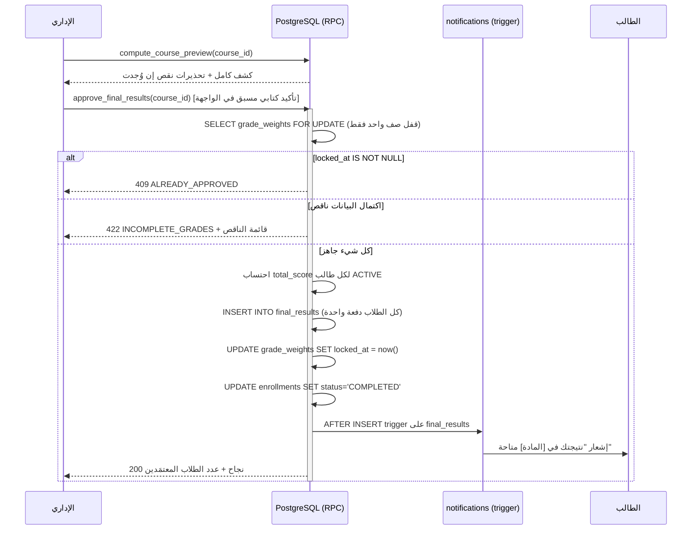
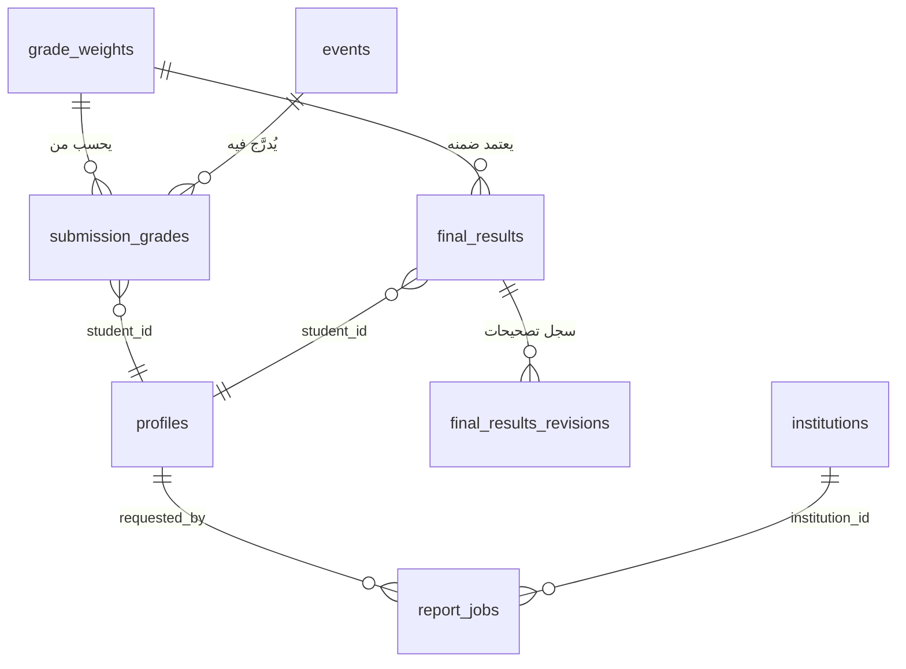
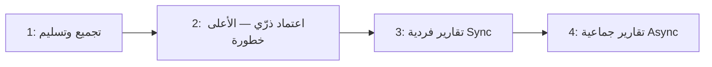

# 📐 وثيقة التصميم التقني — نظام التقارير والنتائج (Results & Reports System TDD)

## Academic Hub — Results & Reports System

---

## بيانات ضبط الوثيقة

| البند | التفاصيل |
|---|---|
| **اسم الوثيقة** | وثيقة التصميم التقني — نظام التقارير والنتائج (تجميع الدرجات، الاعتماد، الاحتفاظ، وتصدير PDF بأنواعه الأربعة) |
| **رقم الإصدار** | v1.0 |
| **المستوى** | 🟡 Production |
| **الوثائق المرجعية** | MVP Functions **v3.6** (§4.3.4 أوزان الدرجات · §5.6 التقارير والنتائج · القرارات #4 #7 #20 #22 #23) · **Core Data Layer TDD v2.1 (المرجع الملزم للـ Schema والأمان)** · Amendment Subscription Blocking Policy v2.0 (يحكم رؤية `final_results` للطالب المحجوب) · Use Cases Admin v1.0 (UC-A-44 → UC-A-52) · Use Cases Lecturer v1.0 (UC-L-35 → UC-L-38) |
| **خارج نطاق هذه الوثيقة** | نظام الدفعات المالية (لوحات مراجعة الدفعات، تأكيد/رفض، `payment_requests`) — **موثَّق مسبقاً في وثيقة منفصلة**؛ هذه الوثيقة **تستهلك** بيانات المدفوعات للقراءة فقط عند توليد التقرير المالي (§5.6.2) دون إعادة تصميم ذلك النظام |
| **مالك الوثيقة** | رامز |
| **الحالة** | جاهزة للمراجعة الهندسية |

---

## القسم 0: بروتوكول التحليل المتسلسل 🧠

### 0.1 — إعادة صياغة المشكلة

المطلوب تصميم النظام الذي يُغلق دورة حياة الفصل الدراسي أكاديمياً: تجميع درجة كل طالب من ست مصادر مختلفة (حضور، واجبات، بحوث، سمنارات، نصفي، نهائي) وفق أوزان يحددها محاضر المادة، ثم اعتماد إداري نهائي **ذرّي** (قرار #22) ينشر النتيجة للطلاب فوراً ويقفل كل شيء نهائياً؛ مع سياسة احتفاظ صارمة (قرار #23) تمنع الحذف الفيزيائي لأي نتيجة إلى الأبد؛ وأربعة أنواع تصدير PDF (طالب واحد، دفعة/مادة، مالي لفترة، بيانات محاضر) تخدم الإداري كواجهة الإخراج الرسمية للمنصة بأكملها. **القيد الحاكم:** لا نتيجة ولا تقرير يتجاوز حدود مؤسسته — لا رؤية عابرة للمؤسسات لأي بيانات درجات أو مالية (قرار #20).

بمراجعة Core Data v2.1 وUse Cases الإداري/المحاضر معاً، تبيّن أن **المخطط القائم يغطي التخزين الأساسي (`grade_weights`, `submission_grades`, `final_results`) لكنه لا يغطي بعض الحالات الوظيفية التي تفرضها الاستخدامات الفعلية**: (أ) لا عمود يميّز "تم التسليم للإدارة وينتظر الاعتماد" عن "لا يزال قيد التحرير من المحاضر" — و`locked_at` وحده لا يكفي لأنه يُفعَّل فقط عند الاعتماد لا عند التسليم؛ (ب) لا آلية تصحيح موثَّقة للنتيجة بعد اعتمادها رغم أن قرار #23 يفترض ضمناً وقوع تصحيحات مستقبلية ("أي إلغاء أو تصحيح يتم بسجل جديد موثَّق لا بحذف القديم")؛ (ج) لا عمود لدرجة "الحد الأقصى" لكل حدث تقييمي رغم أن واجهة المحاضر (UC-L-36) تعرض "الدرجة: [ ] / [الدرجة الكلية]" صراحة. هذه الفجوات مُعالَجة في القسم 4 كأعمدة/جداول امتداد على Core Data — لا كإعادة تصميم.

### 0.2 — الأسئلة الخمسة الحاسمة

1. **من المستخدم الفعلي؟** الإداري (تجميع + اعتماد + تصدير) في اللحظة الأكثر حساسية في الفصل الدراسي كله (نهاية الفصل، كل المواد دفعة واحدة تقريباً)؛ والمحاضر الذي يسلِّم درجات مواده قبل ذلك بأيام قليلة؛ والطالب كمستهلك نهائي سلبي (قراءة نتيجته المعتمدة فقط).
2. **قراءة أم كتابة؟** كتابة نادرة وحرجة جداً (اعتماد نتيجة = عملية تحدث **مرة واحدة** لكل مادة كل فصل ولا رجعة فيها) مقابل قراءة مستمرة خفيفة (الطالب يفتح نتيجته). التصميم يُحسَّن للأمان والذرّية في لحظة الكتابة، لا للسرعة.
3. **ماذا لو تعطّل النظام لحظة نهاية الفصل (ذروة الاستخدام لعشر مؤسسات معاً)؟** كارثي تشغيلياً — كل المؤسسات العشر تعتمد نتائجها تقريباً في نفس الأسبوع (نهاية الفصل موحّد التوقيت أكاديمياً غالباً). التصميم يجب أن يفترض تزامن اعتماد عشرات المواد في نفس الساعات عبر المؤسسات كلها، لا مادة واحدة بمعزل.
4. **ما البيانات الأكثر حساسية؟** (أ) `final_results` — أثر قانوني/أكاديمي مباشر على مستقبل الطالب، ولا يجوز حذفه أبداً (قرار #23)؛ (ب) البيانات المالية المجمَّعة في التقرير المالي (قرار #20: لا تقرير مالي عابر للمؤسسات)؛ (ج) ملف PDF يحمل درجات عشرات أو مئات الطلاب دفعة واحدة — تسريبه أخطر من تسريب نتيجة فرد واحد.
5. **أضيق عنق زجاجة؟** توليد PDF لتقرير دفعة/مادة كاملة (قد يضم مئات الطلاب) أو تقرير مالي تفصيلي (قد يضم آلاف المعاملات على مستوى مؤسسة واحدة، من أصل ~10,000 معاملة شهرياً على مستوى المنصة بأكملها) داخل زمن استجابة طلب HTTP واحد.

### 0.3 — الافتراضات المعلنة (Explicit Assumptions)

| # | الافتراض | مستوى الثقة | تأثيره لو كان خاطئاً |
|---|---|---|---|
| A-01 | `submission_grades.score` يُدخَل كدرجة خام على مقياس الحدث، وتحتاج تطبيعاً بالقسمة على حد أقصى لكل حدث للحصول على نسبة مئوية — Core Data الحالية **لا تخزّن** هذا الحد الأقصى؛ هذه الوثيقة تضيفه كعمود امتداد `events.max_score` | متوسط — مبني على واجهة UC-L-36 ("الدرجة: [ ] / [الدرجة الكلية]") التي تفترض وجود حد أقصى، وعلى غياب أي بديل موثَّق | لو كانت الدرجة تُدخَل كنسبة مئوية مباشرة بلا حد أقصى منفصل: يُحذَف عمود `max_score` ويُبسَّط التطبيع، بلا أثر على بقية التصميم |
| A-02 | درجتا النصفي والنهائي (`submission_grades` لحدثي الامتحان) تُدخَلان يدوياً من المحاضر (UC-L-38)، مع تعبئة مبدئية اختيارية من `exam_attempts.auto_score` كقيمة مقترحة قابلة للتعديل — وليس ربطاً آلياً صارماً | متوسط — لا وثيقة تربط الحقلين صراحة؛ الاستنتاج من وجود `auto_score` في Core Data مع عدم ذكر ربط آلي في UC-L-38 | لو كان الربط آلياً وإلزامياً بلا تعديل: تُحذَف حرية تعديل المحاضر لدرجتي الامتحان في §4.2، ويصبح الإدخال قراءة فقط من `auto_score` |
| A-03 | "الدفعة" (Batch) في تقرير UC-A-50 تُطابَق حرفياً بعمود `profiles.batch` (نص حر يُدخله الإداري) — لا جدول دفعات منفصل | عالٍ — `profiles.batch` موجود فعلياً في Core Data بهذا الاستخدام بالضبط | لو وُجد جدول دفعات مستقل مستقبلاً: يصبح `batch` مفتاحاً خارجياً بدل نص حر، بلا تغيير في منطق التقرير |
| A-04 | لا حد أقصى زمني لطلب تصحيح نتيجة معتمدة (يمكن تصحيح نتيجة من فصول سابقة) — بما يتسق مع قرار #23 ("قابل للاستخراج بعد سنوات") | متوسط — القرار يتحدث عن الاستخراج لا التصحيح صراحة؛ التوسعة منطقية لكنها استنتاج | لو فُرضت نافذة زمنية للتصحيح (مثال: فصل دراسي واحد فقط): تُضاف عتبة CHECK بسيطة على `approved_at` في RPC التصحيح |
| A-05 | توليد تقرير الطالب الواحد وتقرير المحاضر يقعان ضمن ميزانية زمن استجابة synchronous (طالب/محاضر واحد، حجم بيانات محدود)؛ تقرير الدفعة/المادة والتقرير المالي التفصيلي async عبر `report_jobs` | عالٍ — مبني على حساب حجم البيانات (فرد واحد مقابل مئات/آلاف الصفوف) | لو ثبت أن تقرير الدفعة الواحدة صغير دائماً (دفعات < 50 طالباً): يمكن تحويله لـ synchronous أيضاً دون تغيير الجداول |

### 0.4 — نطاق العمل (Scope Fence)

- ✅ **داخل النطاق:** تجميع الدرجات (تلقائي + مُدخل يدوياً)، تسليم المحاضر، اعتماد الإداري الذرّي، قفل الأوزان، نشر النتيجة، سياسة الاحتفاظ والتصحيح، الأنواع الأربعة لتصدير PDF (بما فيها التقرير المالي كقراءة فقط لبيانات `payment_requests`/`subscription_status` الموجودة).
- ❌ **خارج النطاق:** تصميم لوحات مراجعة الدفعات وتأكيدها/رفضها (نظام منفصل مكتمل التوثيق مسبقاً)؛ تصميم واجهة الامتحان أو المراقبة الصوتية (Exams TDD منفصل)؛ إعادة فتح صيغة أوزان الدرجات أو قرار #7 (لا عرض درجات فردية أثناء الفصل) — محسومان نهائياً.

---

## القسم 1: الملخص التنفيذي وسياق المشكلة 📋

### 1.1 — بيان المشكلة

اليوم، لحظة نهاية كل فصل دراسي عبر عشر مؤسسات، يحتاج النظام لتحويل بيانات متناثرة عبر خمسة أنظمة مختلفة (الحضور، التصحيح، الامتحانات، الأوزان، التسجيل) إلى **قرار واحد نهائي غير قابل للتراجع** لكل طالب في كل مادة — بأثر قانوني وأكاديمي مباشر، وبمتطلب احتفاظ أبدي، وبضغط تزامن استثنائي (عشر مؤسسات تعتمد نتائجها في نافذة زمنية متقاربة). لا يوجد اليوم توثيق تقني لكيفية حدوث هذا التحويل بأمان وذرّية، ولا لكيفية إخراجه كتقارير رسمية (PDF) تخدم الطالب والمحاضر والإدارة نفسها.

### 1.2 — الهدف القابل للقياس

نظام يُجمِّع درجات مادة كاملة (حتى ~500 طالب) في أقل من ثانيتين للمعاينة، ويعتمدها كمعاملة ذرّية واحدة لا تترك حالة وسيطة أبداً حتى عند تزامن عشرات هذه المعاملات عبر مؤسسات مختلفة في نفس اللحظة، وينتج تقارير PDF بأربعة أنواع محددة، بلا أي تسريب بيانات عبر حدود المؤسسة، وبلا أي إمكانية لحذف نتيجة فيزيائياً مهما طال الزمن.

### 1.3 — معايير النجاح (Success Criteria)

| المعيار | القيمة المستهدفة | القياس |
|---|---|---|
| ذرّية الاعتماد | 100% — لا حالة وسيطة (نتيجة محفوظة بلا قفل أوزان، أو العكس) تحت أي ظرف بما فيه فشل منتصف العملية | اختبار: قتل الاتصال منتصف `approve_final_results` ثم فحص الاتساق |
| زمن معاينة تجميع درجات مادة (500 طالب) | < 2 ثانية (p95) | قياس مباشر على بيانات اختبار بالحجم المرجعي |
| زمن اعتماد نتيجة مادة (500 طالب) | < 5 ثوانٍ (p95)، ذرّي بالكامل | قياس + فحص عدم وجود قفل جدول طويل يعطّل مواد أخرى بالتوازي |
| تسريب بيانات نتائج/تقارير عبر حدود المؤسسة | 0 حالة | اختبار عدائي: مؤسستان، كل الأدوار، كل المسارات |
| حذف فيزيائي لسجل نتيجة | 0 عملية ممكنة في الكود بالكامل (لا `DELETE` مسموح على `final_results` لأي دور) | مراجعة RLS + بحث كودي |
| توليد تقرير دفعة/مادة (500 طالب) | < 30 ثانية (async، مع تحديث حالة حي) | قياس على بيانات الحجم المرجعي |
| صلاحية رابط تحميل تقرير | 15 دقيقة، Signed URL فقط | فحص الإعداد + محاولة وصول بعد الانتهاء |

### 1.4 — ما ليس هذا النظام (Anti-Goals)

- ليس نظام تحليلات أو Dashboards تفاعلية — المخرج الرسمي دائماً ملف PDF.
- لا يعيد حساب النتائج تلقائياً عند تغيّر بيانات مصدر بعد الاعتماد (مثال: تعديل حضور بأثر رجعي) — أي تغيير بعد الاعتماد يمر حصراً عبر مسار "التصحيح" الموثَّق (§4.2) لا عبر إعادة حساب صامتة.
- لا يدعم "اعتماد جزئي" لمادة (بعض الطلاب معتمدون وبعضهم لا) — الاعتماد كل-أو-لا-شيء لكل مادة في معاملة واحدة (قرار #22).

---

## القسم 2: القيود التقنية وقرارات التصميم 🔧

### 2.1 — القيود المفروضة (Hard Constraints)

| القيد | التفصيل | المصدر |
|---|---|---|
| ذرّية إلزامية | اعتماد النتيجة = قفل الأوزان + `final_results` + `enrollments → COMPLETED` + النشر، في معاملة واحدة لا تُقسَّم | MVP قرار #22 |
| لا حذف فيزيائي أبداً | لا لأي سجل نتيجة، مهما قدُم الفصل الدراسي | MVP قرار #23 |
| لا عرض درجات فردية أثناء الفصل | الطالب يرى فقط النتيجة النهائية المعتمدة والمنشورة | MVP قرار #7 |
| `has_active_subscription()` مصدر الحقيقة الوحيد | يحكم ظهور `final_results` للطالب المحجوب — لا منطق موازٍ | Amendment v2.0 + MVP §3.7.2 |
| الفصل المؤسسي المطلق | لا نتيجة ولا تقرير مالي أو أكاديمي يعبر حدود مؤسسة | MVP قرار #20 |
| القرار البشري أولاً | لا اعتماد آلي — ضغطة تأكيد إدارية واعية إلزامية | UC-A-45 |

### 2.2 — مصفوفات قرارات التصميم (Trade-off Matrices)

#### [D-13] آلية تمييز "مُسلَّم وينتظر الاعتماد" عن "قيد التحرير"

| الخيار | المزايا | العيوب | القرار |
|---|---|---|---|
| **إضافة `submitted_at`/`submitted_by` على `grade_weights` ✅** | يفصل بوضوح ثلاث حالات (تحرير / بانتظار اعتماد / معتمد ومقفل) دون جدول جديد؛ يتيح RLS يمنع تعديل المحاضر بعد التسليم مباشرة | عمودان إضافيان على جدول قائم | مقبول — أبسط حل يحقق المتطلب الوظيفي في UC-L-38 حرفياً |
| جدول `course_grading_status` منفصل | فصل أنظف للمسؤوليات | جدول كامل لحالة ثنائية القيمة أساساً — تعقيد غير مبرر لفريق صغير (A-03 Core Data) | مرفوض |
| استنتاج الحالة من وجود صفوف كاملة في `submission_grades` بلا عمود حالة صريح | لا تغيير في المخطط | هش: لا يميّز "لم يبدأ بعد" عن "اكتمل لكن لم يُسلَّم بعد قصداً"؛ يمنع رسالة خطأ دقيقة للمحاضر | مرفوض |

#### [D-14] آلية التصحيح بعد الاعتماد (لتحقيق قرار #23 عملياً)

| الخيار | المزايا | العيوب | القرار |
|---|---|---|---|
| **جدول `final_results_revisions` (append-only) + RPC `correct_final_result` يُدخل السجل القديم فيه قبل أي تحديث ✅** | يطابق نمط `question_audit_log` المعتمد فعلاً في Core Data لنفس الغرض بالضبط — اتساق معماري؛ توثيق كامل بلا حذف | جدول إضافي | مقبول — يحوّل قرار #23 من نية معلنة إلى آلية قابلة للتنفيذ والاختبار |
| `UPDATE` مباشر على `final_results` بلا أرشفة | أبسط تنفيذاً | يخالف قرار #23 حرفياً — "لا حذف/استبدال صامت" | مرفوض |
| Soft versioning بعمود `version` على `final_results` نفسها (بلا جدول تاريخ) | لا جدول جديد | لا يحتفظ بالسجل الكامل التاريخي القابل للاستخراج؛ يفقد من قرأ النتيجة قبل التصحيح أي أثر | مرفوض |

#### [D-15] بنية توليد تقارير PDF (Sync مقابل Async)

| الخيار | المزايا | العيوب | القرار |
|---|---|---|---|
| **Sync للتقارير الفردية (طالب واحد، محاضر واحد) + Async عبر `report_jobs` للتقارير الجماعية (دفعة/مادة، مالي تفصيلي) ✅** | يطابق حجم البيانات الفعلي لكل نوع؛ لا انتظار غير ضروري للحالات الصغيرة، ولا timeout للحالات الكبيرة | منطقان مختلفان يجب صيانتهما | مقبول — الأنسب لحجم 500-2000 طالب/مؤسسة (A-05) |
| Async للجميع دائماً | بساطة معمارية (مسار واحد) | تجربة أبطأ للحالة الشائعة (تقرير طالب واحد) بلا داعٍ | مرفوض |
| Sync للجميع مع رفع Timeout الخادم | لا جدول جديد | فشل حتمي عند تصدير دفعة كبيرة وقت الذروة (نهاية الفصل، كل المؤسسات معاً) | مرفوض |

---

## القسم 3: معمارية النظام 🏗️

### 3.1 — المخطط العام

```mermaid
graph TB
    subgraph Lecturer["المحاضر"]
        LW[تعديل الأوزان<br/>UC-L-35]
        LG[تصحيح الواجبات/البحوث/السمنارات<br/>UC-L-36/37]
        LS[تسليم درجات المادة<br/>UC-L-38]
    end

    subgraph Sources["مصادر التجميع (قراءة فقط)"]
        ATT[(attendance_records)]
        SUB[(submission_grades)]
        EXA[(exam_attempts.auto_score)]
    end

    subgraph Core["نظام التقارير والنتائج"]
        PREV[compute_course_preview<br/>معاينة بلا كتابة]
        APR[approve_final_results<br/>معاملة ذرّية واحدة]
        COR[correct_final_result<br/>تصحيح موثَّق]
        RPT[report_jobs<br/>مولّد PDF]
    end

    subgraph Storage["Storage خاص"]
        PDF[📦 reports/{institution_id}/...]
    end

    subgraph Admin["الإداري"]
        AA[اعتماد النتيجة<br/>UC-A-45]
        AE[تصدير التقارير الأربعة<br/>UC-A-49..52]
    end

    subgraph Student["الطالب"]
        SR[عرض النتيجة النهائية فقط<br/>قرار #7]
    end

    LW --> Core
    LG --> SUB
    LS --> PREV
    ATT --> PREV
    SUB --> PREV
    EXA -.تعبئة مبدئية اختيارية.-> LS
    PREV --> AA --> APR
    APR --> COR
    APR -->|notifications trigger| SR
    AE --> RPT --> PDF
    APR -->|SELECT final_results| SR
```

### 3.2 — جدول المكونات والمسؤوليات

| المكون | مسؤوليته الوحيدة | ماذا لو فشل؟ | التعافي |
|---|---|---|---|
| `compute_course_preview` | حساب معاينة بلا أي كتابة — قراءة فقط | خطأ في القراءة لا يترك أثراً | إعادة المحاولة بلا مخاطرة (idempotent بطبيعته) |
| `approve_final_results` | المعاملة الذرّية الوحيدة التي تُنتج نتائج رسمية | `ROLLBACK` كامل تلقائي — لا حالة وسيطة | إعادة المحاولة بأمان؛ الفحص الأول داخل المعاملة يمنع الاعتماد المزدوج |
| `correct_final_result` | تصحيح موثَّق بعد الاعتماد فقط | فشل التحديث لا يفقد السجل القديم (يُكتب في `final_results_revisions` أولاً) | إعادة المحاولة |
| `report_jobs` + مولّد PDF | تتبّع طلبات التصدير الجماعي وحالتها | فشل التوليد يُسجَّل `status='failed'` + `error_message` | إعادة الطلب يدوياً من الإداري — لا إعادة محاولة تلقائية صامتة (كل تقرير رسمي يجب أن يُطلَب بوعي) |

### 3.3 — تسلسل حرج: اعتماد النتيجة النهائية (Sequence Diagram)



### 3.4 — قرار معماري: نطاق القفل أثناء الاعتماد [D-16]

| الخيار | المزايا | العيوب | القرار |
|---|---|---|---|
| **`SELECT ... FOR UPDATE` على صف `grade_weights` الواحد فقط ✅** | يمنع الاعتماد المزدوج لنفس المادة فقط؛ مواد أخرى (حتى لو في نفس المؤسسة) تُعتمَد بالتوازي دون تعطيل — حرج عند تزامن عشر مؤسسات في نفس النافذة الزمنية | لا يحمي من حالات نادرة جداً خارج هذا الجدول | مقبول |
| قفل على مستوى الجدول (`LOCK TABLE final_results`) | حماية أوسع نظرياً | يعطّل اعتماد كل مادة أخرى في المنصة بأكملها أثناء اعتماد مادة واحدة — كارثي عند ذروة نهاية الفصل عبر 10 مؤسسات | مرفوض قطعياً |

---

## القسم 4: نماذج البيانات (يُدمج كأعمدة/جداول امتداد على Core Data v2.1) 🗄️

### 4.1 — ERD الإضافي



### 4.2 — SQL الموحَّد (أعمدة/جداول امتداد على Core Data v2.1 — لا تغيير على ما هو قائم)

```sql
-- ============================================================
-- نظام التقارير والنتائج — امتداد على Core Data v2.1
-- ============================================================

-- ---------- (1) حد أقصى للدرجة لكل حدث تقييمي — يسد فجوة A-01 ----------
ALTER TABLE events ADD COLUMN max_score NUMERIC(6,2);
ALTER TABLE events ADD CONSTRAINT max_score_required_for_gradable
    CHECK (type NOT IN ('assignment','research','seminar','exam') OR max_score IS NOT NULL);

-- ---------- (2) حالة "مُسلَّم بانتظار الاعتماد" — يسد فجوة D-13 ----------
ALTER TABLE grade_weights ADD COLUMN submitted_at TIMESTAMPTZ;
ALTER TABLE grade_weights ADD COLUMN submitted_by UUID REFERENCES profiles(id);
-- الحالات الثلاث المشتقة:
--   submitted_at IS NULL                       → قيد التحرير من المحاضر
--   submitted_at IS NOT NULL AND locked_at IS NULL → بانتظار الاعتماد الإداري
--   locked_at IS NOT NULL                      → معتمدة ومقفلة نهائياً

DROP POLICY IF EXISTS weights_lecturer_write ON grade_weights;
CREATE POLICY weights_lecturer_write ON grade_weights FOR UPDATE
    USING (teaches(course_id) AND submitted_at IS NULL)
    WITH CHECK (teaches(course_id) AND submitted_at IS NULL);
-- التسليم نفسه (submitted_at) يُكتب حصراً عبر RPC submit_course_grades أدناه — SECURITY DEFINER

-- ---------- (3) الاعتماد الذرّي: RPC ----------
CREATE OR REPLACE FUNCTION submit_course_grades(p_course_id BIGINT)
RETURNS VOID AS $$
BEGIN
    IF NOT teaches(p_course_id) THEN
        RAISE EXCEPTION 'FORBIDDEN: لست محاضر هذه المادة';
    END IF;

    PERFORM 1 FROM grade_weights WHERE course_id = p_course_id AND locked_at IS NOT NULL;
    IF FOUND THEN
        RAISE EXCEPTION 'ALREADY_APPROVED: النتيجة معتمدة بالفعل — لا يمكن التعديل';
    END IF;

    -- فحص الاكتمال: كل تسجيل ACTIVE يجب أن يملك درجة لكل حدث قابل للتقييم في المادة
    IF EXISTS (
        SELECT 1 FROM enrollments e
        JOIN events ev ON ev.course_id = e.course_id
            AND ev.type IN ('assignment','research','seminar','exam') AND ev.deleted_at IS NULL
        LEFT JOIN submission_grades sg ON sg.event_id = ev.id AND sg.student_id = e.student_id
        WHERE e.course_id = p_course_id AND e.status = 'ACTIVE' AND sg.student_id IS NULL
    ) THEN
        RAISE EXCEPTION 'INCOMPLETE_GRADES: توجد درجات ناقصة — أكملها قبل التسليم';
    END IF;

    UPDATE grade_weights SET submitted_at = now(), submitted_by = auth.uid()
    WHERE course_id = p_course_id;
    -- إشعار الإداري بجاهزية الدرجات (UC-A-48) عبر trigger منفصل على submitted_at
END;
$$ LANGUAGE plpgsql SECURITY DEFINER SET search_path = public;

CREATE OR REPLACE FUNCTION approve_final_results(p_course_id BIGINT)
RETURNS TABLE(students_approved INT) AS $$
DECLARE
    v_weights RECORD;
BEGIN
    IF my_role() <> 'admin' THEN
        RAISE EXCEPTION 'FORBIDDEN: الاعتماد صلاحية إدارية حصراً';
    END IF;

    -- قفل صف واحد فقط (D-16) — لا يعطّل اعتماد مواد أخرى بالتوازي
    SELECT * INTO v_weights FROM grade_weights WHERE course_id = p_course_id FOR UPDATE;

    IF v_weights.locked_at IS NOT NULL THEN
        RAISE EXCEPTION 'ALREADY_APPROVED: هذه المادة معتمدة بالفعل';
    END IF;
    IF v_weights.submitted_at IS NULL THEN
        RAISE EXCEPTION 'NOT_SUBMITTED: لم يسلِّم المحاضر الدرجات بعد';
    END IF;

    WITH computed AS (
        SELECT
            e.student_id,
            COALESCE(att.pct, 0)                                        AS attendance_score,
            COALESCE(avg_sg.assignments, 0)                             AS assignments_score,
            COALESCE(avg_sg.research, 0)                                AS research_score,
            COALESCE(avg_sg.seminars, 0)                                AS seminars_score,
            COALESCE(avg_sg.midterm, 0)                                 AS midterm_score,
            COALESCE(avg_sg.final, 0)                                   AS final_score
        FROM enrollments e
        LEFT JOIN LATERAL (
            SELECT (COUNT(ar.*) FILTER (WHERE ar.student_id IS NOT NULL))::NUMERIC
                   / NULLIF(COUNT(*), 0) * 100 AS pct
            FROM events ev
            LEFT JOIN attendance_sessions ases ON ases.event_id = ev.id
            LEFT JOIN attendance_records ar ON ar.session_id = ases.id AND ar.student_id = e.student_id
            WHERE ev.course_id = e.course_id AND ev.type IN ('lecture','lab','seminar','exam')
                  AND ev.deleted_at IS NULL
        ) att ON true
        LEFT JOIN LATERAL (
            SELECT
                AVG(sg.score / NULLIF(ev.max_score,0) * 100) FILTER (WHERE ev.type = 'assignment') AS assignments,
                AVG(sg.score / NULLIF(ev.max_score,0) * 100) FILTER (WHERE ev.type = 'research')   AS research,
                AVG(sg.score / NULLIF(ev.max_score,0) * 100) FILTER (WHERE ev.type = 'seminar')    AS seminars,
                AVG(sg.score / NULLIF(ev.max_score,0) * 100) FILTER (WHERE ex.kind = 'midterm')    AS midterm,
                AVG(sg.score / NULLIF(ev.max_score,0) * 100) FILTER (WHERE ex.kind = 'final')      AS final
            FROM submission_grades sg
            JOIN events ev ON ev.id = sg.event_id
            LEFT JOIN exams ex ON ex.event_id = ev.id
            WHERE sg.student_id = e.student_id AND ev.course_id = e.course_id
        ) avg_sg ON true
        WHERE e.course_id = p_course_id AND e.status = 'ACTIVE'
    )
    INSERT INTO final_results (course_id, student_id, total_score, breakdown, approved_by, approved_at)
    SELECT
        p_course_id, c.student_id,
        (c.attendance_score * v_weights.attendance_pct
         + c.assignments_score * v_weights.assignments_pct
         + c.research_score   * v_weights.research_pct
         + c.seminars_score   * v_weights.seminars_pct
         + c.midterm_score    * v_weights.midterm_pct
         + c.final_score      * v_weights.final_pct) / 100.0,
        jsonb_build_object(
            'attendance', c.attendance_score, 'assignments', c.assignments_score,
            'research', c.research_score, 'seminars', c.seminars_score,
            'midterm', c.midterm_score, 'final', c.final_score,
            'weights_snapshot', row_to_json(v_weights)
        ),
        auth.uid(), now()
    FROM computed c;

    UPDATE grade_weights SET locked_at = now() WHERE course_id = p_course_id;
    UPDATE enrollments SET status = 'COMPLETED', updated_at = now()
        WHERE course_id = p_course_id AND status = 'ACTIVE';

    RETURN QUERY SELECT COUNT(*)::INT FROM final_results WHERE course_id = p_course_id;
END;
$$ LANGUAGE plpgsql SECURITY DEFINER SET search_path = public;
-- ملاحظة: الدالة كلها transaction واحدة ضمنياً (PL/pgSQL) — فشل أي سطر = ROLLBACK كامل (قرار #22)

-- ---------- (4) التصحيح الموثَّق بعد الاعتماد — يسد فجوة D-14 (قرار #23) ----------
CREATE TABLE final_results_revisions (               -- append-only — Audit Log كامل غير قابل للحذف
    id            BIGINT GENERATED ALWAYS AS IDENTITY PRIMARY KEY,
    course_id     BIGINT NOT NULL,
    student_id    UUID   NOT NULL,
    previous_total_score NUMERIC(5,2) NOT NULL,
    previous_breakdown   JSONB NOT NULL,
    reason        TEXT   NOT NULL,
    corrected_by  UUID   NOT NULL REFERENCES profiles(id),
    corrected_at  TIMESTAMPTZ NOT NULL DEFAULT now(),
    FOREIGN KEY (course_id, student_id) REFERENCES final_results(course_id, student_id)
);

ALTER TABLE final_results ADD COLUMN revision_count INT NOT NULL DEFAULT 0;
ALTER TABLE final_results ADD COLUMN last_revised_at TIMESTAMPTZ;

CREATE OR REPLACE FUNCTION correct_final_result(
    p_course_id BIGINT, p_student_id UUID, p_new_breakdown JSONB, p_reason TEXT
) RETURNS VOID AS $$
DECLARE v_old RECORD;
BEGIN
    IF my_role() <> 'admin' THEN
        RAISE EXCEPTION 'FORBIDDEN: التصحيح صلاحية إدارية حصراً';
    END IF;
    IF p_reason IS NULL OR length(trim(p_reason)) = 0 THEN
        RAISE EXCEPTION 'REASON_REQUIRED: سبب التصحيح إلزامي';
    END IF;

    SELECT * INTO v_old FROM final_results
        WHERE course_id = p_course_id AND student_id = p_student_id;
    IF NOT FOUND THEN
        RAISE EXCEPTION 'NOT_FOUND: لا نتيجة معتمدة لهذا الطالب في هذه المادة';
    END IF;

    INSERT INTO final_results_revisions
        (course_id, student_id, previous_total_score, previous_breakdown, reason, corrected_by)
    VALUES (p_course_id, p_student_id, v_old.total_score, v_old.breakdown, p_reason, auth.uid());

    UPDATE final_results SET
        total_score = (p_new_breakdown->>'total_score')::NUMERIC,
        breakdown = p_new_breakdown,
        revision_count = revision_count + 1,
        last_revised_at = now()
    WHERE course_id = p_course_id AND student_id = p_student_id;

    -- إشعار الطالب بتحديث نتيجته (نفس نوع final_result_published، مع إشارة "مُصحَّحة")
END;
$$ LANGUAGE plpgsql SECURITY DEFINER SET search_path = public;

-- ---------- (5) RLS النهائية على final_results — تدمج تعديل الحجب v2.0 ----------
DROP POLICY IF EXISTS student_own_final ON final_results;
CREATE POLICY student_own_final ON final_results FOR SELECT
    USING (
        (student_id = auth.uid() AND has_active_subscription())   -- Amendment v2.0 §3
        OR my_role() = 'admin'
        OR (my_role() = 'lecturer' AND teaches(course_id))
    );
-- لا سياسة UPDATE/DELETE لأي دور — كل تعديل يمر حصراً عبر correct_final_result (SECURITY DEFINER)

-- ---------- (6) trigger النشر الفوري للنتيجة (بديل نمط Outbox — اتساق مع بقية المنصة) ----------
CREATE OR REPLACE FUNCTION notify_on_final_result() RETURNS TRIGGER AS $$
BEGIN
    BEGIN
        INSERT INTO notifications (user_id, type, ref_type, ref_id, course_id, title, body)
        VALUES (NEW.student_id, 'final_result_published', 'course', NEW.course_id::TEXT, NEW.course_id,
                'نتيجتك متاحة الآن', 'اطّلع على نتيجتك النهائية المعتمدة');
    EXCEPTION WHEN OTHERS THEN
        NULL; -- فشل الإشعار لا يُفشل الاعتماد نفسه أبداً
    END;
    RETURN NEW;
END;
$$ LANGUAGE plpgsql SECURITY DEFINER SET search_path = public;

DROP TRIGGER IF EXISTS trg_notify_on_final_result ON final_results;
CREATE TRIGGER trg_notify_on_final_result
    AFTER INSERT ON final_results
    FOR EACH ROW EXECUTE FUNCTION notify_on_final_result();

-- ---------- (7) تصدير التقارير: تتبّع async للحالات الجماعية (D-15) ----------
CREATE TYPE report_type   AS ENUM ('student','course_batch','financial','lecturer');
CREATE TYPE report_status AS ENUM ('pending','processing','completed','failed');

CREATE TABLE report_jobs (
    id             BIGINT GENERATED ALWAYS AS IDENTITY PRIMARY KEY,
    institution_id UUID NOT NULL REFERENCES institutions(id),
    requested_by   UUID NOT NULL REFERENCES profiles(id),
    report_type    report_type NOT NULL,
    params         JSONB NOT NULL,          -- نطاق التقرير (طالب/مادة/دفعة/فترة/قناة...)
    status         report_status NOT NULL DEFAULT 'pending',
    file_path      TEXT,                    -- {institution_id}/reports/... عند completed
    error_message  TEXT,
    created_at     TIMESTAMPTZ NOT NULL DEFAULT now(),
    completed_at   TIMESTAMPTZ
);
CREATE INDEX idx_report_jobs_tenant
    ON report_jobs (institution_id, requested_by, created_at DESC);

ALTER TABLE report_jobs ENABLE ROW LEVEL SECURITY;
CREATE POLICY report_jobs_owner ON report_jobs FOR SELECT
    USING (institution_id = my_institution()
           AND (requested_by = auth.uid() OR my_role() = 'admin'));
CREATE POLICY report_jobs_insert ON report_jobs FOR INSERT
    WITH CHECK (institution_id = my_institution() AND requested_by = auth.uid() AND my_role() = 'admin');
```

### 4.3 — استراتيجية الفهرسة

| الفهرس | يخدم |
|---|---|
| `idx_report_jobs_tenant` | استعلام "تقاريري السابقة" للإداري + تنظيف الأعمار |
| فهرس ضمني عبر `FOR UPDATE` على `grade_weights(course_id)` (PK قائم) | منع الاعتماد المزدوج دون فهرس إضافي |
| استعلام التقرير المالي (§5.2) يعتمد على فهارس `payment_requests` **القائمة فعلاً** في نظام الدفعات (`institution_id, status, channel`, و`institution_id, created_at` إن وُجد) — لا فهرس جديد مطلوب من هذه الوثيقة |

### 4.4 — دورة الحياة والاتساق

- **`final_results`:** لا `DELETE` لأي دور مطلقاً؛ التعديل الوحيد عبر `correct_final_result` الموثَّق. الاحتفاظ أبدي (قرار #23).
- **`grade_weights`:** ثلاث حالات فقط، انتقال أحادي الاتجاه (تحرير → مُسلَّم → مقفل) بلا تراجع تلقائي؛ فتح القفل يتطلب قراراً إدارياً صريحاً خارج نطاق هذه الوثيقة (غير موثَّق في MVP — يُعامَل كإجراء استثنائي يدوي على مستوى قاعدة البيانات فقط، لا واجهة مستخدم).
- **`report_jobs`:** ليست بيانات أكاديمية دائمة — تُنظَّف الأعمدة `file_path` القديمة (> 30 يوماً) دورياً عبر `pg_cron` مع الاحتفاظ بسجل الطلب نفسه (لا حذف الصف، فقط الملف من Storage) لأغراض التدقيق.

---

## القسم 5: عقود الـ API 🔌

### 5.1 — مبادئ التصميم

RPC للعمليات الحرجة (الاعتماد، التصحيح، التسليم) لضمان تنفيذها داخل قاعدة البيانات كمعاملة واحدة؛ Edge Functions لتوليد PDF وإدارة `report_jobs`. صيغة خطأ موحّدة `{ code, message }` عبر كل شيء، متسقة مع بقية المنصة.

### 5.2 — توثيق العقود

#### `POST /rpc/submit_course_grades` (RPC — محاضر)

| كود | السبب |
|---|---|
| 403 `FORBIDDEN` | ليس محاضر هذه المادة |
| 409 `ALREADY_APPROVED` | النتيجة معتمدة بالفعل |
| 422 `INCOMPLETE_GRADES` | درجات ناقصة لبعض الطلاب |
| 200 | تم التسليم — إشعار للإداري (UC-A-48) |

#### `POST /rpc/approve_final_results` (RPC — إداري)

| كود | السبب | استجابة العميل |
|---|---|---|
| 403 `FORBIDDEN` | الدور ليس إدارياً | رفض الطلب |
| 404 `NOT_SUBMITTED` | لم يُسلَّم بعد | توجيه لصفحة "بانتظار التسليم" |
| 409 `ALREADY_APPROVED` | اعتماد مزدوج (نقرتان متزامنتان مثلاً) | عرض النتيجة الموجودة فعلياً بدل الخطأ |
| 422 `INCOMPLETE_GRADES` | بيانات ناقصة رغم التسليم (تعديل لاحق أفسد الاكتمال) | قائمة الطلاب الناقصين |
| 200 | نجاح | عدد الطلاب المعتمَدين + تأكيد النشر |

#### `POST /rpc/correct_final_result` (RPC — إداري)

| كود | السبب |
|---|---|
| 403 `FORBIDDEN` | ليس إدارياً |
| 400 `REASON_REQUIRED` | سبب التصحيح فارغ |
| 404 `NOT_FOUND` | لا نتيجة قائمة لتصحيحها |
| 200 | تم التصحيح + إنشاء سجل في `final_results_revisions` |

#### `POST /reports/generate` (Edge Function — إداري)

**المدخلات:**
```json
{
  "report_type": "student | course_batch | financial | lecturer",
  "params": { "...": "حسب النوع — student_id / course_id+batch / date_range+channel / lecturer_id" }
}
```

**السلوك:** `student` و`lecturer` يُنفَّذان synchronous ويُعاد ملف مباشرة (§D-15)؛ `course_batch` و`financial` (تفصيلي) يُنشئان صفاً في `report_jobs` بحالة `pending` ويُعاد `job_id` فوراً.

| كود | السبب |
|---|---|
| 400 `INVALID_PARAMS` | نطاق غير مكتمل (مثال: تاريخ نهاية قبل البداية) |
| 403 `WRONG_INSTITUTION` | محاولة تقرير عن كيان (طالب/مادة/محاضر) خارج مؤسسة الطالب الإداري |
| 202 | (async فقط) تم إنشاء المهمة — `{ job_id, status: "pending" }` |
| 200 | (sync فقط) `{ signed_url, expires_at }` |

#### `GET /reports/jobs/{job_id}` (Edge Function — إداري، لمتابعة حالة async)

| كود | السبب |
|---|---|
| 403 `WRONG_INSTITUTION` | المهمة لا تخص مؤسسة الطالب |
| 200 `{status:"pending"|"processing"}` | لا رابط بعد |
| 200 `{status:"completed", signed_url, expires_at}` | صلاحية 15 دقيقة |
| 200 `{status:"failed", error_message}` | يمكن إعادة الطلب من الصفر |

---

## القسم 6: حالات الحافة، أنماط الفشل، والأمان 🛡️

### 6.1 — جرد حالات الحافة

| السيناريو | المعالجة |
|---|---|
| إداريان يضغطان "اعتماد" لنفس المادة في نفس اللحظة | `FOR UPDATE` على `grade_weights` — الثاني يستلم `ALREADY_APPROVED` فور تحرر القفل (§D-16) |
| تعديل حضور بأثر رجعي بعد اعتماد النتيجة | لا أثر تلقائي على `final_results` المعتمدة — أي تصحيح فعلي يمر عبر `correct_final_result` بسبب موثَّق صراحة |
| طالب مُسحَب من المادة (`DROPPED`) بعد التسليم وقبل الاعتماد | يُستبعَد من `approve_final_results` (الشرط `status = 'ACTIVE'` وقت الاعتماد لا وقت التسليم) — لا نتيجة تُنشأ له |
| مادة بلا طلاب ACTIVE عند الاعتماد | الدالة تُرجع `students_approved = 0` بنجاح تقني — الواجهة تُحذِّر الإداري قبل التأكيد النهائي أنه سيعتمد نتيجة فارغة |
| تصحيح نتيجة من فصل دراسي منتهٍ منذ سنوات | مسموح صراحة (A-04) — يُسجَّل في `final_results_revisions` بلا قيد زمني |
| تقرير دفعة/مادة يغطي طلاباً من دفعتين بنفس الاسم النصي في مؤسستين مختلفتين | مستبعد بالتصميم — كل استعلام يُقيَّد أولاً بـ `institution_id = my_institution()` قبل الفلترة بـ `batch` |
| `report_jobs` مهمة "عالقة" في `processing` لأكثر من 10 دقائق (فشل صامت في العامل) | مراقبة (§6.5) + مهمة `pg_cron` تُحوِّل أي مهمة `processing` أقدم من 15 دقيقة إلى `failed` مع رسالة `TIMEOUT` |
| طلب تقرير مالي بفترة تتضمن معاملات لم تُراجَع بعد (قيد `pending`) | تظهر ضمن قسم "معلَّقة" في التقرير بصراحة (كما في مثال UC-A-51) — لا إخفاء ولا افتراض قبول |

### 6.2 — تحليل أنماط الفشل

| المكون | نمط الفشل | الاحتمالية | الأثر | الكشف | التعافي |
|---|---|---|---|---|---|
| `approve_final_results` | خطأ حسابي يوقف الدالة منتصفها (قسمة على صفر إن `max_score = 0` مثلاً) | منخفضة (تُمنع بـ `NULLIF`) | 🟠 عالٍ لو حدثت | فشل الطلب فوراً بخطأ SQL | `ROLLBACK` تلقائي كامل — لا نتائج جزئية أبداً؛ يُصلَح سبب الخطأ ويُعاد المحاولة |
| مولّد PDF (async) | تجاوز الذاكرة عند دفعة كبيرة جداً | منخفضة عند الحجم المرجعي (500) | 🟡 متوسط | `status='failed'` + `error_message` | تقسيم الدفعة لأجزاء أصغر تلقائياً عند الفشل الثاني المتتالي لنفس النوع |
| `notify_on_final_result` (trigger) | استثناء غير متوقع | منخفضة | 🟢 منخفض (مُحتوى) | مراقبة سجل استثناءات trigger | لا يُفشل الاعتماد نفسه — تنبيه للفريق فقط |

### 6.3 — نموذج التهديدات (STRIDE)

| التهديد | مثال ملموس | الدفاع |
|---|---|---|
| Tampering | تعديل `final_results` مباشرة عبر استعلام SQL خارج الـ RPC | لا سياسة `UPDATE`/`DELETE` على `final_results` لأي دور — الكتابة الوحيدة عبر `SECURITY DEFINER` functions |
| Information Disclosure | تسريب PDF تقرير دفعة يضم مئات الطلاب عبر رابط دائم | Storage خاص + Signed URL صلاحية 15 دقيقة فقط + `institution_id` في المسار |
| Information Disclosure | إداري مؤسسة A يطلب تقريراً عن طالب/مادة في مؤسسة B بمعرفة الرقم مباشرة | فحص `institution_id = my_institution()` في `generate-report` **قبل** أي استعلام بيانات (نفس نمط `sign-download` في مستودع الملفات) |
| Repudiation | إنكار إداري تعديله لنتيجة طالب بعد الاعتماد | `final_results_revisions` يسجّل `corrected_by` + `reason` + الوقت — لا حذف ممكن للسجل |
| Elevation of Privilege | محاضر يستدعي `approve_final_results` مباشرة | فحص `my_role() = 'admin'` أول سطر داخل الدالة نفسها — لا اعتماد على فحص الواجهة فقط |
| Denial of Service | إغراق `POST /reports/generate` بطلبات دفعة كبيرة متكررة | Rate limit على مستوى الإداري + طابور `report_jobs` يمنع تنفيذ أكثر من N مهمة متزامنة لكل مؤسسة |

### 6.4 — قائمة تدقيق أمنية إلزامية

- [x] لا سياسة `UPDATE`/`DELETE` على `final_results` — كل تعديل موثَّق عبر RPC
- [x] `approve_final_results` و`correct_final_result` يفحصان الدور أول سطر — لا اعتماد على الواجهة
- [x] كل استعلام تقرير يبدأ بـ `institution_id = my_institution()`
- [x] Signed URLs للتقارير — لا رابط عام دائم
- [x] سجلات تدقيق: كل اعتماد وكل تصحيح — لا حذف لأي منهما أبداً

### 6.5 — المراقبة

| المقياس | العتبة |
|---|---|
| زمن تنفيذ `approve_final_results` | > 5 ثوانٍ لمادة واحدة — تنبيه فوري |
| عدد مهام `report_jobs` بحالة `failed` خلال ساعة | > 5٪ من الإجمالي |
| مهام `processing` عالقة أكثر من 15 دقيقة | > 0 — تنبيه + تحويل تلقائي لـ `failed` (pg_cron) |
| عدد استدعاءات `correct_final_result` شهرياً لكل مؤسسة | تنبيه إعلامي (ليس خطأ) عند تجاوز 20 — مؤشر جودة بيانات، لا أمان |

---

## القسم 7: خطة التنفيذ 🗺️

### 7.1 — ترتيب المخاطر

الاعتماد الذرّي (`approve_final_results`) هو أعلى خطورة لأنه غير قابل للتراجع بطبيعته (قرار #22) — يُبنى ويُختبر أولاً ومعزولاً بالكامل قبل أي شيء آخر، بما في ذلك التقارير.

### 7.2 — المراحل

#### المرحلة 1: التجميع والتسليم — 3 أيام
- **المهام:** أعمدة `events.max_score`, `grade_weights.submitted_at/by` + `submit_course_grades` + `compute_course_preview` (قراءة فقط)
- **المخرج القابل للاختبار:** محاضر يسلِّم درجات مادة اختبارية بنجاح، ويُمنع من التعديل بعدها

#### المرحلة 2: الاعتماد الذرّي — 4 أيام (الأعلى خطورة)
- **المهام:** `approve_final_results` + `final_results_revisions` + `correct_final_result` + RLS المحدَّثة + trigger الإشعار
- **الاعتماديات:** المرحلة 1
- **اختبارات إلزامية:** اعتماد مزدوج متزامن (يجب أن يفشل الثاني بـ 409)، قتل الاتصال منتصف المعاملة (يجب ألا تترك أثراً جزئياً)، تصحيح موثَّق يظهر في `final_results_revisions`

#### المرحلة 3: التقارير الفردية (Sync) — يومان
- **المهام:** `generate-report` لـ `student` و`lecturer`، Storage bucket + Signed URLs
- **الاعتماديات:** المرحلة 2 (تحتاج `final_results` فعلية)

#### المرحلة 4: التقارير الجماعية (Async) — 3 أيام
- **المهام:** `report_jobs` + عامل التوليد (worker/cron) لـ `course_batch` و`financial`، مهمة `pg_cron` لتحويل المهام العالقة إلى `failed`
- **الاعتماديات:** المرحلة 3 (يعيد استخدام منطق توليد الـ PDF نفسه بحجم أكبر)

### 7.3 — مخطط الاعتماديات



### 7.4 — تعريف «الانتهاء» (Definition of Done)

- [ ] اعتماد مادة كاملة (500 طالب) < 5 ثوانٍ وذرّي تحت اختبار تزامن وقتل اتصال
- [ ] صفر مسار كتابة على `final_results` خارج RPC الموثَّق
- [ ] الأنواع الأربعة لتصدير PDF تعمل بأمثلة بيانات حقيقية بالحجم المرجعي
- [ ] اختبار عدائي عبر مؤسستين: صفر تسريب في أي من: النتائج، التقرير المالي، تقرير المحاضر
- [ ] تصحيح نتيجة معتمدة يُنتج سجلاً في `final_results_revisions` قابلاً للاستخراج، ولا يحذف أي بيانات سابقة

---

## ✅ قائمة التحقق النهائية

1. القسم 0 اكتمل قبل أي حل — تضمّن اكتشاف فجوتين حقيقيتين في Core Data (`max_score`, حالة "مُسلَّم") قبل كتابة أي SQL.
2. كل قرار `[D-XX]` (D-13 إلى D-16) مرفق بخيارين مرفوضين على الأقل وسبب الرفض.
3. لا عبارة عامة بلا رقم: كل حد زمني/نسبة في §1.3 مبرَّر بالحجم المرجعي للمنصة (500-2000 طالب، 10 مؤسسات).
4. كل RPC وEndpoint موثَّق بكل أكواد الخطأ المتوقعة.
5. جرد حالات الحافة (§6.1) يغطي التزامن، التصحيح، الاستبعاد، والفصل المؤسسي معاً.
6. كل مرحلة تنفيذ (§7.2) تنتهي بمخرج قابل للاختبار فعلياً لا وصفياً.
7. الافتراضات (§0.3) صريحة بدل اختراع تفاصيل غير موثَّقة في المصادر — تحديداً A-01 وA-02 وهما أساس صيغة الاحتساب في §4.2.

*— نهاية الوثيقة — TDD نظام التقارير والنتائج v1.0 —*
